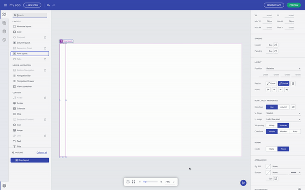
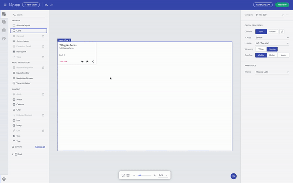

# Flex layouts (and positioning) 

Let's start the walkthrough with flex-based layouts. Since the app builder is targeting web apps, we are offering Flex as one of the approaches to create layouts. It's available to you as a row or column layout component in the toolbox. The outermost container you see here is the canvas and has flex settings already applied to it. You can change the canvas size by editing the viewport size in the properties panel. 
 

## Row and column layout 

Flex-layout containers have settings that allow us to modify the position of the nested UI elements. There are flex properties for h.align and v.align properties that can be easily applied from the respective dropdowns. The canvas defaults to row layout, horizontally aligned to the left and stretched vertically. You can always switch between row and column layout irrespective of what you started with. The layout container is sized based on the content, but you can always specify a height and width. I'll can also add the padding property to container, and margins to space out the child UI elements. 

You can always select the parent UI element by clicking on the label for the child element. This is helpful when you have nested layout containers. On the other hand, you can also select the component you need directly from the Outline menu in the bottom left corner.  

## Fluid resizing & wrapping 

The other note-worthy properties are related to grow and shrink. These affect resizing for components when the viewport changes size. Setting a component to `grow` will expand a container in row direction if it's row layout or column direction if it's column layout.  

## Add to layout via context menu 

If you come up with the need to add an existing component to a new layout, there is a very handful option – with right on a selected component, you can trigger the context menu and to add the element to a row or column layout.  

## Additional Resources

To summarize quickly, whatever you have learned about Flex layouts can be used here in the editor as-is. For someone new to Flex and CSS, it will take some getting used to, but over time it will become a lot easier to think of layouts as rows and columns. The most important is that Flex layout help us build application adapting to a screen size and define components behavior within the layout, while the absolute layout let us have a particular design for only one screen size. 
 Use these resources to learn more about CSS Flexbox
 https://developer.mozilla.org/en-US/docs/Learn/CSS/CSS_layout/Flexbox
 https://css-tricks.com/snippets/css/a-guide-to-flexbox/
 https://flexboxfroggy.com/

* [App Builder Components](indigo-design-app-builder-components.md)

