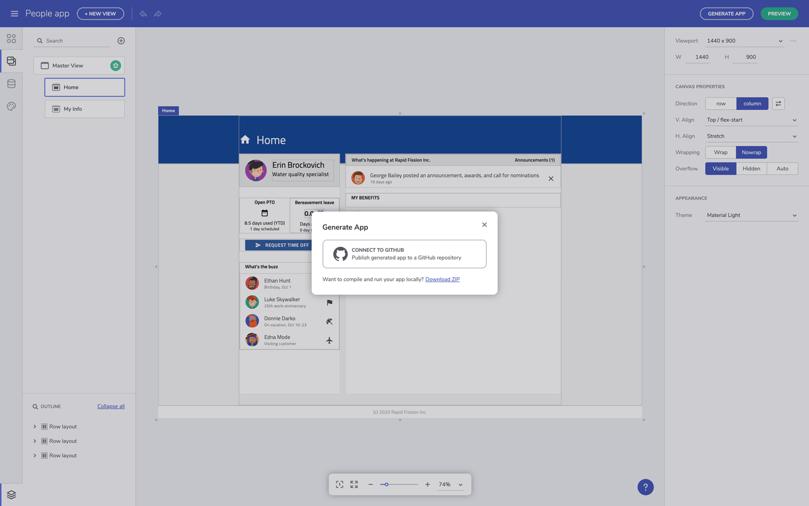
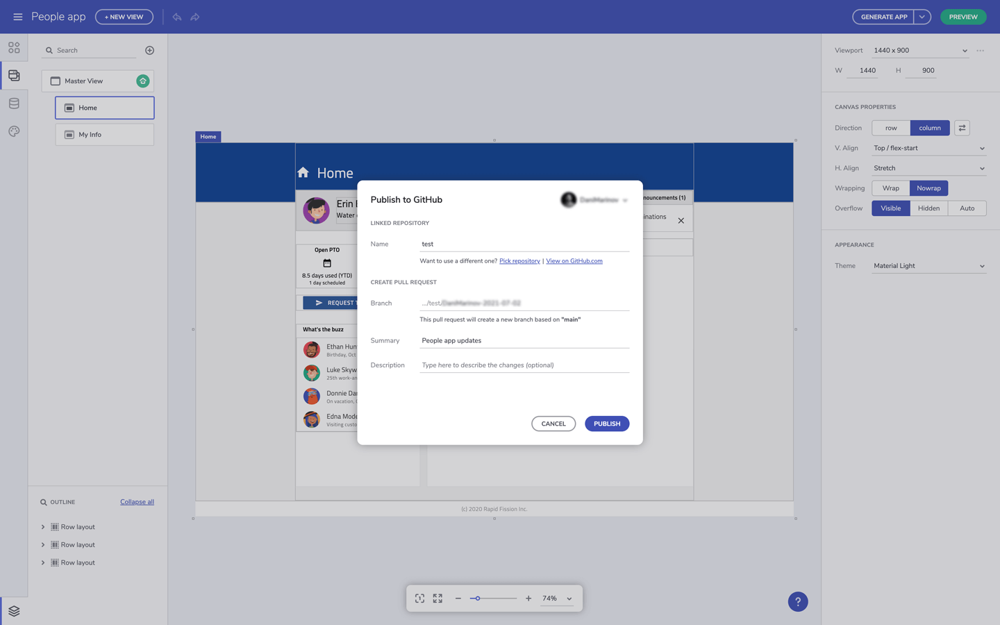
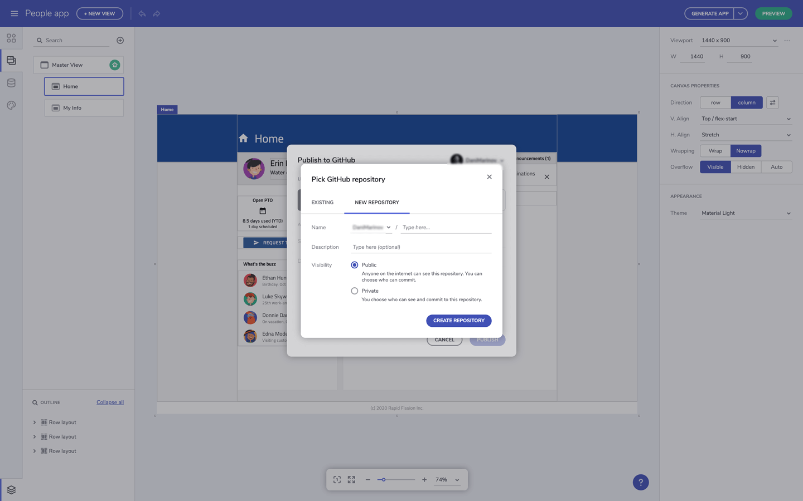
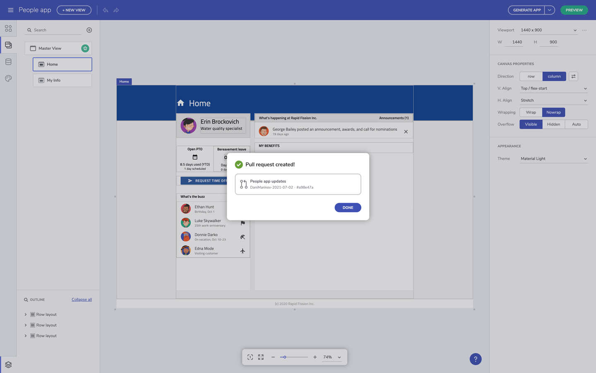

# Upload Application To Github

> [!NOTE]
><b>Once ready with you design in Indigo.Design App Builder you can upload it to your private or Github repository. 

### In this article:
* <a href="#intro">Introduction of the feature</a>
* <a href="#uploading-an-application-to-github">Uploading an application to GitHub</a>

## Intro
One of the great Indigo.Design App Builder features is actually the code generation service, so once the app design is ready and the code reviewed, users can get the final application code. However, what makes the experience even greater is the fact that the app code can be easily uploaded to a GitHub repository directly from inside the App Builder. GitHub is a favorite tool for thousands of developers, so this App Builder feature allows users to benefit from all GitHub features, such as assigning reviewers, tracking changes, commenting and many more. By delivering this feature, the Indigo.Design product team adds one more piece to the full design-to-code collaborative story, but also integrates the App Builder platform with a well-known service that engineers are already used to. 

## Uploading an application to Github
When finalizing the design of your application and preview its code, it comes the moment for generating the full app code. In order to do that, simply go to the Generate app button and then connect your Github account. From the button menu, you can also download you application files.

Connect Indigo.Design App Builder to Github

Once you log in with your Github account, you should authorize Indigo.Design to access it and pick up the repository where the app code will be stored. There, you can select between adding to a new repository or to existing one, specifying the name of the app, adding description and choosing between public or private repo. Once ready, the app files are being uploaded to Github, creating a new Github repository.

Publish application to an existing repo in Github

Create a new repository to Github

When the uploading process is done, users can change the Github repo from inside the App Builder or click to "View it on GitHub" and open the browser to check the updated files in Github.

An application run in VScode

## Additional Resources

* [Run Application Locally](run-application-locally.md)
* [Preview Application Code](../../appbuilder/preview-code.md)
