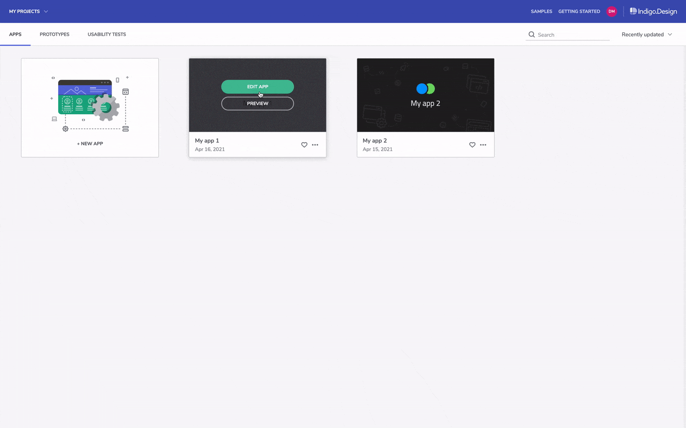
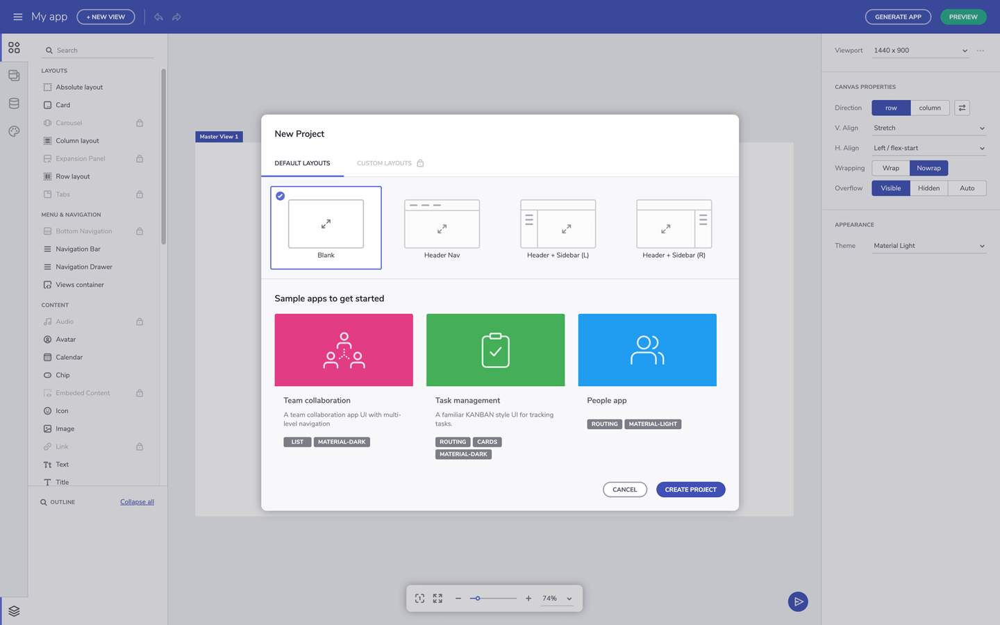
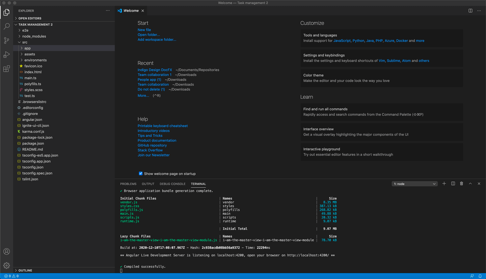

# Getting started with Indigo Design App Builder

> [!NOTE]
><b>Indigo Design App Builder can be launched from the App tab in your Indigo.Design home screen. From there, you will be able also to manage all of your active applications. Once, you finish editing an app in the App Builder, you can generate its code from the "Generate code" button and, then, run it locally.

### In this article:
* <a href="#launch-app-builder-from-indigodesign">Launch App Builder from Indigo.Design</a>
* <a href="#getting-the-code">Getting the code</a>
* <a href="#running-the-app-locally">Running the app locally</a>

<section class="feature__container">
    

        

            <iframe width="800" height="450" src="https://www.youtube.com/embed/DK50La2GFJ0" frameborder="0" allowfullscreen></iframe>
            
Get Started with App Builder

             
        

    

</section>

## Launch App Builder from Indigo.Design
Once you sign in Indigo.Design, you will land in the home screen and from here you can access each of the three core Indigo.Design products - Prototypes and Usability Tests, as well as the newest one - App Builder which can be found under the Apps tab. From the App Builder home screen in Indigo.Design, users can start a new app, preview or edit an existing one. Through the context menu, every existing app can also be renamed, duplicated or archived.  

Indigo.Design home screen

What you'll see when you launch the [Indigo Design App Builder]({environment:infragisticsBaseUrl}/products/indigo-design/app-builder) for first time is a pop up window suggesting a quick onboarding tour. What you will see next is the create new project dialog. There are four ways to start a new app:
1. <b>Create from existing design</b> - if you have an existing Sketch file, created using the Indigo.Design UI kit for Sketch, you can upload it at this point and continue your design in the App Builder, without the need to recreate everything from scratch. Note, that due to the differences between the absolute layout in Sketch and the Flex layout in the App Builder, some additional adjustments may be needed after parsing your Sketch file.
2. <b>Sample apps</b> - the getting started apps will help you explore applications that have been created using the Indigo Design App Builder and also allow you to modify them in your own user space. They are also a good source for you to preview generated code for a larger application without having to create your own app from scratch. If you use the Indigo Design App Builder for first time, we recommend to use the sample app option as a starting point. This is the quickest way to onboard yourself with the awesome features of the tool and to start building your application.
3. <b>Defaul layouts</b> - start a new app from scratch, benefiting from a basic predefined layout.
4. <b>Blank</b> - start a new app from scratch.

New project dialog

Note, that once in the App Builder, users are enabled to easily switch between their active applications or go back to their workspace in Indigo.Design from the in-app side menu at design time without leaving the App Builder.

Side menu

## Getting the code
The Indigo Design App Builder always displays a live-running web application both on the design surface and in the preview window. The underlying code and application model are updated in real time as you make changes to the application in the design surface. You can view the generated application code at any time in the preview window and you can also download the generated application at any time as a complete application code repository, which you can then open in a code editor of your choice. Then you can build and run the application you've designed using the Indigo Design App Builder locally on your machine and you can make additional modifications on the generated code.
 

Application preview window

Code of a generated application and then run in VScode

> [!NOTE]
> Once the code for your application is downloaded, changes made locally will not be reflected in your Indigo Design App Builder user space.

## Running the app locally

In order to run the downloaded application, the following prerequisites need to be installed on your machine.

1. NodeJS.
2. Visual Studio Code (we recommend VS Code, but you can use a different code editor).

    

      
      <a target="_blank" href="https://nodejs.org/en/download/" class="no-external-icon"
         style="color:white;background-color:#09f;text-decoration:none;font-weight:700;font-size:16px;padding: 5px 15px 5px 15px;">
        DOWNLOAD NODE
      </a>
    

    

      
      <a target="_blank" href="https://code.visualstudio.com/download" class="no-external-icon"
         style="color:white;background-color:#09f;text-decoration:none;font-weight:700;font-size:16px;padding: 5px 15px 5px 15px;">
        DOWNLOAD VS CODE
      </a>
    

## Additional Resources

* [App Builder Interface Overview](interface-overview.md)
* [Single Page And Navigation](single-page-apps-and-navigation.md)
* [Indigo.Design App Builder Components](indigo-design-app-builder-components.md)
* [Flex Layouts](flex-layouts/flex-layouts.md)
