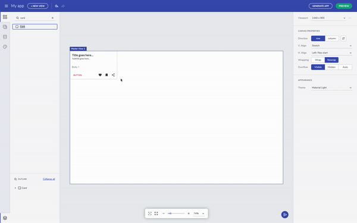

# Indigo Design Components

The **Toolbox** tab on the left let you cycle through the list of all available [Ignite UI for Angular]({environment:infragisticsBaseUrl}/products/ignite-ui-angular) components, as well as some [Indigo.Design]({environment:infragisticsBaseUrl}/products/indigo-design) general components, such as absolute, row, column layout and views container. The search input on the top of the components list makes it easy to find a particular component. All of the components are conveniently distributed into groups based on their usage. The grayed-out components have still not been added, and are thus disabled, but soon will be available in next updates. Components can be added to the **Design Canvas** by dragging and dropping them from the **Toolbox**.

## Quick add components 

You can also use our quick-add feature by using the keyboard shortcut ctrl+E or cmd+E on a macs to search and add components. Just remember "E" stands for everything. The quick-add keeps track of recently used components making it faster to add components you use frequently. Double-clicking a component in the **Toolbox** will also add it to the **Design Canvas**.  

#### Quick add a component

## Configuring components 

Every component comes with a set of preset types that match the Indigo.Design system. For instance, there are three preset types of buttons in the Indigo.Design system - raised, outlined and flat. 

#### Component's presets

For more complex components, like an input field or say card component, you can turn ON/OFF sections of the component. Also, the component properties also reflect the visual structure of the component, and match the specifications you will find in our developer toolkit like [Ignite UI for Angular]({environment:infragisticsBaseUrl}/products/ignite-ui-angular). In the case of an input field, you can enable or disable the prefix section to add a leading icon. 

#### Turn off component's properties

## Additional Resources

* [App Themes](app-themes.md)