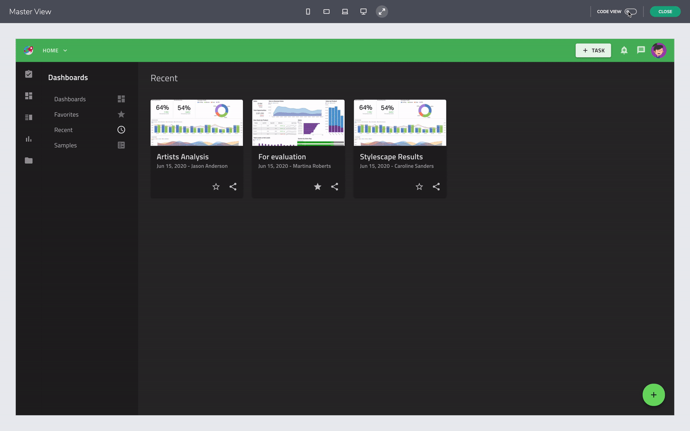
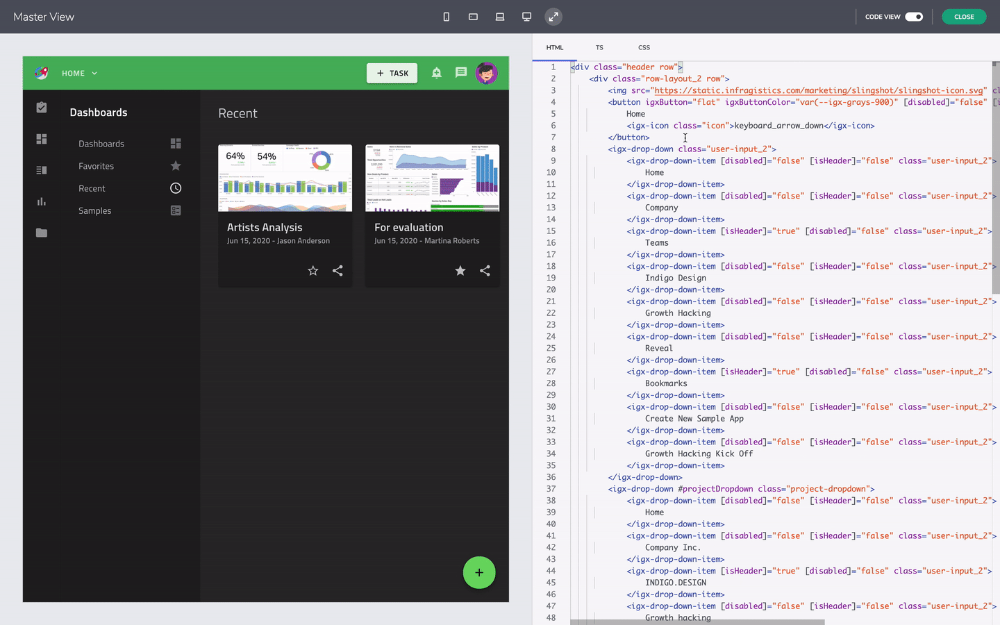

# Preview Code

<section class="feature__container">
    

        

            <iframe width="800" height="450" src="https://www.youtube.com/embed/zxT-nIXKn7I" frameborder="0" allowfullscreen></iframe>
            
Preview and Generate App Code

             
        

    

</section>

Previewing generated code and downloading your work as an Angular app is the final step after designing one application. The design and development user story will be completed once the application is generated with all styiling and layout properties.

## Preview Code 

The preview mode allows you to interact with your design as-if it's a running app. For instance, you can resize the viewport to see how the positioning for components behave. But the real value it offers to developers is to preview the app code that is about to be generated. To see this, you can toggle the code-view ON and see it side-by-side with the design. It's in read-only mode, but  will help you review the quality of code produced. 

View code in the Preview mode

The code view allows you to see the HTML, CSS and TS separately. And this saves time by sparing you the effort to write markup and CSS to create something that's pixel perfect. The generated code makes use of real developer components, in this case, Ignite UI for Angular, so you can be assured that there is comprehensive developer documentation to back it up.
Moreover, you are skipping the hand-off where developers have to inspect the visual assets to extract visual specifications which usually requires a lot of communication between designers and developers and includes multiple rounds of polishing one design.

View HTML, CSS, Typescript files in the Preview mode

## Additional Resources

* [Generate App](generate-app.md)