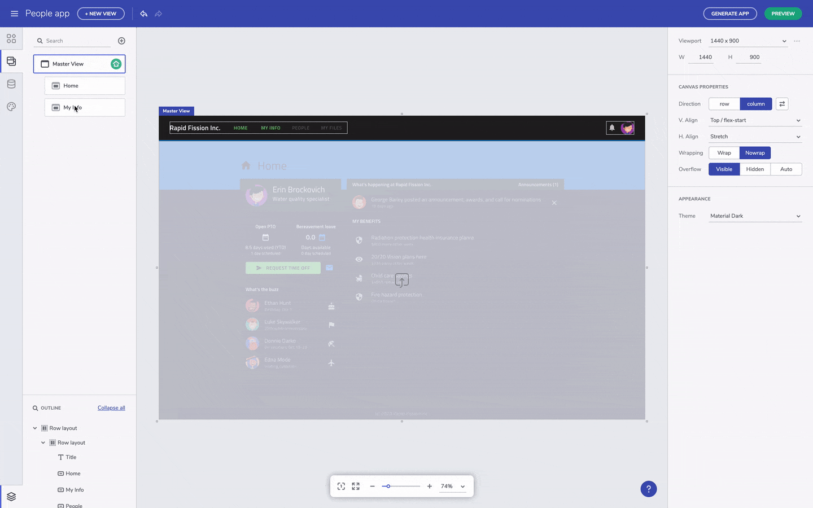

# Interactions

> [!NOTE]
><b>Once you are ready with the design of you application in Indigo.Design App Builder, you can download it and run in locally or directly upload its files to a Github repository. 

### In this article:
* <a href="#intro">Introduction of the feature</a>
* <a href="#uploading-an-application-to-github">Uploading an application to Github</a>

<section class="feature__container">
    

        

            <iframe width="800" height="450" src="https://www.youtube.com/embed/zxT-nIXKn7I" frameborder="0" allowfullscreen></iframe>
            
Interaction feature introduction

             
        

    

</section>

## Intro
One of the great Indigo.Design App Builder features is actually the code generation service, so once the app design is ready and the code reviewed, users can get the final application code. However, what makes the experience even greater is the fact that the app code can be easily uploaded to a Github repository directly from inside the App Builder. Github is a favourite tool for thousands of developers, so this App Builder feature allows users to benefit from all Github features, such as asigning reviewers, tracking changes, commenting and many more. By delivering this feature, the Indigo.Design product team add one more piece to the full design-to-code collaborative story, but also integrates the App Builder platform with a well-known service that engineers already got used to. 

## Uploading an application to Github
When finalize the design of your application and preview its code, it comes the mom for generating the full app code. In order to do that, simply go to the Generate app button and then connect your Github account.

"Navigate to" interaction

Once you are logged in with your Github account, you should authorize Indigo.Design to access it and pick up the repository where the app code will be stored. There, you can select between adding to a new repository or to existing one, specifying the name of the app, adding description and choosing between public or private repo. Once ready, the app files are being uploaded to Github, creating a new Github repository.

"Navigate to" interaction

When the uploading process is done, users can change the Github repo from inside the App Builder or click to "View it on GitHub" and open the browser to check the files in Github.

"Navigate to" interaction

## Additional Resources

* [Preview Code and Generate App](preview-code-and-generate-app.md)