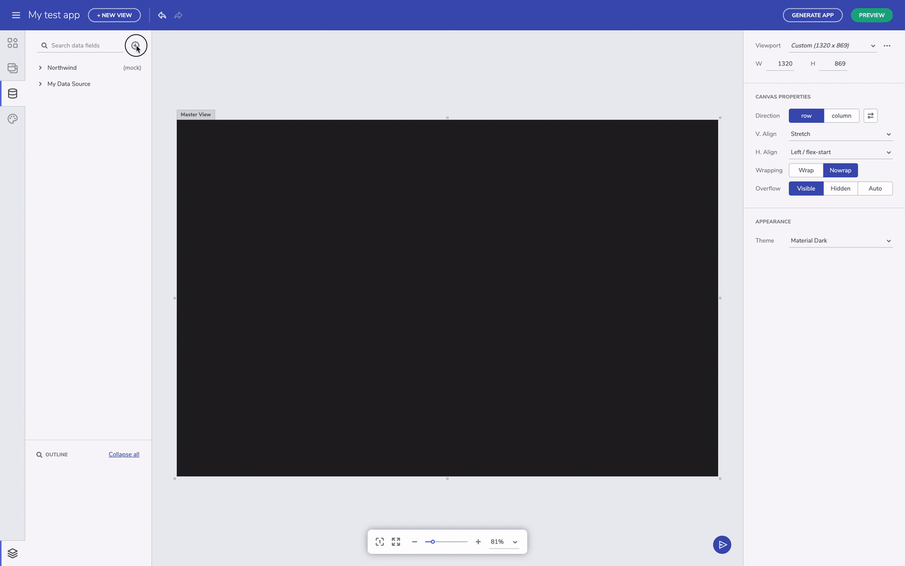
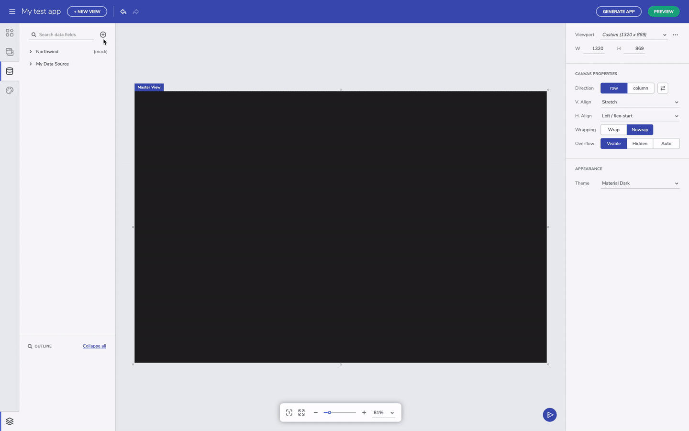
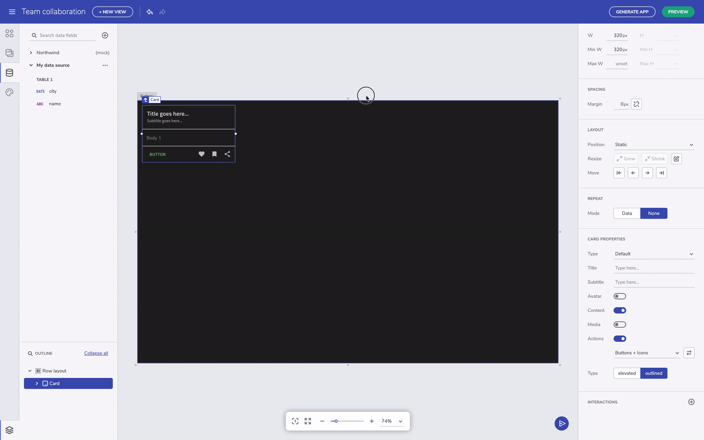

# Data Feature overview 
The Indigo Design App Builder Data features lets users add, edit and use external data source in the application they are developing. By default, the Indigo Design App Builder comes with a mock Northwind data source which users can use for reference. Currently, a Rest API data source types can be added, enabling users to upload a JSON file or provide a URL with the data source. All added data sources are placed in the data toolbox and users can expand/collapse each data source in order to see the included tables and selected fields.

Adding data source from a URL

## Adding a data source
The Indigo Design App Builder Data feature enables users to add an external data sources, such as JSON (Rest API), Excel or CSV file, either by uploading a file, or linking to external publicly available source. Only Rest API option is available in the initial release of this feature.

> [!NOTE]
> Data sources added to the Indigo Design App Builder are restricted to the user space and are visible only to the user that added them, or to their team space (when the teams feature is available).

Adding data source from a URL

Adding data source by uploading a file

## Selecting data fields and changing fields type
When a data source has been added, users can connect a particular data field to a component section. In order for this to be done, first select the component (a card component is used in the example below), then change Repeat mode to Data and scroll down the menu to locate and select the table from the Data Source that you want to connect to. Finally, connect the card section with the selected table field.

Selecting data fields

Changing a data source table field type

## Connecting Data Source to a repeated component
When a data source has been added, users can connect a particular data field to a component section. In order for this to be done, first select the component (a card component is used in the example below), then change Repeat mode to Data and scroll down the menu to locate and select the table from the Data Source that you want to connect to. Finally, connect the card section with the selected table field.

Connect a data source table field to a component section

## Additional Resources

* [Indigo Design App Builder Components](indigo-design-app-builder-components.md)