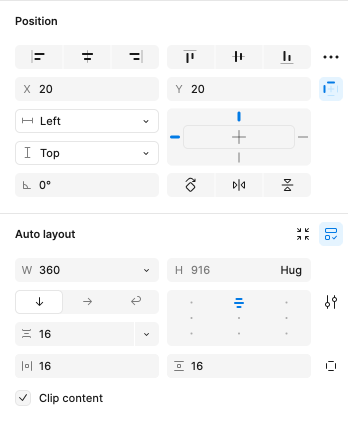

# Layout Best Practices

This topic provides design guidance regarding the positioning of Components in your app layouts and the setting of resizing rules that ensure good responsive app design. By sticking to the recommendations below, you will be able to generate an Angular app effortlessly with the responsive behavior specified in Figma.

## Layout

In Figma you can either use absolute positioned frames/groups, in which case layout generation will follow the [Absolute Layout](./best-layout-practices.md#layout) rules, or you can take advantage of the Auto-Layout options:

### Auto-Layout

Auto-layout is an unique Figma feature that allows structuring containers (such as Frames, Components, Groups) so that they have a more responsive layout that adapts according to the screen size. It allows setting rules on how the content should flow, how it should be positioned, sized and how it should spread within its container. As such it is very similar in concept as flexbox  in web.

Auto-layout option can be set by the designed via Figma's UI:

Below you'll find more information on each specific setting.

#### Layout Direction

Can be either Vertical or Horizontal. Determined the direction in which elements will flow in the container.
Will generate generate `flex-direction: row` for a horizontal layout and flex-direction: column` for a vertical layout.

#### Alignment

Determines how items will be aligned within this container.
Correlates with the `justify-content` and `align-items` css options. Note that `justify-content determines` the alignment along the main direction axis( vertical for column, horizontal for row), while align-items determines the alignment along the counter axis (horizontal for column, vertical for row). So these depend also on the Layout Direction as well.

#### Others

You can also set spacing between items and padding via the related Space Between Items and Padding options in Figma. These will parse as `gap` and `padding` in css.

## Sizing

Figma has Horizontal and Vertical Resizing options that determine how items should resize relative to its their parent or content.

Options are Fixed, Hug or Fill. Below you'll find what each one will generate.

Fixed - Size is fixed in pixels.
Hug - Size is based on the child content. No size is applied in this case.
Fill - Size is based on parent. It should stretch to fill parent. Relates to `flex: 1 1 0px;` or `self-align: stretch`.

## Additional Resources

Related topics:

- [Input](components/input.md)
- [Bottom Navigation](components/bottom-nav.md)
- [Navbar](components/navbar.md)
- [Navigation Drawer](components/nav-drawer.md)
  

Our community is active and always welcoming to new ideas.

