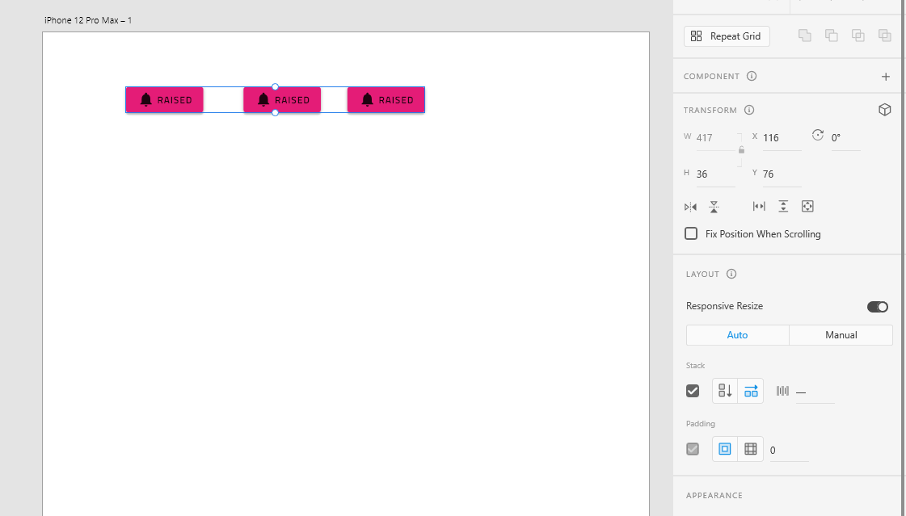
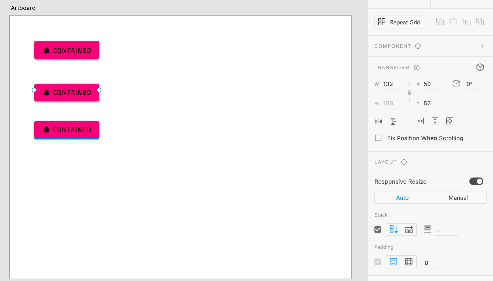
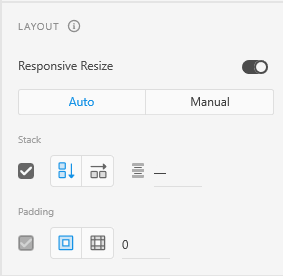
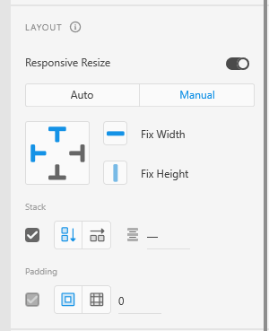

# Layout Best Practices

This topic provides design guidance regarding the positioning of Components in your app layouts and the setting of resizing rules that ensure good responsive app design. By sticking to the recommendations below, you will be able to generate an Angular app effortlessly with the responsive behavior specified in AdobeXD.

## Layout
This section provides guidance on how to group your elements in AdobeXD for best results. 
For the most part Absolute layout rules apply. More detailed information can be found [here](./best-layout-practices.md#layout).

### Stacks

One additional feature that AdobeXD provides over Sketch is that groups be used to create dynamic designs with stack. 
Stacks provide options to create a vertical or horizontal layout and also allow to determine padding and margin spacing, giving more control over the layout you want to create.

The stack direction determines whether this will generate a flex row or flex column.

Row Layout will generate `flex-direction: row` for the group:

Column layout will  generate `flex-direction: column` for the group:

Note that paddings and margins can also be specified for the group and those will also be generated as css for the related element in the DOM.

## Sizing

This section determines the elements' sizing.

The elements sizing is determined by the Layout setting in AdobeXD.
There are 2 options: Auto and Manual.

With Auto the generated element will be relatively sized to the page. Hence it will grow/shrink together with the page size.

With Manual you can Fix the Width or Height so that the element has the specified absolute size in pixels.

## Fixing
This section determines how fixing directions will affect the position of elements.

Fixing can also be specified via the Manual Layout menu. You can set different fix direction on the element and those will affect whether the element has relative position or absolute position. The same rules as with [Sketch Pinning](./best-layout-practices-sketch.md#pinning) apply. 

## Additional Resources

Related topics:

- [Input](components/input.md)
- [Bottom Navigation](components/bottom-nav.md)
- [Navbar](components/navbar.md)
- [Navigation Drawer](components/nav-drawer.md)
  

Our community is active and always welcoming to new ideas.

