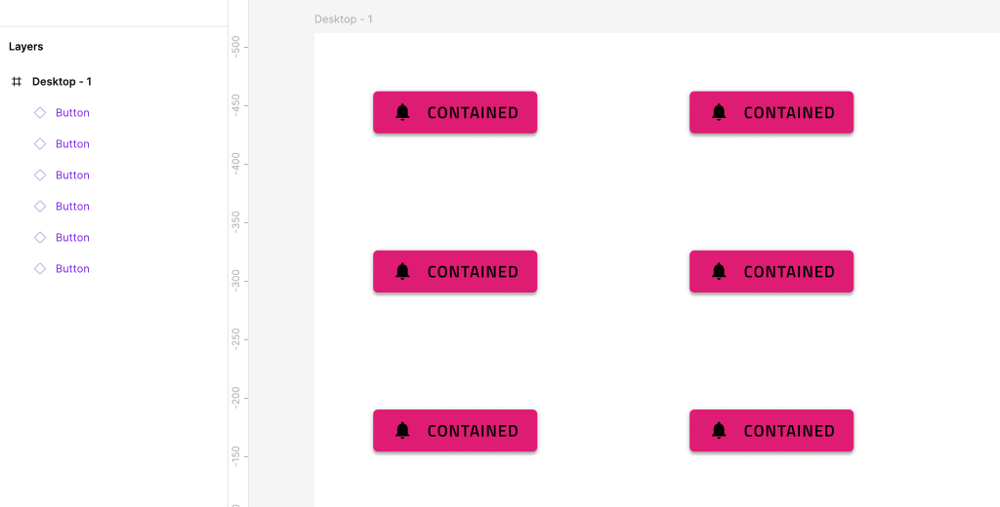
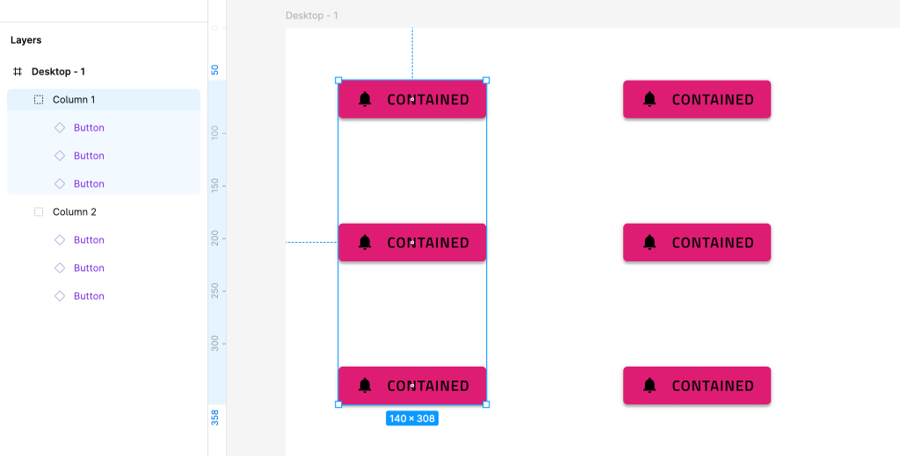
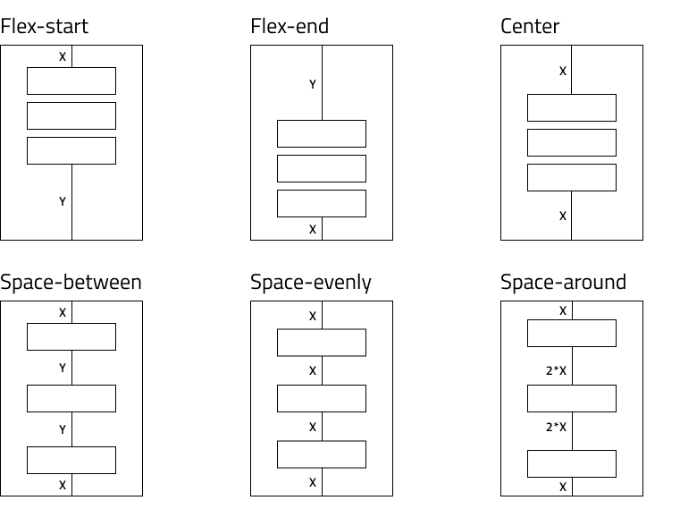
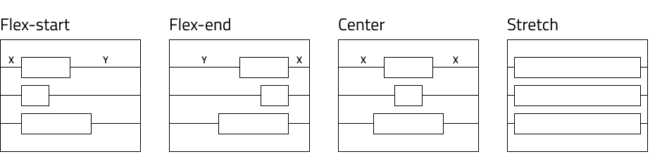

# Overview

This topic provides design guidance regarding the positioning of Components in your app layouts and the setting of resizing rules that ensure good responsive app design.

Each design tool (Figma, Sketch, XD) provides a unique way of configuring the positions and sizes of elements in the view. 

In general these tools allow you to specify either a:

- Absolute layout design

  This is a design where all elements are ordered with absolute position on the view and have no additional positioning or sizing information. Their purpose is to show a design in a particular resolution only.

  For such designs it is harder to determine a meaningful responsive layout as the designer's intent on how elements should react to resize of the view is not always clear.

  The Design to Code algorithm will still attempt to build a responsive design based on the absolute layout positions as best as it can. For the specific rules and guidelines on the absolute to responsive layout refer to the [Absolute Layout Best Practices](./best-layout-practices.md) section.
  
- Responsive layout design

  - This is a design that utilizes the specific tool's ability to mark layers as responsive to size changes and determine the responsive rules those layouts and their children should follow.
    It is specific to each tool and you can find more information in their related topics:

    - [Responsive layouts in Figma](./best-layout-practices-figma.md)
    - [Responsive layouts in Sketch](./best-layout-practices-sketch.md)
    - [Responsive layouts in XD](./best-layout-practices-xd.md)
  
  As with this approach there's more available information from the design on how things should react to resize it would always give generation results closer to the original design in the App builder. 
  Due to this it's recommended to utilize the specific tool's responsive layouting option to get better results.

# Absolute Layout - Best Practices

This section provides design guidance regarding the positioning of Components in your app layouts. By sticking to the recommendations below, you will be able to generate an app effortlessly with the responsive behavior.

## Layout
This section provides guidance on how to group your elements for best results.

The code generation algorithm starts by creating the layout horizontally. It forms the rows first. If your design is column oriented, then you should take advantage of the groups in Sketch for better results. For the following design, there are six buttons and no groups:

The generated app would have three rows, each of them containing two buttons.

The designer can very easily organize this layout in two columns by applying groups in Sketch:

The generated app from this design would contain a single row and two columns in it.

In this way the designer may control the generated result grouping. It is recommended to always group elements. This produces not only cleaner and well-organized design, but also ensures bundling the elements that are meant to be together. Note that code generation may apply additional rows or columns for elements in a group. This is done to further improve the position of elements in flex-display containers.

## Justification & Alignment
In real world scenarios, an app designed with flex containers in mind uses `justify-content` and `align-items` to arrange its groups and elements. The generator does the same thing. It applies justification and alignment properties to the rows and columns. This determines the elements' placement in the space of those rows and columns. The generator takes into account several parameters like position, size and offset of elements to apply proper values for the `justify-content` and `align-items` CSS properties.

Possible values for `justify-content` are `flex-start`, `flex-end`, `center`, `space-around`, `space-between`, `space-evenly`. Their usage is explained in the following diagram.

To achieve the desired responsive alignment, the designer should strive to position the elements and form the groups in one of the following configurations.

If there is a match, the generator applies the corresponding value. For some scenarios neither of the options match the layout. In this case, the generator splits the elements creating smaller groups. Then it executes the same logic for these smaller groups until each one gets the justification that best matches its layout.

Possible values for `align-items` are `flex-start`, `flex-end`, `center`, `stretch`. Their usage is explained in the diagram below.

Similar rules apply for `align-items`. The design should be close to either of these configurations to achieve the best responsive alignment.

> [!Note]
> For some groups there may be more than one suitable value. In such cases the generator applies the first that fits.

## Sizing

If no sizing option is set for elements they will stretch and get percentage-based size.

In addition, the elements receive `min-width` or `min-height` that is equal to the width and height in the design. This is to ensure a specific element does not get smaller than what the design specifies breaking the layout.

## Additional Resources

Related topics:

- [Input](components/input.md)
- [Bottom Navigation](components/bottom-nav.md)
- [Navbar](components/navbar.md)
- [Navigation Drawer](components/nav-drawer.md)
  

Our community is active and always welcoming to new ideas.

