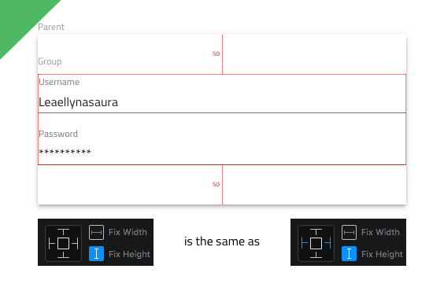
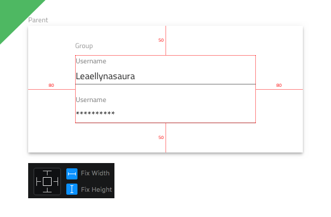
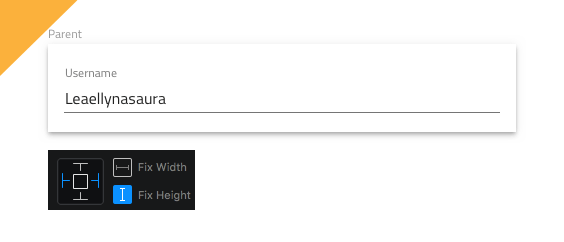
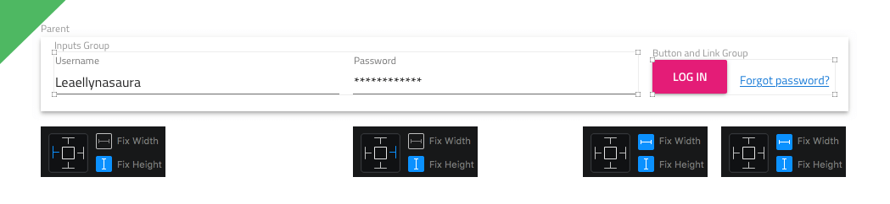
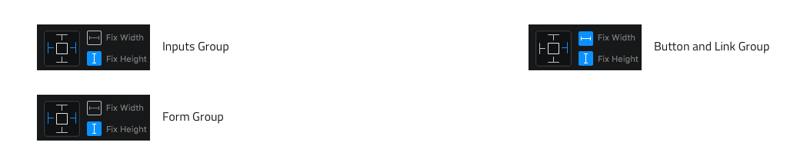
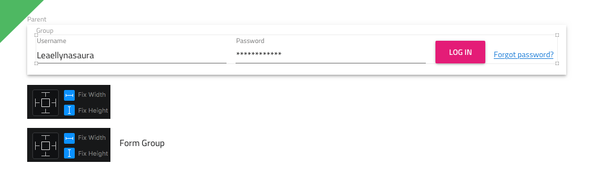
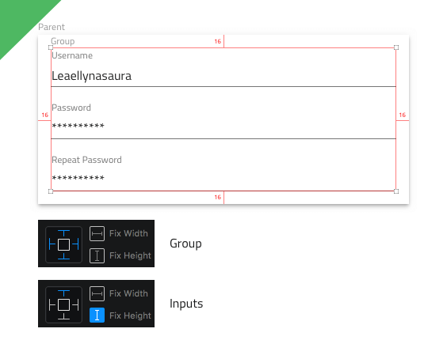

## Layout Best Practices

This topic provides design guidance regarding the positioning of Components in your app layouts and the setting of proper resizing rules to assure proper responsive app design. By sticking to the recommendations below you will be able to effortlessly generate an Angular app with the responsive behavior specified in Sketch.

> [!Note]
> Inputs, Radio Buttons, Sliders, Checkboxes, Hyperlinks, Switches, Progress Bars, Toasts, Snackbars, Avatars, Dialogs, Icons, and Title and Paragraph Texts have a preset height that is controlled by the layout of the component or its font size in the case of text-based components. It is recommended to use the default height of each of these components and fix it in Sketch since it will work fine for the vast majority of scenarios.

## Vertical Layouts

This section provides design guidance for the vertical layout of Components and Patterns affecting how they will respond to changes of the height of a group or artboard in Sketch that they belong to.

### Vertical Centering

In order for a layout to always be in the vertical center of the group or artboard it belongs to, its Components and Patterns have to be grouped together in a new group with fixed height, which is positioned at equal distances from the top and bottom borders of the original group or artboard mentioned above. Also make sure that the new group is neither top, nor bottom pinned.

**As the group scales horizontally, so will the Inputs it contains. The containing group is vertically centered.**

**Despite that in Sketch this scenario will behave as the one above, the lack of group around the two Inputs will not generate the expected results in Angular.**

If the width of the new group is also fixed and it happens to be positioned at equal distances from the left and right borders of the original group or artboard, the new group will also be centered horizontally.

**The group always preserves its dimensions and is centered vertically and horizontally.**

### Pinning Elements Top

In order for a Component or Pattern to always keep its top margin in relation to the group or artboard it belongs to, it should be pinned top through the resizing properties. This pinning will kick in even in scenarios, where the element is positioned at equal distances from the top and bottom borders of the group or artboard it belongs to.

**The Input will always preserve its top margin of 40px.**

**In Sketch the lack of pinning to the top will result in a varying top margin when the height of the parent group changes.**

When it comes to layouts of multiple elements, in order for them to keep the top margin in relation to the group or artboard, as well as the margins that space them away from one another on the vertical axis, each element should be pinned top through the resizing properties.

**The Inputs will always preserve their top margin as well as the margins in between them along the vertical axis.**

**In Sketch the lack of pinning to the top will result in a varying top margin and margins between the individual inputs when the height of the parent group changes.**

When such layouts of multiple elements are placed in a group, apply the top pinning rule to both the group and its contents.

**The group will always preserve its top margin and the Inputs will keep the margins between themselves along the vertical axis.**

## Horizontal Layout

This section provides design guidance for the horizontal layout of Components and Patterns affecting how they will respond to changes of the width of a group or artboard in Sketch that they belong to.

### Flexible Width

In order for a Component or Pattern to scale to the full width of the group or artboard it belongs to, make sure that its left and right side match with the group or artboard left and right side.

**The Input will scale with the change of width in its parent. Since the left and right sides match with those of the group or artboard it belongs to, pinning both left and right will result in the same responsive behavior as when none of the sides are pinned.**

**The Input will keep a left and right margin and scale correctly when its parent width changes. However, it will be better to put the Input in a group, so that it has proper flexible width behavior and set the left and right margins on the group instead.**

**The Input will keep a left margin and proportionally scale when its parent width changes, resulting in bizzare responsive behaviors.**

**The Input will proportionally scale and move left and right when its parent width changes, resulting in bizzare responsive behaviors.**

### Fixed Width

In order for a Component or Pattern to keep its width, make sure that it has a fixed width and is pinned either to the left or right side of the group or artboard it belongs to. In most scenarios though, our advice is to use the flexible widths explained above for elements that appear alone on a layout row, unless these elements come with a fixed width by default as a component e.g. Avatar, Circular Progress Bar, Icon and Toast.

**The Input will always preserve its left margin have a fixed width that will not change in resposive scenarios.**

**The Input will always preserve its right margin have a fixed width that will not change in resposive scenarios.**

**The Input will always preserve its width but the lack of pinning either left or right will result in bizzare responsive behaviors.**

### Horizontal Layouts with Two Elements

In order for each element to properly adjust its size in two-element horizontal layouts, it should be either pinned left (if appears on the left in the layout), or right (if appears on the right in the layout) and the two elements should be placed in a group. This group should be pinned both left and right to the group or artboard in Sketch where it belongs.

**The left Input is pinned left and the right one is pinned right. The group they are put into is pinned both left and right.**

In order for one element to properly adjust its size and the other to keep its width in two-element horizontal layouts, the first one should be pinned both left and right, the second one should be pinned left (if appears on the left in the layout), or right (if appears on the right in the layout) and the two elements should be placed in a group. This group should be pinned both left and right to the group or artboard in Sketch where it belongs.

**The left Input is pinned both left and right, while the right one is only pinned right and its width is fixed. The group they are put into is pinned both left and right.**

In order for each element to keep its width in two-element horizontal layouts, it should be either pinned left (if appears on the left in the layout), or right (if appears on the right in the layout) and the two elements should be placed in a group with fixed width.

**The left Input is pinned left and the right one is pinned right. None of the widths need to be fixed except for the width of the group they are put into.**

> [!Note]
> Proportionally changing the width of elements in a responsive layout is possible, as long as the elements are placed in a group and neither their individual widths are fixed, nor that of the group.

**The left Input is pinned left and the right one is pinned right but none of the widths are fixed. Both elements will scale proportionally, but so will the margin between them in Sketch. However, the generated code respects the margin and sets it to the value at the time of export, scaling proportionally only the actual elements when the group they belong to changes its width.**

### Horizontal Layouts With More Elements

In order to assure the proper behavior of a layout with more elements in responsive scenarios group its elements as necessary and apply the rules defined so far on the elements and groups that constitute the layout.

**The left Input has a fixed height and is pinned left, while the right one has a fixed height and is pinned right. Both are placed in a group. The Button and Hyperlink are both with their widths and heights fixed and also put in a separate group.**

**The Inputs group has a fixed height and is pinned left and right, while the other group has both the width and height fixed and is pinned right. These two groups are put in another group that brings the whole layout together, which is pinned left and right and has a fixed height. Thus when the form needs to change width, the Inputs Group and the Input elements inside will resize correctly to account for more or less available space, while the Button and Link Group will always keep its size and size of its elements, making sure they always occupy the same space on the right end of the form.**

Alternatively, one may want to have a form with fixed width that is always centered in relation to the group or artboard it belongs to.

**Both Inputs, as well as the Button and the Hyperlink, have fixed widths and heights and are also put in a common group that has a fixed width and height and is positioned equally far from the sides of its parent both vertically and horizontally. All elements will preserve their dimensions under a responsive scenario and the form as a whole will be centered both ways.**

### Default Horizontal Layouts With More Elements

When a Component or Pattern is positioned the distance to the left and top borders of the group or artboard it belongs to should be respected, therefore make sure to pin it left and top.

**Each of the elements is pinned left and top which will generate code that renders it so that the left and top margins are respected in relation to the parent. The widths and heights of each element have been fixed as well in order to make sure that they don't resize if the parent does.**

## All Margins

In order for a layout to keep its margins on all sides related to the group or artboard it belongs to, its Components and Patterns have to be grouped together in a new group pinned on all four possible sides.

**The group will always preserve its left, right, top and bottom margins of 16px each and change its size accordingly. The content inside the group will adapt according to the rules specified for each element, in this case the Inputs will preserve their height, top margin of 0px and margins in between along the vertical axis.**

> [!Note]
> Specific components, usually navigation elements such as Bottom Navigation, Navbar, Navigation Drawer and others, have three of their sides pinned and a width or height fixed along the direction of the unpinned side, according to the Components desired location in the app layout.

## Additional Resources

Related topics:

- [Input](components/input.md)
- [Bottom Navigation](components/bottom-nav.md)
- [Navbar](components/navbar.md)
- [Navigation Drawer](components/nav-drawer.md)
  

Our community is active and always welcoming to new ideas.

- [Indigo Design **GitHub**](https://github.com/IgniteUI/design-system-docfx)
