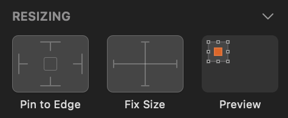

# Layout Best Practices

This topic provides design guidance regarding the positioning of Components in your app layouts and the setting of proper resizing rules to assure proper responsive app design. By sticking to the recommendations below, you will be able effortlessly to generate an Angular app with the responsive behavior specified in Sketch.

## Layout
This section guides how to group your elements in Sketch for best results.

The code generation algorithm starts by creating the layout horizontally. It forms the rows first. If your design is column oriented, then you should take advantage of the groups in Sketch for better results. For the following design, there are six buttons and no groups:

The generated app will have three rows, each of them contain two buttons.

The designer can very easy organize this layout in two columns by applying groups in Sketch:

The generated app from this design will be a single row and two columns in it.

The designer can very much control the generated result using the Sketch groups. It is recommended to always group elements in Sketch. Not only cleaner and organized design, but also it will ensure bundling the elements that needs to be together. Note that the code generation may apply additional rows or columns for elements in a Sketch group. This is done to achieve the best assumption for the position of the elements.

## Justification & Alignment
In real world scenario, an app designed with flex uses `justify-content` and `align-items` to arrange its groups and elements. The generator does the same thing. It applies justification and alignment properties to the rows and columns. This determines the elements placement in the space of those rows and columns. The generation takes into account several parameters, like position ,size and offset of elements, to apply the proper value for `justify-content` and `align-items` CSS properties.
The values for `justify-content` are `flex-start`, `flex-end`, `center`, `space-around`, `space-between`, `space-evenly`.

To achieve the desired responsive alignment designer should strive to position the elements and form the groups in one of the following configurations.
If there is a match, the code generation will apply the corresponding value.
For some scenarios, none of the values matches the layout. If this is the case, the code generation will split the elements in additional, smaller groups and searches for a value match in the groups.

The values for `align-items` are `flex-start`, `flex-end`, `center`, `stretch`.

Similar rules apply for `align-items`. The design should be close to any of these configurations to achieve better responsive alignment.

> [!Note]
> For some groups there can be more than one suitable value, but the generator will apply first that fits.

## Sizing
Sketch allows setting fixed size to the elements. This is the decision point for an element if it will be responsive or not.

If the designer applies fixed size to an element, the code generation applies this size in pixels to the element in the generated app.
The recommendation is to avoid setting fixed size, especially to groups. The code generation stretches non-fixed size elements and applies percentage-based size to them.
There are cases, where fixed size is required. Some of the components in Indigo.Design UI kit also have fixed size, like the Avatar, for example. If you do not want to stretch some element into the generated app, apply fixed width or height to it. Nevertheless, keep in mind that fixed size groups may limit the responsiveness of the app.

In addition, the elements receive `min-width` or `min-height` as much as their design width and height. This is to ensure, a specific element will not get smaller than it was in the design and break its layout.

## Pinning
The code generation builds the app Flex layout model, but sometimes elements have to be on top of other elements. In order to position elements absolutely in a layout, designers can pin elements to edges of their container. To ensure element goes over other and it is located in the right place, it should be pinned to right or to bottom. This way it receives absolute position and the appropriate margin from the pinned side.
Avoid overlapping elements and groups in Sketch for better responsive apps.

> [!Note]
> Opposite pins (left and right/top and bottom) are discarded and not taken into account. The code generation assumes the element need to be stretched instead of position it absolutely.

## Additional Resources

Related topics:

- [Input](components/input.md)
- [Bottom Navigation](components/bottom-nav.md)
- [Navbar](components/navbar.md)
- [Navigation Drawer](components/nav-drawer.md)
  

Our community is active and always welcoming to new ideas.

