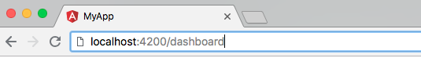

# After code generation

## Introduction

This topic describes what to do after code has been generated from a Sketch design and placed into your project by the Infragistics VS Code Extension. It is recommended that you work in a brand new Angular project while reading this topic. It will make it easier to follow along as it will be using file names that will exist in new projects. Once you've read through the topic you should be able to apply what you've learned to existing, more complicated projects. You can create a new Angular project like so:

```
ng new my-app --style=scss
```

> Note: The code generator will produce [SCSS](https://sass-lang.com/) so this command configures Angular to use .scss files instead of .css which it would use by default.

## Routing

If you used the Infragistics VS Code Extension to update the project then some basic routes will have been added to the generated modules. These routes make the generated components ready for navigation. However, in a new Angular application there is no place for navigated content to go so the first thing you need to do is add a [RouterOutlet](https://angular.io/api/router/RouterOutlet) to your application. For now you can place this in the **app.component.html** which is the main page for the application.

Example:

```html
<div>
    <h1>Hello World!</h1>
    <router-outlet></router-outlet>
</div>
```

A `<router-outlet>` in your main page gives the content a place to live when you navigate to it. You can see these routes in your **AppModule** and in each of the generated modules. It will look something like this:

```typescript
const routes: Routes = [{ path: "dashboard", component: DashboardComponent }];

RouterModule.forChild(routes);
```

So with a [RouterOutlet](https://angular.io/api/router/RouterOutlet) in place you can run the application using `npm start` in terminal and then navigate to the website in your browser, appending the name of the component to the url.



This gives a good starting point for developers. From here it is expected that developers will change the routes to fit their application criteria. It is also expected that developers will write some code to trigger navigation based on certain actions such as a button click.

## Required Themes

In order to use Ignite UI for Angular in an Angular project it will need to import the Ignite UI theme. The simplest way to do this is to include the proper SCSS in the application's main styling file. If you generated the Angular application using the command specified at the top of this article then there should be a `styles.scss` file at the root of the app. Inside this file the following code can be added:

```scss
@import "~igniteui-angular/lib/core/styles/themes/index";
@include igx-core();
@include igx-theme($default-palette);
```

The Google's Material Icon set should also be included as many of the Ignite UI for Angular controls use icons.

```scss
@import url("https://fonts.googleapis.com/icon?family=Material+Icons");
```

All of our sketch components use the [Titillium Web](https://fonts.google.com/specimen/Titillium+Web) font so it is recommended that you include this font as well.

```scss
@import url("https://fonts.googleapis.com/css?family=Titillium+Web");
```

If you used the Infragistics VS Code Extension to update your project this will have already been done for you. If it notices that these imports do not exist in your `styles.scss` file then it will include a new file called `ig.scss` in the project and the project will be updated to reference this along with `styles.scss`.

## Additional Resources

Related topics:

- [Category Chart](../components/chart-category.md)
- [Indigo.Design Code Generator for VS Code](vscode-plugin.md)
  <div class="divider--half"></div>

External Links:

- [Ignite UI for Angular](https://www.infragistics.com/products/ignite-ui-angular)
- [Angular Routing & Navigation](https://angular.io/guide/router)

Our community is active and always welcoming to new ideas.


