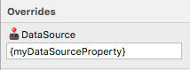

# Data Binding

Many of the Ignite UI for Angular components support data binding. In order to use these data binding features we have exposed certain overrides in Sketch which allow you to provide property names which we will use during code generation to setup the bindings. These properties in Sketch will vary from component to component so it is advised that you check the individual component docs to see which overrides support bindings.

## Usage

Data bindings are specified in Sketch by surrounding the property name with curly braces. This lets code generation know that the content between the curly brace is a property that you intend to use for data binding. It will generate the proper HTML using this property.



Certain overrides will support string interpolation. String interpolation allows you to mix normal text with data bound text. Curly braces are still required around the property you wish to bind. You will need to check the docs for the component you are working with to see if string interpolation is supported. For example, usually display text properties will support string interpolation but data source properties will not.


> [!NOTE]
> Not all display text properties will support string interpolation. Please check the docs for the individual component you are working with to verify whether it is supported or not.

## Nested Properties

Nested properties are supported. What this means is you can bind to properties that are contained inside other properties. Let's say we had a Typescript class called `User` and this class had a property called `address` that was an `Address` object.

```typescript
export class Address {
  street: string;
  city: string;
  state: string;
}

export class User {
  address: Address;
}
```

In Sketch you could specify that you want to bind to the `street` property in `Address` using a nested property.


This binding is assuming that `User` is going to be the model object name specified in the [Indigo.Design Code Generator](vscode-plugin.md) extension during code generation. It is important to note that wherever data binding is supported nested properties are also supported.
