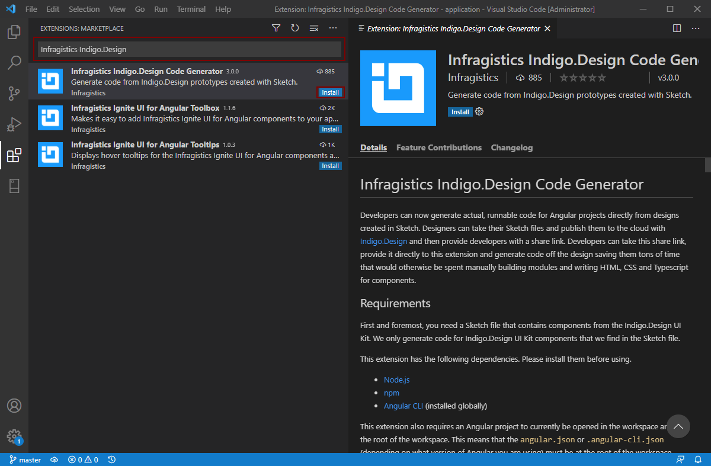

# Installing the Visual Code Extension

Before you can install the VS Code Extension, please make sure you have Visual Studio Code installed. To generate code and run Angular apps, you also need Node.js installed. You can get both from the links here:

1.  NodeJS: [Download](https://nodejs.org/en/download/) and install
2.  Visual Studio Code: [Download](https://code.visualstudio.com/download) and install

## Step-by-Step

1.  Once Visual Studio Code is open, select "View" then "Extensions" from the main menu

    

    
    

    

    

    

    

2.  In the Extensions pane, in the search for the extensions in Marketplace, type the following "Infragistics Indigo.Design".

3.  Make sure to select "Infragistics Indigo.Design Code Generator" extension and click install

    

    
    

    

    

    

    

The extension is now installed on your machine.

## Additional Resources

Our community is active and always welcoming to new ideas.

