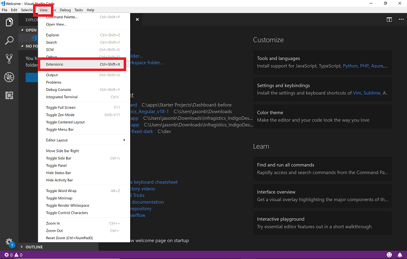
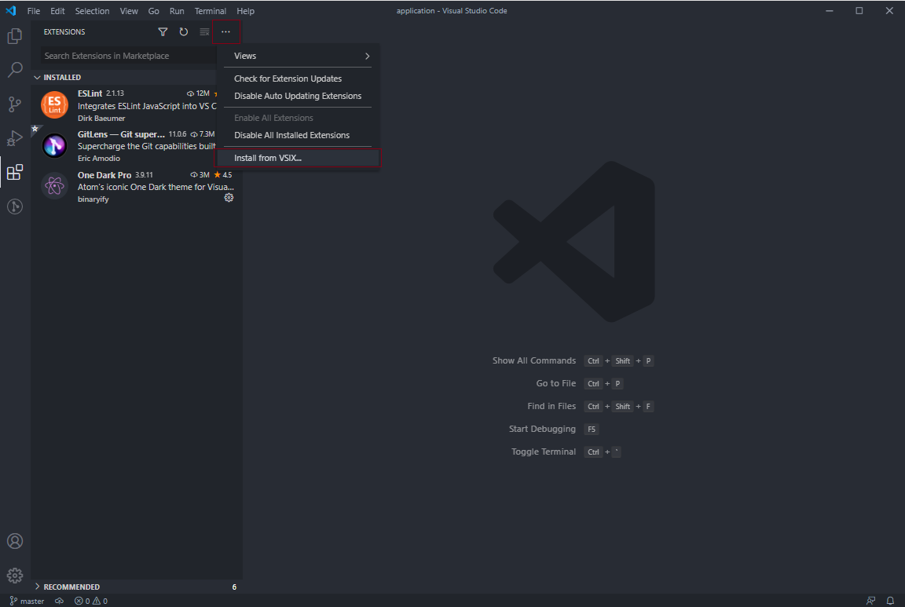
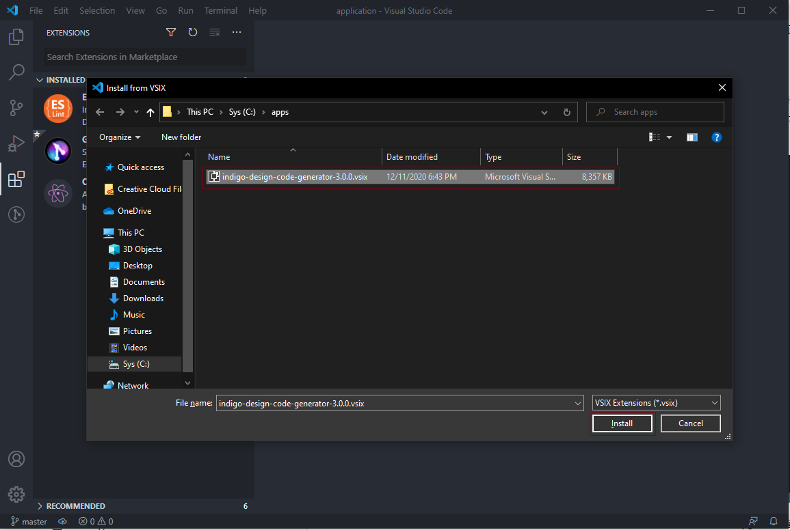
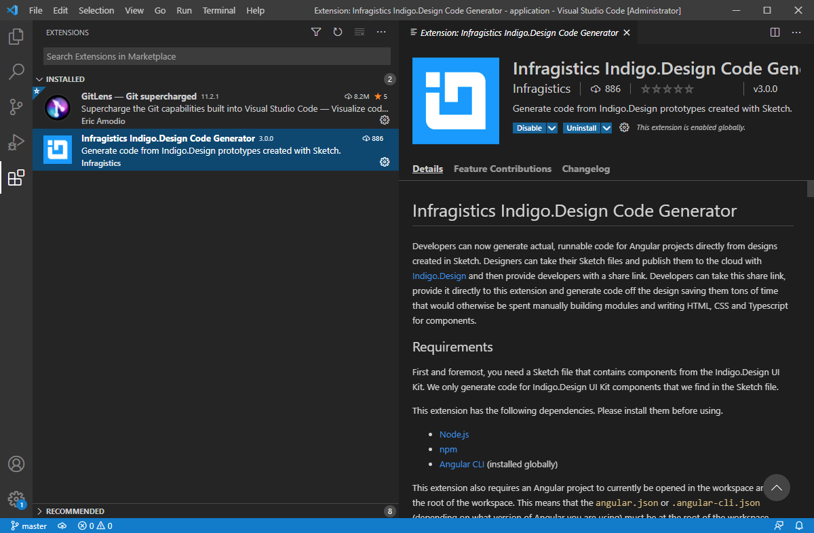

## Installing the Extension

Before you can install the VS Code Extension, please make sure you have Visual Studio Code installed. To generate code and run Angular apps, you also need Node.js installed. You can get both from the links here:

1.  NodeJS: [Download](https://nodejs.org/en/download/) and install
2.  Visual Studio Code: [Download](https://code.visualstudio.com/download) and install

## Step-by-Step

1.  Unzip the package to your hard drive

2.  Once Visual Studio Code is open, select "View" then "Extensions" from the main menu

    

    
    

    

    

    

    

3.  In the Extensions pane, click the More Options button (the three horizontal dots) in the upper right

4.  Select "Install from VSIX" from the dropdown menu

    

    
    

    

    

    

    

5.  Browse to the location of the unzipped file you downloaded to select the VS Code Extension
    

    
    

    

    

    

    

The extension is now installed on your machine.

## Additional Resources

Our community is active and always welcoming to new ideas.

- [Indigo Design **GitHub**](https://github.com/IgniteUI/design-system-docfx)
