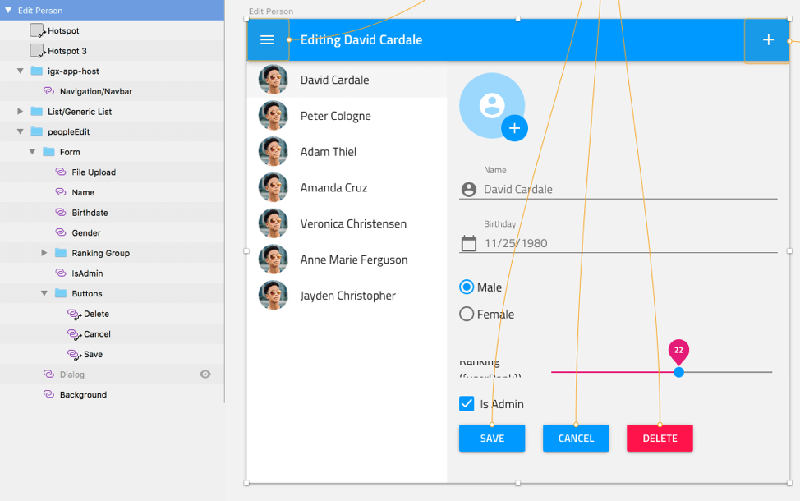
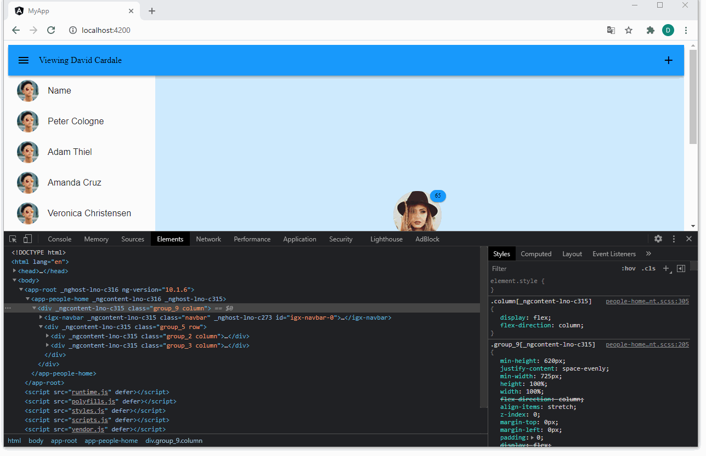
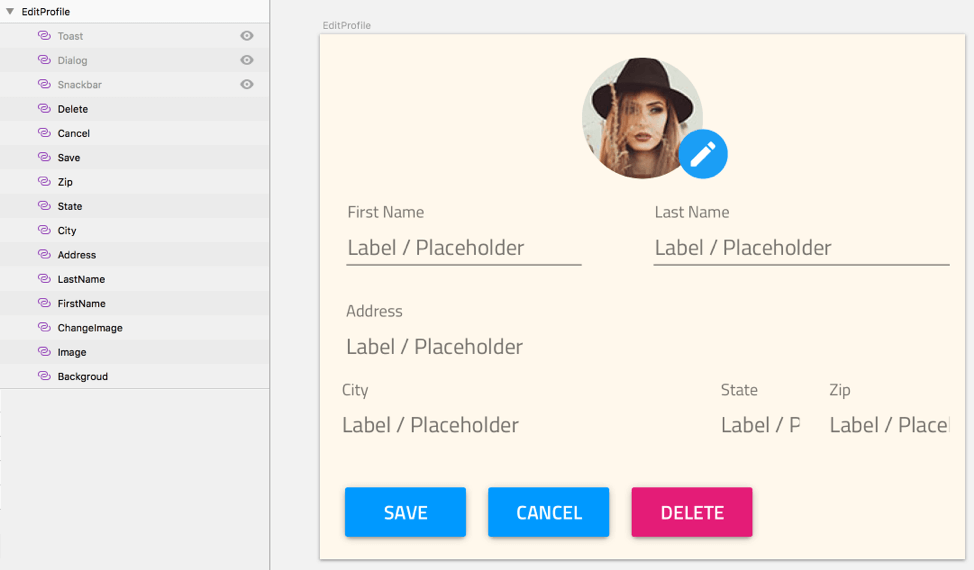
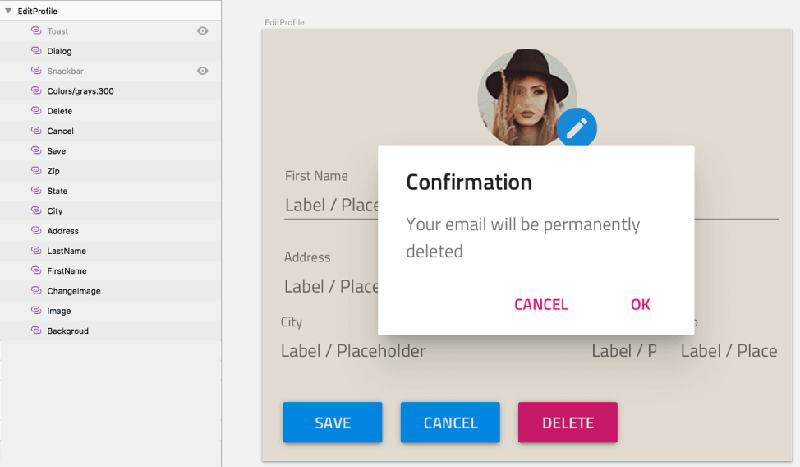
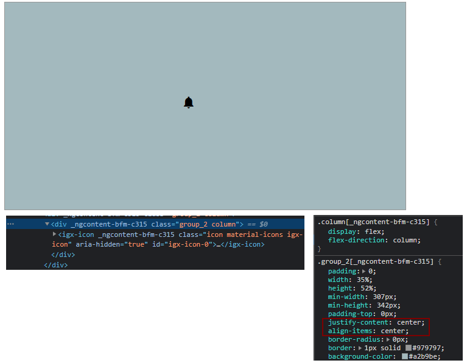

# Layout Generation

## Selecting an Artboard or Group for Code Generation

For each selected Artboard or Group, a single Angular Component is created. Each created component uses [Angular Reactive Forms](https://angular.io/guide/reactive-forms).
Only Artboards or Groups may be selected for code generation. 99% of the time, the developer will select one or more groups from an Artboard to generate components for.
The reason a whole Artboard is rarely selected for code generation is that Sketch designs typically have chrome around a form, this same chrome is repeated for each Artboard. The application chrome is created once by the developer when architecting their application. The chrome has complex interactions that provide navigation and other essential application services.

The below two images are examples of what a developer would select for code generation.

In the below image the developer would select the Sketch Group `peopleEdit` for code generation. The other elements are chrome used by the designer to show the application and components in context.

In the below image the developer would select the Sketch Groups `peopleList` and `peopleDetails` for code generation, ignoring the navigation chrome elements.

### Component Sizing

> [!Note]
> Artboards in Sketch do not have fixed height or fixed width settings so this section on Component Sizing only applies to a Component within a Group that the user selects for code generation.

When a Group is selected for component code generation and the Components inside have a fixed height and or a fixed width, those fixed size values will be added to the generated component CSS.
Normally the parent of Angular components is responsible for their sizing or resizing at runtime. However, there are design scenarios where the designer wants the component to be a fixed size element when added to the Angular application. Code generation supports this design scenario.

## Layouts

Sketch arranges artboards of projects through absolute positioning, using properties such as Top, Left, Width and Height. Often these designs have to represent fluid and responsive applications. Most web applications built from such designs use modern paradigms such as flex and grid display containers. The job of the Code generation is to get as close as possible to the application, a developer will build from a given design. This requires the Code generation to go through a set of heuristics and based on them to produce fluid design from the absolute/static one in Sketch.

Code generation reads Sketch files and uses the layout properties defined by native Sketch schema. Please, note that 3rd party Sketch plugins used to create or maintain the drawing layout typically have their own set of properties that the code generator is not aware of and these would not be used when creating the HTML and CSS.

Code generation respects and uses Sketch groups when creating the layout. Code generation renders HTML and CSS that uses [Flexbox](https://css-tricks.com/snippets/css/a-guide-to-flexbox/). Flexbox lays out elements in either columns or rows.

Sketch container elements such as groups or artboards are rendered as divs with flex CSS applied to them.

### How it works
The idea behind building a responsive layout is to combine the components into groups. This creates a structure that is closer to what the developer expects. These groups use Flexbox rules and are made of either rows or columns thus the layout is represented by a hierarchy of rows and columns containing all elements based on their positions relative to each other and their respective Sketch groups.

The algorithm starts by creating a row for the first component and stores in it the components considered part of that row (positioned on the same X-axis as the row). Once it exhausts the components in the artboard and creates all the rows for them, it uses the same principle, but for columns for each of these rows. Components become part of the same column if they are positioned on the same Y-axis. The process alternates between rows and columns until no further grouping is needed.

The fluid layout is in a tree structure. The branches and the root are rows and columns and the leaves are components.

## Heuristics and rules
In order to be properly transform the elements in HTML, the Code generator applies heuristics and rules to produce responsive web design from statically positioned elements.

> [!Note]
> The conversion to fluid application design cannot guarantee pixel perfect outcome. For some designs, the components or generated groups (rows/columns) may appear displaced. Users should review the generated code and apply changes as needed.

> [!Note]
> If the designer wants to ensure some components are part of the same group (row or column), he should group them in Sketch. The generator respects these groups.

### Navigation menu components
Navbar, NavDrawer and Bottom Navigation require special handling. These elements typically represent root level menus. When building the layout these special-case components are "moved" at the end of the group. This makes them appear on top of other elements (if there are overlaps).

### Overlaps
The code generator finds elements that overlap each other. Elements that are partially or fully on top of others are removed from further heuristics and receive absolute positioning with an appropriate z-index. In addition, overlapping elements are grouped together to ensure the upper element overlaps the element bellow into the new fluid layout regardless of the viewport size when applied to the applications responsiveness. Typical example of this is an avatar with a badge.

### Backgrounds
Sketch shapes are often used to represent a background for groups or portions of the page. The generator creates HTML container elements, usually DIVs, for them and puts all fully contained child elements inside these containers. This applies to specific shapes only. There should be elements over them and completely into their boundaries. Currently only simple shapes (rectangles and ovals) without images are used for creating background containers.

### Pinned elements
Sketch allows pinning elements to their parents and the generator handles these using the following rules:

- Having right or bottom pin to an element applies absolute position and the corresponding margin to that element.
- Left or top pins are ignored and these elements are included to the layout groups as if they did not have pins.
- Opposite pins (left and right/top and bottom) are discarded and not taken into account. The assumption behind the rule is that elements with opposite pins should be stretched instead of having margins applied. For example, left and right pins to an element are handled the same way as if the element did not have pins.

### Percentage-based size
Elements receive fluid (percentage-based) width and height. The proportion ratio in their group is maintained, unless they are explicitly set as fixed-sized in Sketch.

### Dialog, Toast, Tooltip
Dialog, Toast, and Tooltip show on top of the content via overlay so they, by design, belong to a higher z-index level. The Code generation excludes them from the default mechanism of creating rows and columns. They receive a higher z-index and are not considered in justification or alignment rules for the group.

The Dialog, Toast, and Tooltip components have another thing in common. They all appear in the UI dynamically using code. Since these are not normally visible until programmatically shown, they are usually not shown in the Sketch design unless the designer is creating an artboard for their open state. To solve the disconnect between the designer’s requirements to show the Artboard in several states, and the developer only code generating the component once, the following guidance should be followed. Add the required Dialog, Toast, and Tooltip to the drawing, configure them, as you will any other element, then hide them as below. This form is the one the developer selects to generate code. Hiding elements in the object panel has no effect on code generation, code generation generates all elements here, hidden or not. Dialog, Toast, and Tooltip elements are placed at the bottom of the components HTML and not mixed in with other elements as they have dynamic runtime placement when brought into view.

The below image is an example of a designer state drawing, this drawing should not be used for code generation as it has an extra color element to simulate the gray overlay that the Dialog will place at runtime.

### Positioning Layouts
Layout position is relative to their parent. During layout building if a group has one child, then the group takes the dimensions of the child (position and size). The child assumes position (0, 0) relative to its parent. When a new child needs to be included in group it may affect the dimensions of the group, if this is the case then all other children in the group are going to be updated.

If a group remains with one child, the structure is optimized and the group is omitted.

### Group size
  - Columns - the width of a column represents the width of its children. For the height, the column fully fills the vertical space determined by its parent.
  - Rows - the height of a row represents the height of its children. For the width, the row fully fills the horizontal space determined by its parent.

> [!Note]
> Additional paddings/margins are applied after justification is resolved based on the justification type.

### Justification and alignment
Rows receive `row` value for `flex-direction` css property and columns receive `column`.

Code generation identifies the most appropriate value for `justify-content` property in css. Using the position and size of the elements in a group the whole group can justify its elements in the beginning, at the end, center them, etc. The decision maker here is the space between the children and the edges of the parent. The code generator also tries to determine the most suitable value for `align-items` css property on the counter axis.

Example would be if the items in a group are horizontally and vertically centered, then `justify-content` is `center` and `align-items` is `center`.

### Padding and margin
Padding and margin are applied based on the resolved justification type as follows:

  - flex-start - Padding-left is applied to cover any space between the parent and first child. Margin is applied to cover any inner space between the sibling elements.
  - flex-end - Padding-right is applied to cover any space between the parent and last child. Margin is applied to cover any inner space between the sibling elements.
  - center - Margin is applied to cover any inner space between the sibling elements.
  - space-between - Padding-left and Padding-right is applied to cover any space between the parent and first/last child. Inner spaces are covered fully by the justification so no margin is needed.
  - space-around/space-evenly - All spaces are covered (both start/end and inner spaces) so no padding or margin are needed.

## Limitations

- For the current release of Code Generation, native Sketch objects such as vector, mask, pencil, complex shape, etc. are bypassed and not generated. This includes the new Text Styles feature of Sketch 5.1, these elements will be bypassed and not generated.
- Only styles applied via the Indigo.Design plug-in are supported. All other custom styles applied on specific components are ignored.
- Designers should use elements from the Indigo.Design library only.
- Sketch Image is supported. The image will be rendered with a fixed height and width of the image in Sketch. 

## Additional Resources

External Links:

- [Ignite UI for Angular](https://www.infragistics.com/products/ignite-ui-angular)

Our community is active and always welcoming to new ideas.

