## Layout Generation

## Selecting an Artboard or Group for Code Generation

For each selected Artboard or Group, a single Angular Component is created. Each created component uses [Angular Reactive Forms](https://angular.io/guide/reactive-forms).
Only Artboards or Groups may be selected for code generation. 99% of the time, the developer will select one or more groups from an Artboard to generate components for.
The reason a whole Artboard is rarely selected for code generation is that Sketch designs typically have chrome around a form, this same chrome is repeated for each Artboard. The application chrome is created once by the developer when architecting their application. The chrome has complex interactions that provide navigation and other essential application services.

The below two images are examples of what a developer would select for code generation.

In the below image the developer would select the Sketch Group `peopleEdit` for code generation. The other elements are chrome used by the designer to show the application and components in context.

In the below image the developer would select the Sketch Groups `peopleList` and `peopleDetails` for code generation, ignoring the navigation chrome elements.

### Component Sizing

> [!Note]
> Artboards in Sketch do not have fixed height or fixed width settings so this section on Component Sizing only applies to a Group that has been selected for code generation.

When a Group is selected for component code generation and the Group has a fixed height and or a fixed width, those fixed size values will be added to the generated component CSS.
Normally Angular components are sized or resized by their parent at runtime. However, there are design scenarios where the designer wants the component to be a fixed size element when added to the Angular application. Code generation supports this design scenario.

### Theme Colors and Code Generation

Code generation supports reading color selections from Sketch drawings and applying those colors using the Ignite UI Theme APIs for the Ignite UI Component. The below section, “Ignite UI Theme Created Divs” addresses the requirement to wrap all Ignite UI Components in a div for the theme colors to be applied by the browser.
Since code generation does not know in advance if a color in Sketch is the default one or not, it emits all colors from the Sketch drawing. This provides predictable code generation from an Ignite UI Component perspective. Note, this adds to the outputted CSS and HTML as required.
However, if the designer matches their color palette to the default color palette that the web developer is using, emitting the theme coloring CSS and extra divs in the HTML is unnecessary because Ignite UI Components will pick up their coloring from their default palette.
To have code generation bypass emitting all Theme colors, the code generation option “Only Use Ignite UI Theme Colors” should be selected. This will emit much cleaner HTML without all the divs required to support theme coloring. Note, when using this option, none of the color selections will be code generated for the Ignite UI Components.

### After Component Code Generation – Before Rendering in The Browser

Developers need to perform the following edits of generated components before rendering in the browser:

- If the HTML has formControlName elements, the formGroup comment under the `<form>` tag must be uncommented: `<!-- [formGroup]="customerForm" -->`
- In the TypeScript, check for `<!-- // TODO – uncomment-->` and uncomment the FormGroup comment if you have one.
- In the TypeScript, check the `ngOnInit` method and uncomment the form code.

## Sketch Element Names

Code generation requires each element in the Sketch Layer List to have a name. Any element without a name will be skipped and not processed. This includes all of the skipped element's children as well.

## CSS Class Names

When code generation is creating CSS class names, it uses the name of the Sketch element that the CSS is being applied to as CSS name. _Having meaningful names in the Sketch drawing for elements will make it much easier for the developer to understand and modify the HTML and CSS that is generated._ If names are left as the default name provided by Sketch, the CSS will be very difficult for the developer to work with.
If duplicate names are used, and CSS class names are required for those elements, a number will be added to the name to generate a unique CSS name. For example, if the drawing has three groups named “row” and those groups required CSS to be generated, the name of the first group’s CSS would be “row”, the second would be “row-1”, the third “row-2” and so forth.
The case of the name is used to split the name into words separated by a dash. See the below examples of the generated CSS class names.

| Element Name | Generated CSS Class Name |
| ------------ | ------------------------ |
| Save         | save                     |
| SAVE         | save                     |
| FirstName    | first-name               |
| firstname    | firstname                |
| First Name   | first-name               |

## Ignite UI Theme Created Divs

In Angular, when a component has nested child components, the local CSS values in the parent component cannot be directly applied to a child component. To get around this, Angular provides a solution which requires that child components be wrapped in their own div and the CSS be applied to that wrapper div.
Code generation will wrap Ignite UI components in a div when theme colors or fonts are being specified. This allows code generation to leverage the default palette set up by the developer for the project. [Ignite UI Theming](https://www.infragistics.com/products/ignite-ui-angular/angular/components/themes/index.html) makes it very easy for the project to take on new branding simply by changing the color palette.

## Layout Grouping

Code generation reads Sketch files and uses the layout properties defined by native Sketch schema. Please be aware, if a 3rd party Sketch plugin is used to create and maintain the Sketch drawing layout, they typically have their own set of properties that code generation is not aware of and will not use when creating the HTML and CSS.
Code generation respects and uses Sketch groups when creating the layout. Code generation renders HTML CSS that uses [Flexbox](https://css-tricks.com/snippets/css/a-guide-to-flexbox/). Flexbox lays out elements in either a column or row.
Sketch container elements such as a group or an artboard are rendered as divs with flex CSS applied to them.

Please see the [Best Layout Practices](../best-layout-practices.md) for getting _predictable layout_ from code generation. This guidance explains many layout scenarios Sketch designers create every day. It helps to reduce the friction between Sketch layout requirements and HTML CSS layout. The purpose of the guidance is to explain how code generation processes the Sketch file layout.
Sketch designers can group elements to get the Sketch and code generation behavior they require.
For each container element (Artboard or Group) code generation sorts all child elements by their Y axis value and then their X axis value. For each Group that is a child of an Artboard or a Group, the same processing will occur for that Group.
Sorting by the Y axis allows code generation to group elements with the same or similar Y axis value into Flexbox rows. “Same or similar Y axis value” means elements that intersect each other on the horizontal axis.

> [!Note]
> Items in a code generated row will have the pinned right and pinned bottom attributes set to false. Designers requiring blocks of elements to be pinned right or bottom, need to put those elements inside a Sketch group and pin the group as required.

In the below drawing, the two “Row A” buttons demonstrate this. The two “Row B” buttons are another example. The below drawing will yield HTML with three divs. One parent div, one child div for “Row A”, and one child div for “Row B.” No div will be created for “Row C” because there is only one child in the row, so there is no reason to create an additional div.

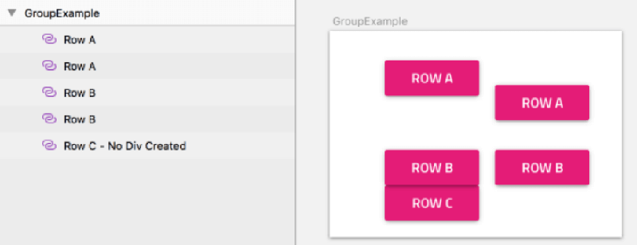

In the below image, two groups (divs) will be dynamically generated, one for the city, state, and zip, and one of the two buttons. Since name is the only child on the row, no div will be created.
Since their parent is the artboard (a parent could also be in a single group as well), when creating the CSS class names for the generated divs, the parent name will be used to derive the CSS class names. Given the below example, the city, state, and zip group CSS name will be “form” and the buttons group will be named “form-1”.

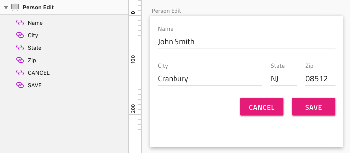

If elements are grouped in a Sketch drawing as below, code generation will apply the same layout group process to each group. In the below image, each element within the group it belongs to has the same or similar Y axis value and will be rendered in the same div. In the end there will be one div for Address and one div for Buttons.

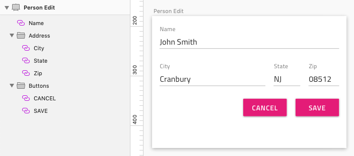

In the below image, the Buttons group has three buttons. Two have the same or similar Y axis values and one is positioned below them. Code generation will create a Buttons div, a div for the CANCEL and SAVE buttons, and will render the DELETE button as a child of the Buttons div.

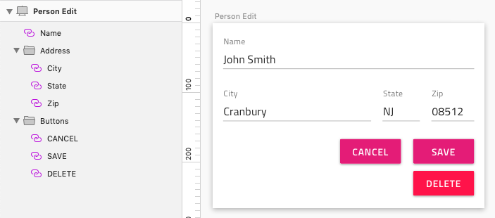

When layout groups are created for an element not in a group, if there is a Group that would be added to the dynamically generated div (row), the generated layout will be incorrect. In the image below, the top Artboard demonstrates the correct grouping to ensure predictable layout. Battleship and Actions are grouped together in the ImageButtons Group.
The bottom Artboard has incorrect grouping because the Battleship element is horizontally aligned with the Actions Group, but they are not grouped together. This rule only applies to elements in line with another Group.

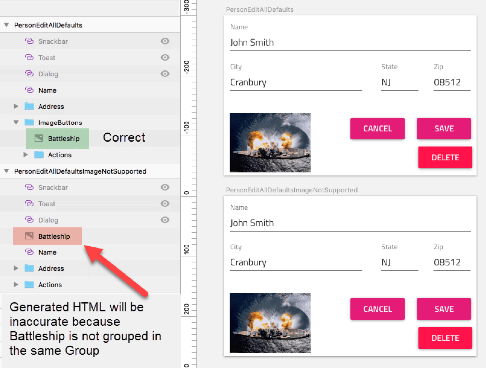

## Generated HTML

Every attempt is made to generate CSS that can be understood and modified.
Code generation creates HTML divs for two independent reasons:

- To group elements in either a column or row for Flexbox layout
- To apply theme CSS to a nested child component

This is the source Sketch drawing that was used to generate the HTML and CSS in the image below this one.

In the below image, the green tinted divs are layout divs, the yellow/green tinted divs are the Ignite UI Theming divs.

| Div Class Name | Purpose                                                                                                                                                                                                                                             |
| -------------- | --------------------------------------------------------------------------------------------------------------------------------------------------------------------------------------------------------------------------------------------------- |
| actions        | This is the first created div. This nested div was dynamically created to layout the Cancel and Save button in a flex row.                                                                                                                          |
| cancel         | Provides Theme CSS for the Cancel button.                                                                                                                                                                                                           |
| save           | Provides Theme CSS for the Save button.                                                                                                                                                                                                             |
| delete         | Provides Theme CSS for the Delete button.                                                                                                                                                                                                           |
| actions-1      | This is the last CSS class name created, hence the “-1” after the name. This div was created because of the Sketch “Actions” group element. This group becomes a parent div for its children and renders them according the above layout procedure. |

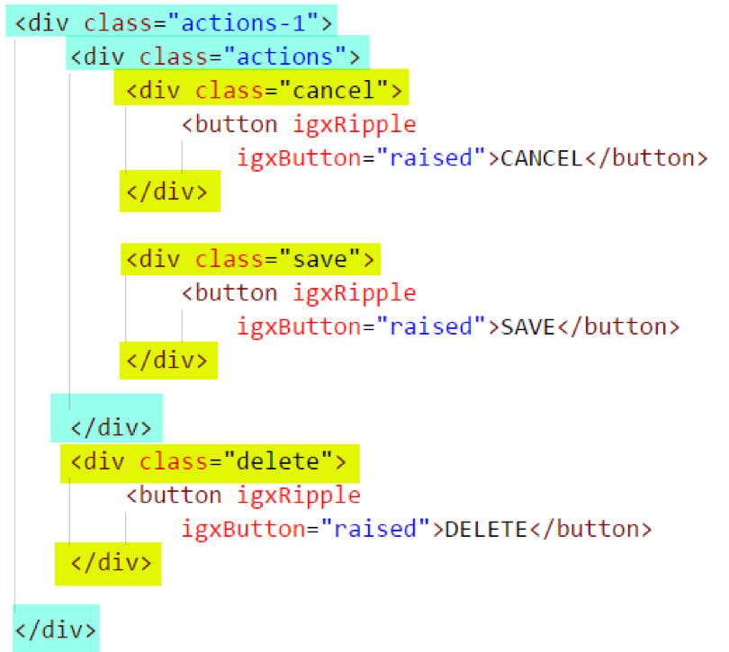

## Group Background Color

Sketch designers like to use rectangles with a fill as backgrounds for groups or artboards. For this Beta release this can easily be accomplished using an Indigo-Styling Color element as shown below. Colors used this way must have a height and width +- 3 of the parent shown below. Note the usage of color elements in the Artboard and Group below to achieve the desired results.
Pinning of the top, left, right, bottom is optional, a background color will be created if the above margin rule is followed.

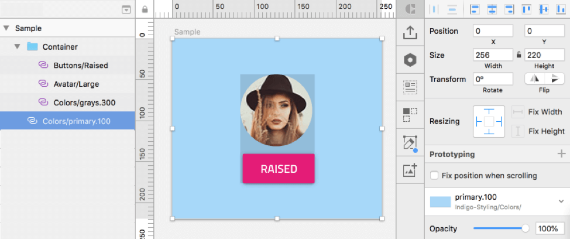

## Height

Sketch Drawing scenarios do not always have a one-to-one layout correspondence between Sketch and HTML/CSS when generating CSS for a layout. Friction between the two is caused by designers needing to fix element heights to prevent Sketch from resizing them when the parent container resizes. So, elements get their heights fixed, but this would not always translate directly to how a web developer would code the CSS as many HTML element default height is normally used and not specifically set.
For code generation, the following controls will always render using the default height provided by the control’s HTML (fixed height will be ignored for code generation), no height CSS is generated for these elements:

- Avatar
- Checkbox
- Circular Progress
- Dialog
- Hyperlink
- Icon
- Inputs
- Linear Progress
- Paragraph
- Radio
- Slider
- Snackbar
- Switch
- Time Picker
- Title
- Toast
- Typography

For code generation, the following controls will render using the default height provided by the control’s HTML unless the height is fixed:

- Badge
- Bottom Nav
- Button
- Button Group
- Calendar
- Card
- Carousel
- Nav Bar
- Nav Drawer
- Paragraph
- Title
- Typography

The Grid height is always set to null in the HTML like this: `[height]="null"` to ensure the grid rows are visible at runtime.
Category Chart height is always fixed to match with height in Sketch. This will be changed in the future to accomodate improvements in Ignite UI for Angular.
Image always uses fixed height from Sketch.
For all other elements, when height is not fixed or the top and bottom are pinned, the height will be set to 100% in CSS.
For all other elements, when height is fixed, the height will be fixed, and the value assigned in CSS.

## Width

When calculating widths for elements there are several Sketch settings that impact this. In addition, when the settings are not set, different elements will have different rules applied to them based on the type of element they are, and if they are a single child in a row, or in a group of children in a row.
In the below table, single child in a row means a single child in a row calculated by the layout engine as in the previous examples.

**General Layout Rules**
**exceptions are explained below this table**

| Sketch Layout Settings                            | Width                                                                                                                                                                                                         |
| ------------------------------------------------- | ------------------------------------------------------------------------------------------------------------------------------------------------------------------------------------------------------------- |
| 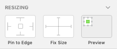 | Known as the “default” state. When an element is a single child in a row, width will be 100%. When the element is in a row with multiple elements, the below proportional width sizing rules will be applied. |
| 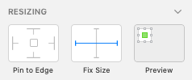 | Width will be fixed.                                                                                                                                                                                          |
| 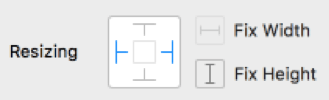 | When an element is a single child in a row, its width will be 100%. When the element is in a row with multiple elements, the below proportional width sizing rules will be applied.                           |

### Sizing Exceptions

The following controls will render using the default width provided by the control’s HTML unless the width is fixed or pinned left and right:

- Badge
- Bottom Nav
- Button
- Button Group
- Calendar
- Card
- Carousel
- Checkbox
- Dialog
- Hyperlink
- Linear Progress
- Nav Bar
- Nav Drawer
- Paragraph
- Radio
- Slider
- Switch
- Time Picker
- Title
- Typography

The following controls will always render using the default width provided by the control’s HTML, irrespective of any Sketch sizing or pinning:

- Avatar
- Circular Progress
- Icon
- Toast

Snackbar is always rendered with a width of 100%.
Category Chart width is always fixed to match with width in Sketch. This will be changed in the future to accomodate improvements in Ignite UI for Angular.
Image always uses fixed width from Sketch.
The Grid is always rendered with a fixed width equal to the sum of the column widths.

### Fixed Sizing

For elements except for the above exceptions, when width is fixed, the width will be fixed.

### Pinned Left and Right Sizing

For elements except for the above exceptions, when pinned left and right width will be 100%.

### Proportional Width Sizing

For elements except for the above exceptions, proportional width sizing applies to the element when the width is not fixed.
If the element is the only element in the row, it will be sized width 100%.
If the row the element is in has a fixed width, the element will be sized using a fixed width.
For this Beta, all proportional width values will be 100% and the developer can make necessary adjustments.

## Group Width

When a Sketch group has a fixed width, that width value will be applied, otherwise no width value will be assigned in CSS.

## Alignment

### Centering

The below centering logic only applies to a Sketch Group and no other elements. Further, the Group must be a child of the Artboard or Group that was selected for code generation.  
All groups that are set up to center must have content. Content could be another group or any other element, _except a background color, because it does not count as an element_.
In the below image you can see the selected group, “Inner No Children” only has a Color element _set up as the background_, so this group will not render. However, if that same Color element was not set up as the background color, it would render the color in the centered group it belongs to.

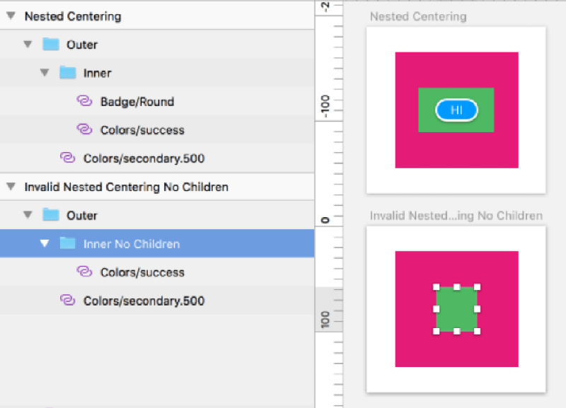

> [!Note]
> If a Group was selected as the component for code generation and has fixed height or width, the below centering logic does not apply because centering is performed by the parent in layout.

### Vertical

If an element has a fixed height, top/bottom margins are equal (+-3px), and element is not pinned to the top or bottom, center element vertically in parent.

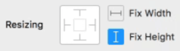

### Horizontal

If an element has a fixed width, left/right margins are equal (+-3px), and element is not pinned to the left or right, center object horizontally in parent.

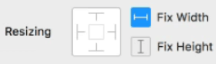

### Both

If an element has fixed height and width, top/bottom and left/right distances are equal (+-3px), and nothing is pinned left or right, top or bottom, center object in parent.

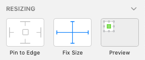

### Pinning Overlapping Objects

When an element that is pinned only top-left, or top-right, or bottom-left, or bottom-right and overlaps another element (except a Color element), the below absolute positioning will be generated.
If this absolute positioning is enforced, no other pinning or alignment rules are used.
In the below image we can see that in both groups, the badge overlaps the avatar and the badge is pinned bottom-right, so this element will be positioned using absolute positioning from its parent group.
In the second example, a third element (button) has been added to the group. The button will be positioned using other positioning rules and is not part of the absolute positioning of the badge. While this second scenario is supported, it is recommended that the elements that require overlapping absolute positioning are the only ones in the group.

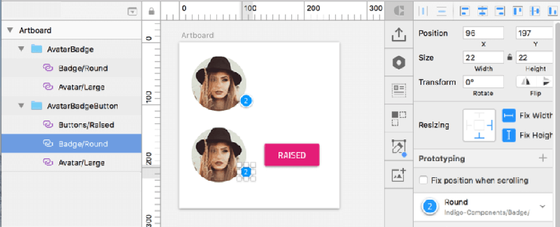

### Aligning or Pinning Right

When a single element in a group of elements is pinned right, that element will be aligned to the right by adding `margin-left: auto;` to the element's CSS, which causes it to be aligned and pinned to the right of its parent.
When more than one element needs to be pinned to the right, create a Sketch Group for these elements, and pin the Group to the right.

### Aligning or Pinning Bottom

When a single element in a group of elements is pinned bottom, that element will be aligned to the bottom by adding `margin-top: auto;` to the element's CSS, which causes it to be aligned and pinned to the bottom of its parent.  
Pinning an element to the bottom should only be used when you need to an element to have HTML bottom pinning runtime behavior, otherwise, do not pin and allow the top margin to position the element.
When more than one element needs to be pinned to the bottom, create a Sketch Group for these elements, and pin the Group to the bottom.  
In order to get the best predictable code generation, it is recommended to only pin groups and not individual elements.

### Pinning to a Corner

If an element is pinned top-left, no pinning will be performed since HTML already accounts for this.
If an element is pinned top-right only the right alignment will be added to the CSS.
If an element is pinned bottom-left only the bottom alignment will be added to the CSS.
If an element is pinned bottom-right both bottom and right alignment will be added to the CSS.

### Row Items Vertical Alignment

Child elements will be positioned vertically using top margins to adjust the distance of the element from the top edge of the parent unless the child is pinned to the bottom or is absolute positioned.

### Row Items Horizontal Alignment

Child elements will be positioned horizontally using left margins to adjust the distance of the element from the left edge of the parent unless the item is pinned right or is absolute positioned.

## Margins

Any margin value that is equal to or less than 3px, will be ignored. This accounts for Sketch drawings where element positioning is not perfect.
Left margin is added to position the element to the left of its parent or the element to its left.
Top margin is added to position the element down from its parent or the element above it.
Right margin is added when an element is pinned right to position the element to the right of its parent or element to the right.
Bottom margin is added when an element is pinned bottom to position the element above the bottom of its parent or element below it.

## Dialog, Toast, Snackbar

The Dialog, Toast, and Snackbar all have one thing in common, they are all shown in the UI dynamically using some form of TypeScript.
Since these are not normally shown until programmatically shown in the UI, they would not normally be shown in the Sketch drawing unless the designer was showing the Artboard in a state where one of these would be displayed.
To solve the disconnect between designer’s requirements to show the Artboard in several states, and the developer only code generating the component once, the following guidance should be followed.
Add the required Dialog, Toast, and Snackbar to the drawing, configure them as you would any other element, then hide them as below. This form would be the one the developer would select to code generate.
The hiding of element in the object panel has no effect on code generation, code generation will generate all elements here, hidden or not.
Dialog, Toast, and Snackbar elements will be placed at the bottom of the components HTML and not mixed in with other elements as they have dynamic runtime placement when brought into view.

The below image is an example of a designer state drawing, this drawing should not be used for code generation as it has an extra color element to simulate the gray overlay that the Dialog would place at runtime.

## Limitations

For the Beta release of Code Generation, native Sketch objects such as text, vector, mask, pencil, shape, etc. are bypassed and not generated. This includes the new Text Styles feature of Sketch 5.1, these elements will be bypassed and not generated.
All text that needs to be generated using this Beta needs to use the Typography symbols from the Indigo-Styling library.
Designers should use elements from the Indigo-Components and Indigo-Styling libraries only.
From Indigo-Styling only the Color and Typography element added to an Artboard are supported. The others are ignored for this Beta.
Sketch Image is supported. The image will be rendered with a fixed height and width of the image in Sketch. Note, if the image width extends past the viewable artboard, code generation will not clip the image. If the Image needs to be pinned or centered, wrap the Image in a Sketch Group and perform the pinning and centering there.
For this Beta release of code generation and Indigo.Design UI Kit, text elements do not always have a pixel perfect vertical alignment. This is limitation that we hope to resolve in the future. Developers will need to examine the generated component at runtime and make a slight CSS margin-top adjustment.

On a rare occasion Sketch allows child elements to extend past the parent Group bounding box. If an error is returned stating that a margin was negative, have the designer perform the following to correct:

1.  Remove all fixed heights and widths from the Group and children
2.  Remove all pinning from the Group and children
3.  Select the elements to Group and Group them
4.  Reapply fixed sizes and pinned edges

## Additional Resources

External Links:

- [Flexbox](https://css-tricks.com/snippets/css/a-guide-to-flexbox/)
- [Ignite UI for Angular](https://www.infragistics.com/products/ignite-ui-angular)

Our community is active and always welcoming to new ideas.

