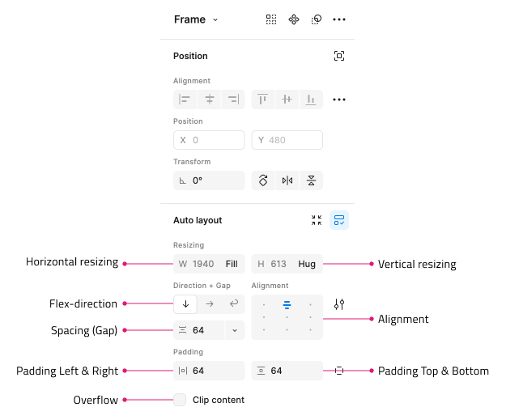
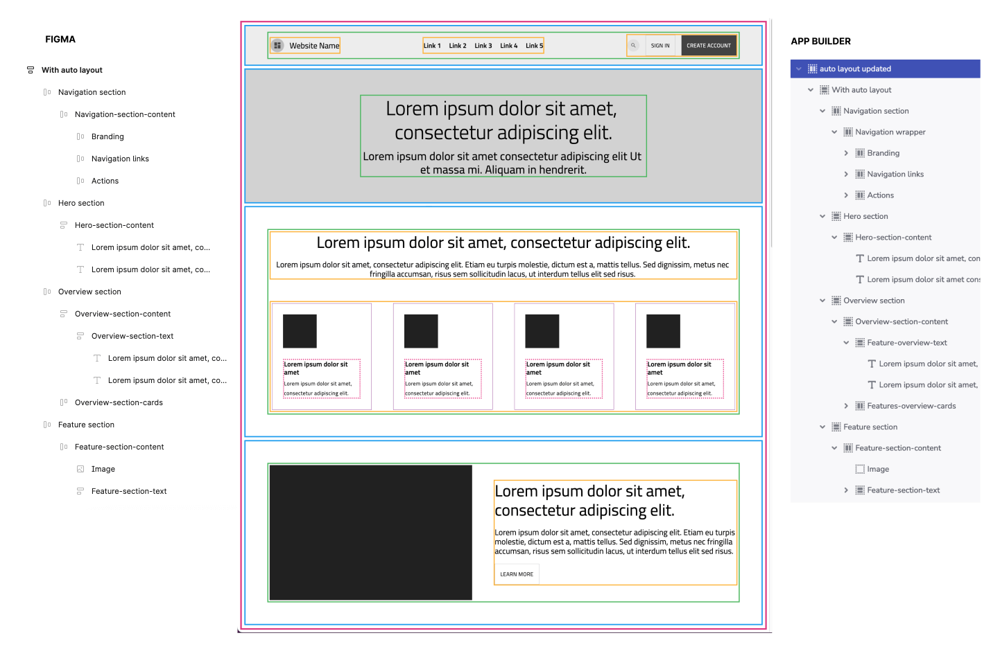

## Introduction to Figma Parser

The main goal for the Figma parser is to bridge the gap between the Figma design tool and the App Builder. By using the needed heuristics the parsers would try to read what the user would like the app to look like and provide a meaningful representation of how a web developer would try to structure and configure it so it can later be used by the Code Gen to create the actual app and how its code would look like.

## Figma Auto-Layout to common model Flex layout

If a designer uses Auto-Layout in Figma to create a design, the parser will utilize this and consider that to build the layout of the app. If Auto-Layout is not used, the parser will default to absolute layout.

The Figma Auto-Layout is an implementation of Flexbox layouts inside of Figma. While it's exposed in a slightly different way to designers, the intent is to bridge designed-layouts with Web-Layouts.

### Prerequsites

- Designer enables Auto-Layout when creating designs in Figma, starting with setting the whole Frame as Auto-Layout.
- Makes use of nested Frames, also with Auto-Layout enabled within each Frame.

## Figma Auto-Layout and App Builder

Auto-Layouts are considered to be flex containers, with the appropriate properties. They represent DIV elements with direction, alignment and spacing between the items. All items inside an Auto-Layout are treated as flex items, and should generate the appropriate flex/CSS properties.

- Direction: Defines if stacking of child Layers is Horizontal or Vertical
- Alignment: Can be Top/Top-center/Top-right/Center-left/Center-center/Center-right/Bottom-left/Bottom-center/Bottom-right; Packed/Space-between
- Spacing (Gap): vertical or horizontal spacing based on direction. Defines the spacing between each child Layer
- Padding: top & bottom, left & right, custom
- Overflow: Clipped (boolean), essential Overflow hidden vs. visible
- Vertical and horizontal resizing for child items: Hug vs. Fill vs. Fixed

### Mapping properties to App Builder

The following example design shows how the frames can be mapped to layouts in app builder.

## Additional Resources

Related topics:

- [Creating a Frame in Figma](../creating-a-frame-in-figma.md)
- [Figma Plugin](../plugins/figma-plugin.md)
- [Responsive layouts in Figma](../best-layout-practices-figma.md)
- [Video Tutorials](../video-tutorials.md)
- [Quick Tips](../quick-tips.md)

External Links:

- [Ignite UI for Angular](https://www.infragistics.com/products/ignite-ui-angular)
- [App Builder Overview](https://www.appbuilder.dev/help/app-builder-overview)
- [Design to Code story](https://www.appbuilder.dev/help/ui-kits/figma)
- [Responsive Fluid Layouts](https://www.appbuilder.dev/help/how-to/responsive-fluid-layout)
- [Flex Layouts](https://www.appbuilder.dev/help/flex-layouts/flex-layouts)

Our community is active and always welcoming to new ideas.

