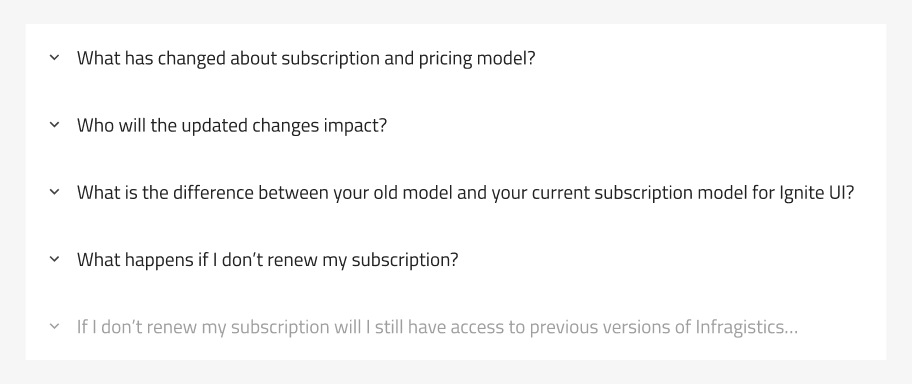
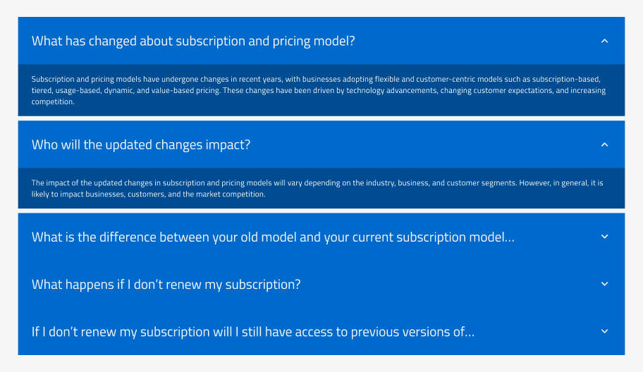
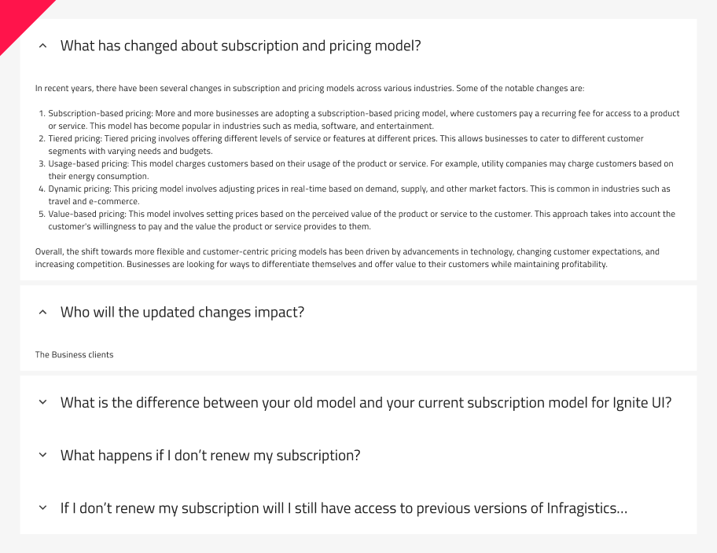

## Accordion

The Accordion component allows users to reveal content in a vertical stack progressively. It typically consists of a list of [Expansion Panels](expansion-panel.md), where each item can be expanded or collapsed to reveal or hide its content. Accordions are often used to manage a large amount of information in a compact space and to allow users to focus on specific pieces of information selectively. The Accordion is visually identical to the [Ignite UI for Angular Accordion Component](https://www.infragistics.com/products/ignite-ui-angular/angular/components/accordion)

## Accordion Demo

## Using the Accordion in Figma and Sketch

The Accordion comes with 5 panels. Each panel consists of top and bottom margins, which can be turned on/off with the boolean operations. By going into the nested Expansiоn Panels, you can modify their contents. If you need to design an Accordion with more Expansion Panels, the easiest way to do it is by detaching the component. To detach the component, you need to place it in your workspace (Frame or Artboard). Right-clicking on it will open a contextual menu where `Detach Instance` (`Detach from Symbol` in Sketch) should be selected.

After detaching the component, you will be able to add your additional Expansion Panels by duplicating any of the existing ones. In Figma, the size will be adjusted automatically thanks to the Auto Layout. In Sketch, you should manually adjust the additionally added Expansion Panels' position.

## Using the Accordion in Adobe XD

> [!NOTE]
> WIP: Currently, we don't support the Accordion component in Adobe XD, but you can also combine multiple `Expansion Panels` into a similar Accordion component behavior. However, this will not generate appropriately in the App Builder.

## Interaction States

The Accordion doesn't have interaction states, but its panels have `Disabled` and `Expanded,` which can be toggled on and off for the selected Expansion Panel. Check [Expansion Panels](expansion-panel.md)

In Figma, the `Expanded` property gives you the ability to configure the states of the panel as per your requirement. Additionally, based on the panel hierarchy in the Layers panel and which panel is expanded, you can activate the top and bottom margins from boolean properties, adding more space to your designs. In Sketch, there is a predefined symbol, `Single Branch Expanded,` covering the expanded state of the panel and its margins.

## Styling

The Accordion component offers styling flexibility, with various options for customization. You can choose the colors of both the Header's and Body's background, as well as the text color and weight. Additionally, you can customize the icon color and type.

## Usage

If you are using an accordion to chunk information, only put non-essential information inside. For example, on a product page, you wouldn’t put the price or brand name inside an accordion. You would, however, put the sizing guide, delivery questions, and product materials inside one.

Additionally, avoid using accordions for small amounts of content that can be easily displayed on a single page or screen, and also refrain from overloading users with too many accordion sections or too much content within each section.

| Do                                                                             | Don't                                                                              |
| ------------------------------------------------------------------------------ | ---------------------------------------------------------------------------------- |
|  |  |

## Additional Resources

Related topics:

- [Expansion Panel](expansion-panel.md)
- [Icon](icon.md)

Our community is active and always welcoming to new ideas.