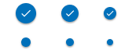
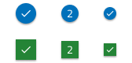
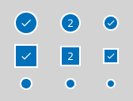

# Badge

Use the Badge Component to draw attention to another interface element or to display a notification. It enhances the component to which it is attached with additional information, disclosed to the user upon interacting with it. The Badge is visually identical to the [Ignite UI for Angular Badge Component](https://www.infragistics.com/products/ignite-ui-angular/angular/components/badge.html)

## Badge Demo

## Type 

The Badge can carry different types of content such as a number or an icon. Additionally, a dot type badge variant is available for use. The dot type badge is usually used in user interfaces to draw attention and to indicate a status or a notification.

## Size 

The Badge comes in three different sizes:

- Large
- Medium
- Small

## Shape 

The Badge component is available in two shapes: rounded and square.

## Outlined Variants 

Outlined variants are available for all badge types and shapes and can be enabled using the `Outlined` boolean property in the properties panel.

## States

The Badge can be used in one of the following preset color combinations to draw attention: **Primary**, Info, Success, Warn, and Error.

## Styling

The Badge provides extensive styling flexibility, allowing customization of the background, icon and its color, as well as the text, its color, and style where applicable. Since all badge types and shapes also support outlined variants, users can further refine the appearance by adjusting the border colors.

## Usage

Use the Badge to "stamp" another piece of UI, such as an Avatar or a text title and avoid using the Badge on its own.

| Do                                                                           | Don't                                                                            |
| ---------------------------------------------------------------------------- | -------------------------------------------------------------------------------- |
|  |  |

## Additional Resources

Related topics:

- [Avatar + Badge](../patterns/avatar-badge.md)
  

Our community is active and always welcoming to new ideas.
