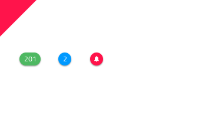

# Badge

Use the Badge Component Symbol to draw attention to another interface element or to display a notification. It enhances the component to which it is attached with additional information, disclosed to the user upon interacting with it. The Badge is visually identical to the [Ignite UI for Angular Badge Component](https://www.infragistics.com/products/ignite-ui-angular/angular/components/badge.html)

## Badge Demo

## Type

The Badge can carry different types of content such as a number or an icon.

## Styling

The Badge comes with styling flexibility through the various overrides controlling the background and border colors, the icon with its color, and the text with its style where applicable, as well as the presence of a shadow that is cast on the underlying interface element.

## Usage

Use the Badge to "stamp" another piece of UI, such as an Avatar or a text title and avoid using the Badge on its own.

| Do                                                                           | Don't                                                                            |
| ---------------------------------------------------------------------------- | -------------------------------------------------------------------------------- |
|  |  |

## Additional Resources

Related topics:

- [Avatar + Badge](../patterns/avatar-badge.md)
  

Our community is active and always welcoming to new ideas.

