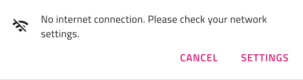
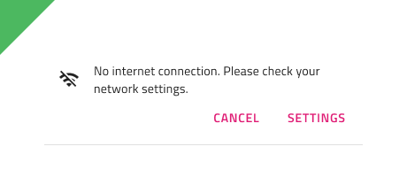
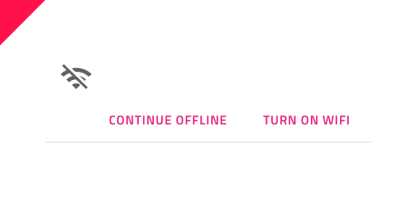

# Banner

Use the Banner Component to display a prominent message and optionally actions related to it. The Banner is visually identical to the [Ignite UI for Angular Banner Component](https://www.infragistics.com/products/ignite-ui-angular/angular/components/banner)

## Banner Demo

## Message

The Banner's Message consists of an Icon and a Text field. It uses a smart layout on Sketch and a Stack on Adobe XD, allowing it to hide one or the other when set to ~No Symbol for Sketch users, and hiding the layer's visibility on Adobe XD.

## Actions

The Actions consist of two Button components. If you need you can turn one or both off by setting them to ~No Symbol for Sketch or turning off the layer's visibility in Adobe XD.

## Styling

The Banner has styling flexibility with the many options for the background, border, icon, and button symbols, their background options, as well as text color.

## Usage

Don’t combine buttons with different emphasis, which would promote one action over the other. Illustrations are used to support the message. Don't use them without a descriptive text to promote the action.

| Do                                                                             | Don't                                                                              |
| ------------------------------------------------------------------------------ | ---------------------------------------------------------------------------------- |
|  |  |

## Additional Resources

Related topics:

- [Button](button.md)
- [Icon](icon.md)
  

Our community is active and always welcoming to new ideas.
