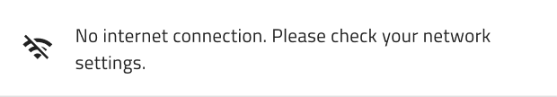
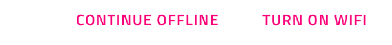
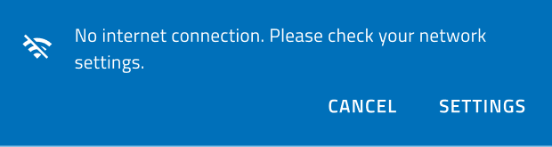
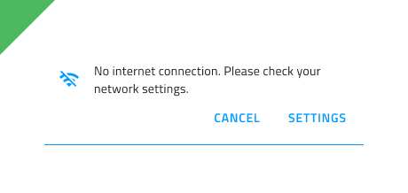
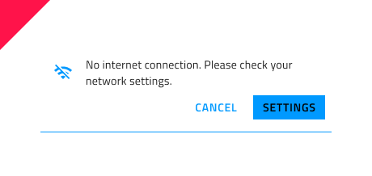

# Banner

Use the Banner Component to display a prominent message and optionally actions related to it. The Banner is visually identical to the [Ignite UI for Angular Banner Component](https://www.infragistics.com/products/ignite-ui-angular/angular/components/banner)

## Banner Demo

## Message

The Banner's Message consists of an Icon and a Text field. It uses a smart layout in Sketch to let you hide the Icon by setting it to ~No Symbol, and a Stack in Adobe XD that takes care of the layout automatically as you add or delete components. In Figma, you can use the "Icon" boolean operation from the properties panel to show/hide the Icon.

## Actions

The Actions area contains two Button components by default. If you only need one or want to remove both of them, set them to ~No Symbol in Sketch and the smart layout will adjust everything. In Adobe XD you can achieve the same by deleting the unnecessary button layers and rely on the Stack applied to adjust the interface, but on top of that you can even add more actions or use different components by dragging them into the Actions area from the Libraries panel. In Figma, to manage the actions displayed in the Banner, you can choose which one to keep and hide the other from the layers panel or hide the entire actions container using the "Actions" boolean operation.

## Styling

The Banner has styling flexibility with options for text, background and border colors, icon glyph and color, as well as the types of buttons with their styling options.

## Usage

Illustrations are used to support the message. Don't use them without a descriptive text to promote the action. Don’t combine buttons with different emphasis, which would promote one action over the other. 

| Do                                                                             | Don't                                                                              |
| ------------------------------------------------------------------------------ | ---------------------------------------------------------------------------------- |
|  |  | 
|  | |

## Additional Resources

Related topics:

- [Button](button.md)
- [Icon](icon.md)
  

Our community is active and always welcoming to new ideas.
