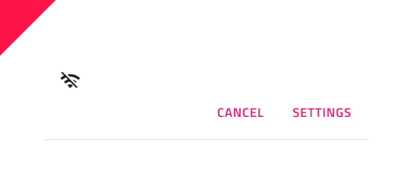

# Banner

Use the Banner Component to display a prominent message and optionally actions related to it. The Banner is visually identical to the [Ignite UI for Angular Banner Component](https://www.infragistics.com/products/ignite-ui-angular/angular/components/banner)

## Banner Demo

## Message

The Banner...

## Actions

The Banner...

## Styling

The Banner...

## Usage

When using a Banner...

| Do                                                                             | Don't                                                                              |
| ------------------------------------------------------------------------------ | ---------------------------------------------------------------------------------- |
|  |  |

## Additional Resources

Related topics:

- [Button](button.md)
- [Icon](icon.md)
  

Our community is active and always welcoming to new ideas.

