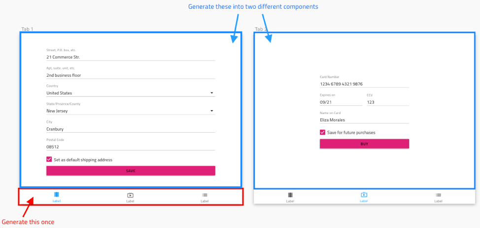

## Bottom Navigation

Use the Bottom Navigation Component to implement application-level navigation by placing it at the bottom of the screen with up to five items that allow browsing between their associated views. The Bottom Navigation is visually identical to the [Ignite UI for Angular Bottom Navigation Component](https://www.infragistics.com/products/ignite-ui-angular/angular/components/tabbar.html)

### Bottom Navigation Demo


### Items Amount

The Bottom Navigation supports between two to five items. If you need to design application-level navigation with more than five items or views, consider using consider using the [Navigation Drawer](nav-drawer.md) instead.


### Item Style

The Bottom Navigation item contains either a combination of **icon+text** or just an icon. There is always one item in active (selected) state, and the remaining items must be set to inactive.


### Styling

The Bottom Navigation comes with styling flexibility through the various overrides controling the background color, as well as the item label and icon colors.


## Usage

The Bottom Navigation always appears on top of other content, and the shadow it casts is a crucial visual element. Make sure that you always place its layer over those representing the screen content and under no circumstances should you remove the shadow it casts.

| Do                                                                                     | Don't                                                                                      |
| -------------------------------------------------------------------------------------- | ------------------------------------------------------------------------------------------ |
|  |  |
|  |  |

## Code generation

Due to the limitations of Sketch there is no way to associate content with specific tabs in the Bottom Navigation component. Therefore, it is not a good idea to generate an entire Artboard that has a Bottom Navigation component in it. Instead you should generate the Bottom Navigation component by itself and then generate the desired tab content separately into different Angular components. Once your tab content is in separate Angular components you can come back to the Bottom Navigation component and manually reference the generated tab content within each tab.



> [!WARNING]
> Triggering `Detach from Symbol` on an instance of the Bottom Navigation in your design is very likely to result in loss of code generation capability for the Bottom Navigation.

```html
<igx-bottom-nav>
    <igx-tab-panel>
        <!-- Manually add this component reference -->
        <app-tab1></app-tab1>
    </igx-tab-panel>
    <igx-tab-panel>
        <!-- Manually add this component reference -->
        <app-tab2></app-tab2>
    </igx-tab-panel>
</igx-bottom-nav>
```

> [!Note]
> Tab content is not rendered with “height: 100%” so it will not fill the entire page. It will only use the space required by the content.

This section describes some important overrides and how they affect code generation.

### Event

When supplied the `🕹️Event` override is used to create a method in the component TypeScript and add an `onClick` signature in the HTML. When supplied the `🕹️Event` must be specified using the curly braces format: `{onEventName}`.

### Items Amount

This override determines the number of tabs/items to be displayed.

### Tab

This override will determined the type of tab that will be generated. It can be an icon or an icon with text.

### Text

This override is only shown for Icon + Text tabs. It specifies what text is shown within the tab. It may contain plain text, [binding text](../codegen/data-binding.md), or a combination of the two.

- Settings
- {settingsLabel}
- Important {labelText}

## Additional Resources

Related topics:

- [Navigation Drawer](nav-drawer.md)
- [Data Binding](../codegen/data-binding.md)
  <div class="divider--half"></div>

Our community is active and always welcoming to new ideas.

- [Indigo Design **GitHub**](https://github.com/IgniteUI/design-system-docfx)
