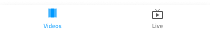
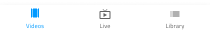
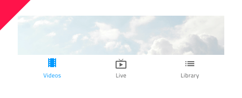

## Bottom Navigation

Use the Bottom Navigation Component to implement application-level navigation by placing it at the bottom of the screen with up to five items that allow browsing between their associated views. The Bottom Navigation is visually identical to the [Ignite UI for Angular Bottom Navigation Component](https://www.infragistics.com/products/ignite-ui-angular/angular/components/tabbar.html)

### Bottom Navigation Demo


### Items Amount

The Bottom Navigation supports between two to five items. If you need to design application-level navigation with more than five items or views, consider using consider using the [Navigation Drawer](nav-drawer.md) instead.





### Item Style

The Bottom Navigation item contains either a combination of **icon+text** or just an icon. There is always one item in active (selected) state, and the remaining items must be set to inactive.


### Styling

The Bottom Navigation comes with styling flexibility through the various overrides controling the background color, as well as the item label and icon colors.


## Usage

The Bottom Navigation always appears on top of other content, and the shadow it casts is a crucial visual element. Make sure that you always place its layer over those representing the screen content and under no circumstances should you remove the shadow it casts.

| Do                                                                                     | Don't                                                                                      |
| -------------------------------------------------------------------------------------- | ------------------------------------------------------------------------------------------ |
|  |  |
|  |  |

## Code generation

When colors or fonts are specified for the Bottom Navigation, the Bottom Nav HTML element will be wrapped in a div. This is required by browsers to style a nested component (a component within another component).

> [!WARNING]
> Triggering `Detach from Symbol` on an instance of the Bottom Navigation in your design is very likely to result in loss of code generation capability for the Bottom Navigation.

### Data Bindings

Data bindings are specified by using curly brace syntax, example: {isAdmin}. Text fields (not `🕹️DataProperty` or `🕹️DataSource`) also support string interpolation syntax example: Admin: {isAdmin}. Data bindings can be non-nested or nested. If the target property is a nested property, include the nested property chain, but don’t include the model object name. Examples:

#### Not Nested

```typescript
Customer {
  imageName: String;
}
```

DataProperty would be: `{imageName}`

#### Nested

```typescript
Profile {
  imageName: String;
}

Customer {
  profile: Profile;
}
```

DataProperty would be: `{profile.imageName}`

### Event Property

When supplied the `🕹️Event` property is used to create a method in the component TypeScript and add an `onTabSelected` signature in the HTML.

### Items Amount

This property determines the number of tabs/items to be displayed.

### Tab

This property will determine the type of tab that will be generated. It can be an icon or an icon with text.

### Text

This property is only shown for Icon + Text tabs. It specifies what text is shown within the tab. It may contain plain text, binding text, or a combination of the two, examples:

- Settings
- {settingsLabel}
- Important {labelText}

## Additional Resources

Related topics:

- [Navigation Drawer](nav-drawer.md)
  <div class="divider--half"></div>

Our community is active and always welcoming to new ideas.

- [Indigo Design **GitHub**](https://github.com/IgniteUI/design-system-docfx)
