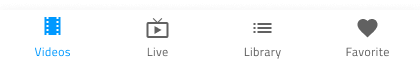

# Bottom Navigation

Use the Bottom Navigation Component to implement application-level navigation by placing it at the bottom of the screen with up to five items that allow browsing between their associated views. The Bottom Navigation is visually identical to the [Ignite UI for Angular Bottom Navigation Component](https://www.infragistics.com/products/ignite-ui-angular/angular/components/tabbar.html)

## Bottom Navigation Demo

## Items Amount

In Figma, the Bottom Navigation uses auto layout allowing it to adjust accordingly when one or more of its items are hidden from the layers panel. In Sketch, the Bottom Navigation uses a smart layout allowing it to adjust accordingly when one or more of its items are set to ~No Symbol. In Adobe XD, you can delete the unused items and the layout will adjust through the use of Stacks.  Bear in mind that the maximum number of items is limited to 5 and if you need to design application-level navigation with more items or views, consider using the [Navigation Drawer](nav-drawer.md) instead.

## Item State

The Bottom Navigation consists of items that support **Active**, Inactive and Disabled states. In Figma, these items are nested .Base components inside the main Bottom Navigation component. To make changes, you have to select one or more items and modify their State through the Properties panel. In Sketch this is achieved with `Symbol Overrides`, while in Adobe XD we are using the `Component States` paradigm to let you easily switch between states. In a Bottom Navigation there is always one Active item, and an arbitrary number of Inactive and Disabled ones.

## Item Content Template

The Bottom Navigation items come as a combination of icon and text by default. In Figma, you can switch on/off the label using the boolean operation from the properties panel, once one or multiple items are selected. In Sketch, the smart layout rules applied to the item content template lets you remove the text label and have an icon-only item when you set the label to ~No Symbol. In Adobe XD, the content is in a Stack and you can achieve the same by deleting the label layer when it is not needed. 

## Styling

The Bottom Navigation comes with styling flexibility through the various options for the background color, as well as the item label and icon colors.

## Usage

The Bottom Navigation always appears on top of other content, and the shadow it casts is a crucial visual element. Make sure that you always place its layer over those representing the screen content and under no circumstances should you remove the shadow it casts.

| Do                                                                                     | Don't                                                                                      |
| -------------------------------------------------------------------------------------- | ------------------------------------------------------------------------------------------ |
|  |  |
|  |  |

## Additional Resources

Related topics:

- [Navigation Drawer](nav-drawer.md)
  

Our community is active and always welcoming to new ideas.
