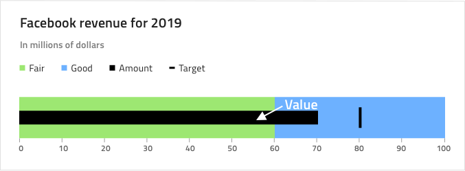

## Bullet Graph

Use the Bullet Graph Component as a data visualization that displays the progress of a value to a target value, within context depicted by color-coded ranges underneath. The Bullet Graph is visually identical to the [Ignite UI for Angular Bullet Graph Component](https://www.infragistics.com/products/ignite-ui-angular/angular/components/bulletgraph.html)

For scenarios where no target value exists or is irrelevant you should use the [Linear Gauge](linear-gauge.md) instead.

### Bullet Graph Demo

### Ranges Amount

The Bullet Graph comes with three preset range configurations: two, **three**, and four ranges.

### Styling

The Bullet Graph comes with styling flexibility through the various overrides controlling the background color and a range of brushes including: Value Brush, Target Value Brush, Tick Brush, Minor Tick Brush, and a collection of Range Brushes.

## Usage

When creating data visualizations and information dashboards pick carefully between Bullet Graph and Linear Gauge depending on whether your scenario has a target value or not. Keep in mind that both Graphs and Gauges only show the current value and have no way to display historical values, if your application scenario requires such display, you should consider using the [Category Chart](chart-category.md). To create an easy to the eye and crisp data visualization pick colors for the Value and Target Value Brushes that have good contrast with the ranges and background underneath, avoid using variants of the same color as this makes the visualization hard to read and interpret.

| Do                                                                                       | Don't                                                                                        |
| ---------------------------------------------------------------------------------------- | -------------------------------------------------------------------------------------------- |
|  |  |

## Code Generation

This section describes some important overrides and how they affect code generation.

> [!WARNING]
> Triggering `Detach from Symbol` on an instance of the Bullet Graph in your design is very likely to result in loss of code generation capability for the Bullet Graph.

### Minimum Value

This override controls the minimum value displayed by the Bullet Graph. It supports [data binding](../codegen/data-binding.md) as well as direct setting of a number. If a binding is used the bound property must result in a number at runtime. If no binding is used the value must be a number. If the value provided is not in the correct format the Bullet Gauge will be generated without a minimum value set and the control default will be used.

Binding:

No binding:

### Maximum Value

This override controls the maximum value displayed by the Bullet Graph. It supports [data binding](../codegen/data-binding.md) as well as direct setting of a number. If a binding is used the bound property must result in a number at runtime. If no binding is used the value must be a number. If the value provided is not in the correct format the Bullet Graph will be generated without a maximum value set and the control default will be used.

Binding:

No binding:

### Ranges Amount

This override controls how many ranges are displayed within the Bullet Graph. During code generation it will create `<igx-linear-graph-range>` elements which are what represents a single range. This range element has `startValue`, `endValue` and `brush` properties which are used to define where the range starts and ends and what color it is. These are all automatically generated for you such that regardless of what the Minimum Value and Maximum Value overrides are set to you will always get the same appearance as what is displayed in the Sketch.

You may not want the ranges to use the auto-generated start and end values, however, in that case you will need to manually update the ranges in the generated HTML.

### ValueDataProperty

This override controls the current value of the Bullet Graph.

It only supports [data binding](../codegen/data-binding.md) so provided values must be in the correct format.

The bound property **must** result in a number at runtime.

### TargetValueDataProperty

This override controls the target value of the Bullet Graph.

It only supports [data binding](../codegen/data-binding.md) so provided values must be in the correct format.

The bound property **must** result in a number at runtime.

## Additional Resources

Related topics:

- [Linear Gauge](linear-gauge.md)
- [Category Chart](chart-category.md)
- [Data Binding](../codegen/data-binding.md)
  

Our community is active and always welcoming to new ideas.

