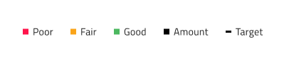
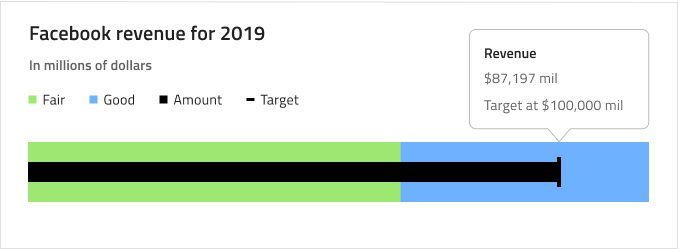
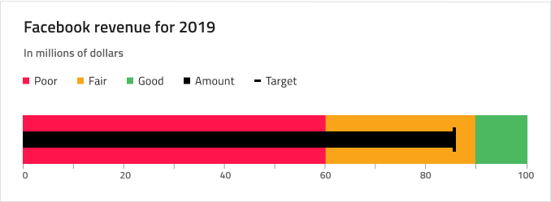
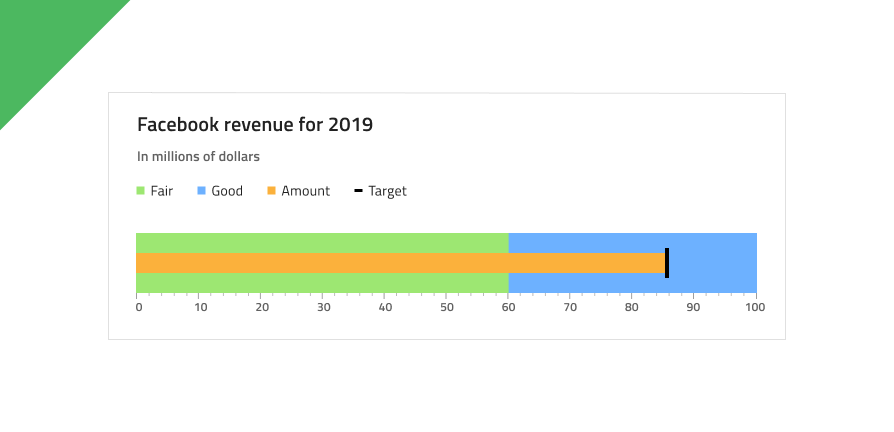

# Bullet Graph

Use the Bullet Graph Component as a data visualization that displays the progress of a value to a target value, within context depicted by color-coded ranges underneath. The Bullet Graph is visually identical to the [Ignite UI for Angular Bullet Graph Component](https://www.infragistics.com/products/ignite-ui-angular/angular/components/bulletgraph.html)

For scenarios where no target value exists or is irrelevant you should use the [Linear Gauge](linear-gauge.md) instead.

## Bullet Graph Demo

## Title and Subtitle

The Bullet Graph has a Title and Subtitle whose text can be changed. In Sketch, they can also be hidden if they are not needed by setting them to ~No Symbol, while in Adobe XD you should delete their respective layers.

## Legend

The Bullet Graph comes with a Legend that can be adjusted accordingly to match the selected Series Amount. In Sketch, Legend items can be removed by setting the corresponding Series to ~No Symbol or added by finding it in the Overrides/Charts/Legend/Serie. In Adobe XD, you have to delete the unused layers instead, and the layout will adjust through the use of stacks. Also, you can change the icon type between Square, Line, or Circle.

## Tooltip

The Bullet Graph comes with a tooltip that may be hidden by setting the override to ~No Symbol in Sketch, while in Adobe XD you have to delete the unused layer instead.

## Ranges Amount

The Bullet Graph comes with three preset range configurations: **two**, three, and four ranges.

## Ticks and Values

Ticks and Values are also configurable. The two types of ticks: Ticks and Minor Ticks can be hidden by setting their color to `Transparent`. The default Values 0,10,20 etc. up to 100 can be adjusted according to one's needs.

## Styling

The Bullet Graph comes with styling flexibility through the various overrides controlling a selection of brushes including Value Brush, Target Value Brush, Tick Brush, Minor Tick Brush, and a collection of Range Brushes.

## Usage

When creating data visualizations and information dashboards pick carefully between Bullet Graph and Linear Gauge depending on whether your scenario has a target value or not. Keep in mind that both Graphs and Gauges only show the current value and have no way to display historical values, if your application scenario requires such display, you should consider using the Line or Column charts. To create an easy on the eye and crisp data visualization pick colors for the Value and Target Value Brushes that have good contrast with the ranges and background underneath, avoid using variants of the same color as this makes the visualization hard to read and interpret.

| Do                                                                                 | Don't                                                                                  |
| ---------------------------------------------------------------------------------- | -------------------------------------------------------------------------------------- |
|  |  |

## Additional Resources

Related topics:

- [Linear Gauge](linear-gauge.md)
- [Line Chart](line-chart.md)
- [Column Chart](column-chart.md)
  

Our community is active and always welcoming to new ideas.
