# Button Group

Use the Button Group Component to combine the triggers for a few related features into one interface element. The Button Group is visually identical to the [Ignite UI for Angular Button Group Component](https://www.infragistics.com/products/ignite-ui-angular/angular/components/button-group.html)

## Button Group Demo

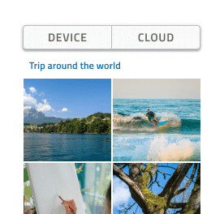

## Layout

The Button Group supports two layout directions: horizontal, where items are laid out left to right, and vertical, where their order is top to bottom.

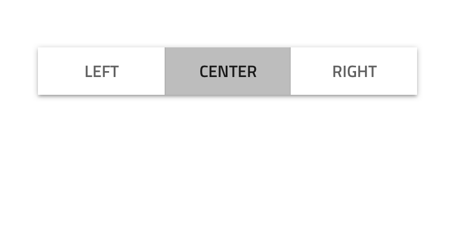
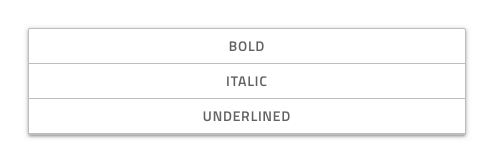

## Buttons Amount

In Figma, the Button Group uses an auto layout allowing it to adjust accordingly when you choose the exact amount of buttons you need and hide the extra nested ones in the layers panel.

## Button Layout Template

Each Button in the Button Group is a Flat Button and allows for the same degree of templating.

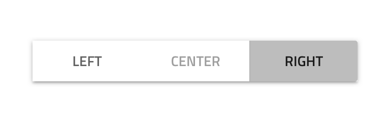
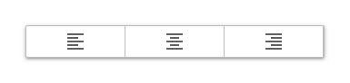

## Styling

The Button Group comes with styling flexibility through the various options for the border and background color, as well as the individual buttons' outline, background, text, and icon colors.

## Usage

Always use Buttons with consistent style and avoid combining Text Buttons with Icon Buttons within the same Button Group. Size the Button Group according to its content to avoid leaving too much empty space in the Buttons. Use the Button Group only to display simple and related actions, as it is not suitable for even simple navigation. If you're looking beyond these actions, [Tabs](tabs.md) are much more appropriate.

| Do                                  | Don't                                 |
| ----------------------------------- | ------------------------------------- |
| 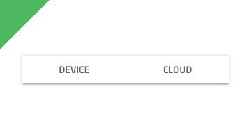 | 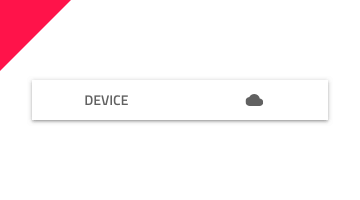 |
| 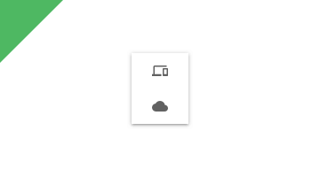 | 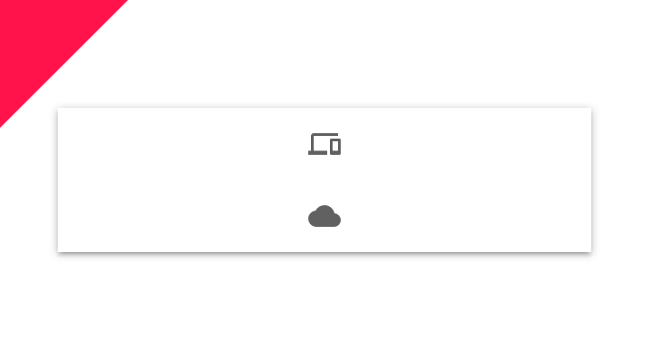 |
| 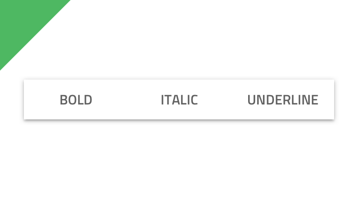 | 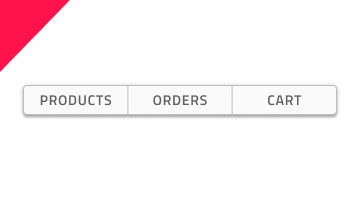 |

## Additional Resources

Related topics:

- [Button](button.md)
  

Our community is active and always welcoming to new ideas.

