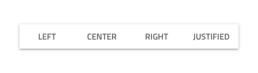
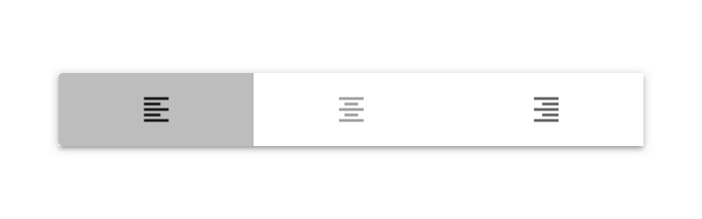

## Button Group

Use the Button Group Component Symbol to combine the triggers for a few related features into one interface element. Is supports both exclusive selection, where only one of the buttons can remain pressed, and multiple selection, where more than one button can remain pressed.
The Button Group is visually identical to the [Ignite UI for Angular Button Group Component](https://www.infragistics.com/products/ignite-ui-angular/angular/components/buttongroup.html)

### Button Group Demo

### Layout

The Button Group supports two layout directions: horizontal, where items are laid out left to right, and vertical, where their order is top to bottom.

### Buttons Amount

For the majority of scenarios a Button Group needs between two and four items. If your case requires more than four items you may want to consider designing a custom toolbar to encompass the rich set of actions you want to provide.

### Button Type

Each Button within the Button Group contains either **text** or icon, and can be set in one of the following states: **default**, disabled, hover and selected.
The selected state comes in three variants that need to reflect the Button position because of the addition of a border that separates the selected button from the adajcent siblings.

### Styling

The Button Group comes with styling flexibility through the various overrides controling the background color, as well as the individual buttons' border, background, label and icon colors.

## Usage

Always use Buttons with consistent style, avoid combining text Buttons with icon Buttons within the same Button Group. Size the Button Group according to its content to avoid leaving too much empty space in the Buttons. Use the Button Group only to display simple and related actions, it is not suitable even for simple navigation, for which [Tabs](tabs.md) are much more appropriate.

| Do                                  | Don't                                 |
| ----------------------------------- | ------------------------------------- |
|  |  |
|  |  |
|  |  |

## Code generation - TODO

> [!WARNING]
> Triggering `Detach from Symbol` on an instance of the Button Group in your design is very likely to result in loss of code generation capability for the Button Group.

`🕹️DataSource`
`🕹️Event`

## Additional Resources

Related topics:

- [Button](button.md)
  

Our community is active and always welcoming to new ideas.

- [Indigo Design **GitHub**](https://github.com/IgniteUI/design-system-docfx)
