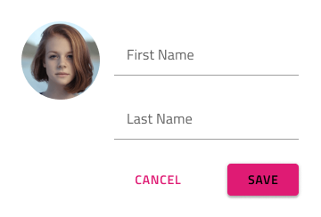
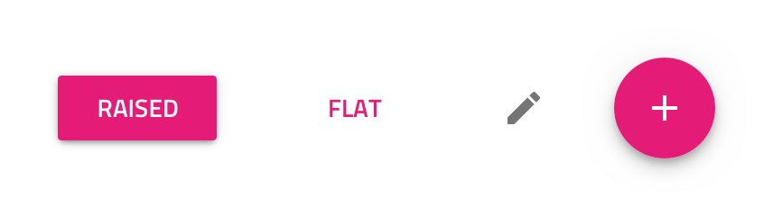
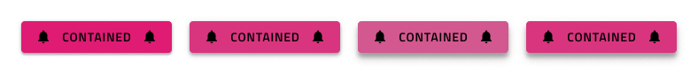
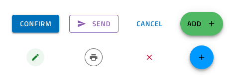
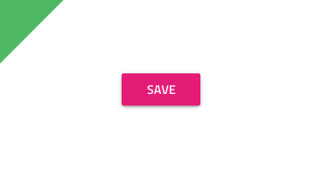
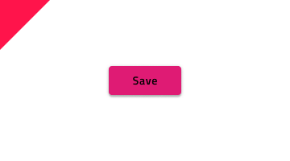
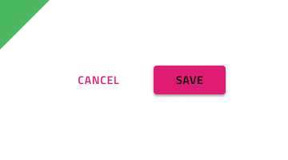
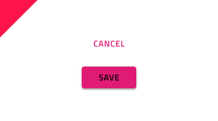
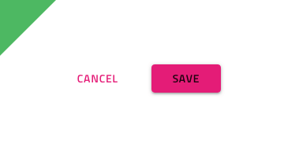
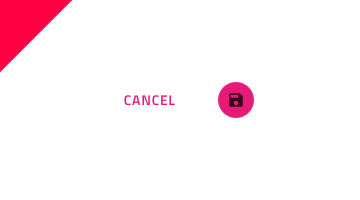

## Button

Use the Button Component to represent the trigger for a simple action that user can take. Buttons are used in cards, dialogs, forms, and many other components and patterns. The Button is visually identical to the [Ignite UI for Angular Button Component](https://www.infragistics.com/products/ignite-ui-angular/angular/components/button.html)

### Button Demo

### Type

Four types of Buttons are supported:

- A more prominent Raised Button with color fill and shadow that emphasizes an action and supports both **text** and combination of icon and text.
- A less prominent Flat Button that is typically used for less important actions and supports both **text** and combination of icon and text.
- An Icon Button for actions that are represented only with an Icon.
- A very prominent Floating Action Button (fab) with color fill and shadow that is used once per screen to strongly emphasize the main action.

### States

Every type of button supports a **default**, hover, and disabled state. A button with an icon and label is also available in the default state.

### Styling

The Buttons come with styling flexibility through the various overrides controlling the background, label, and icon colors.

## Usage

When the content of a Button contains a label, it must be uppercase and with a thicker (usually Medium or Semi-bold) font treatment. When more than one Button is needed for a layout, size them with equal height and arrange them on the same horizontal plane next to each other with sufficient space on both sides to avoid erroneous taps and clicks. In such layouts, avoid combining the different types of buttons. Preferably, you'll want to choose one and use it consistently for all actions that belong in that section of the UI.

| Do                                                                             | Don't                                                                              |
| ------------------------------------------------------------------------------ | ---------------------------------------------------------------------------------- |
|  |  |
|  |  |
|  |  |

## Code Generation

This section describes some important overrides and how they affect code generation.

> [!WARNING]
> Triggering `Detach from Symbol` on an instance of the Button in your design is very likely to result in loss of code generation capability for the Button.

### Event Property

When supplied the `🕹️Event` property is used to create a method in the component TypeScript and add an Angular click signature in the HTML. When supplied the event must be specified using the curly braces format: {onEventName}.

### Sketch Elevations

Button elevation changes in Sketch drawings are not rendered during code generation. Each button type has a default elevation that will be applied by the Ignite UI Component. Currently, this is a known limitation of the Ignite UI for Angular product that will be resolved in the upcoming releases.

### Text

The Text property may contain text, [binding text](../codegen/data-binding.md), or a combination of the two, examples:

- Settings
- {settingsLabel}
- Important {labelText}

`🕹️DataSource`
`🕹️Event`

## Additional Resources

Related topics:

- [Button Group](button-group.md)
- [Cards](cards.md)
- [Dialog](dialog.md)
- [Snackbar](snackbar.md)
- [Time Picker](time-picker.md)
- [AV Player Pattern](../patterns/av.md)
- [File Upload Pattern](../patterns/file-upload.md)
- [Form Pattern](../patterns/form.md)
- [Data Binding](../codegen/data-binding.md)
  

Our community is active and always welcoming to new ideas.

