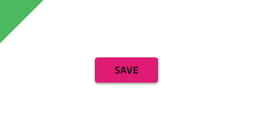

# Button

Use the Button Component to represent the trigger for a simple action that user can take. Buttons are used in cards, dialogs, forms, and many other components and patterns. The Button is visually identical to the [Ignite UI for Angular Button Component](https://www.infragistics.com/products/ignite-ui-angular/angular/components/button.html)

## Button Demo

## Type

Five types of Buttons are supported:

- A more prominent Contained Button with color fill and shadow that emphasizes an action.
- A less prominent Outlined Button with color outline appropriate for the majority of actions.
- A very subtle Flat Button that is typically used for the least important actions.
- An Icon Button for actions that are represented only with an icon.
- A very prominent Floating Action Button (Fab) with color fill and shadow that is used once per screen to strongly emphasize the main action.

## Interaction States

You may also insert each button in a disabled state because they all support both Enabled and Disabled variants. In Figma you can switch between the two using a boolean operation from the properties panel. In Adobe XD we are using the `Component States` paradigm to let you easily switch between them.

## States

Enabled buttons support **Rest** and Hover state. In Figma you can change them from the State property. In Sketch this is achieved with `Symbol Overrides`, while in Adobe XD we are using the `Component States` paradigm to let you easily switch between states.

## Layout Template

Contained, Outlined, Flat, and Floating Action Buttons support flexible icon and label templates. In Figma you can show/hide the icons using the Left Icon and Right Icon boolean properties or you can set the Content property to Icon, if you want an Icon Button. In Sketch, the smart layout rules applied, allow the layout to adjust accordingly when you set the elements you want to hide to ~No Symbol. In Adobe XD, you achieve the same by deleting the unused layer instead. However, if you only want to change the label and icon position at design time you can simply drag one of them to the other side of the other one.

## Styling

The Buttons come with styling flexibility through the various options for the background, label, and icon colors.

## Usage

When the content of a Button contains a label, it must be uppercase and with a thicker (usually Medium or Semi-bold) font treatment. When more than one Button is needed for a layout, size them with equal height and arrange them on the same horizontal plane next to each other with sufficient space on both sides to avoid erroneous taps and clicks. In such layouts, avoid combining the different types of buttons. Preferably, you'll want to choose one and use it consistently for all actions that belong in that section of the UI.

| Do                                                                             | Don't                                                                              |
| ------------------------------------------------------------------------------ | ---------------------------------------------------------------------------------- |
|  |  |
|  |  |
|  |  |

## Additional Resources

Related topics:

- [Button Group](button-group.md)
- [Card](card.md)
- [Dialog](dialog.md)
- [Snackbar](snackbar.md)
- [Time Picker](time-picker.md)
- [AV Player Pattern](../patterns/av.md)
- [File Upload Pattern](../patterns/file-upload.md)
- [Form Pattern](../patterns/form.md)
  

Our community is active and always welcoming to new ideas.

