# Calendar

Use the Calendar Component to visually represent a date and provide consistent means for navigating its parts through views for days, months and years. The Calendar is meant to be inlined in a view to allow browsing dates and selecting one or more of them e.g. a range of dates. The Calendar is visually identical to the [Ignite UI for Angular Calendar Component](https://www.infragistics.com/products/ignite-ui-angular/angular/components/calendar.html) and is used within the [Ignite UI for Angular Date Picker Component](https://www.infragistics.com/products/ignite-ui-angular/angular/components/date_picker.html)

## Calendar Demo

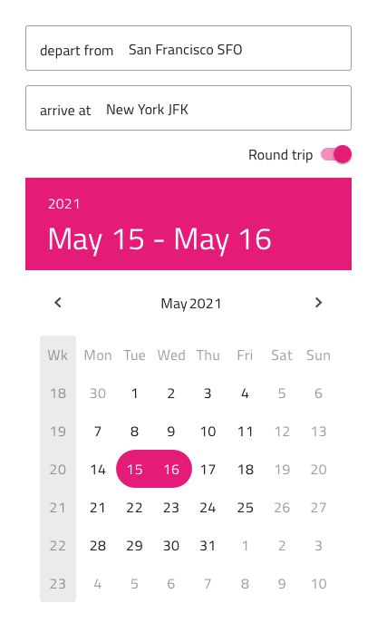

## Size

The Calendar is available in three sizes:
- Large
- Medium
- Small

Horizontal layout:

Vertical layout:

## Layout

The Calendar supports Horizontal or Vertical layout. In Figma you can switch them using the `Orientation` property.

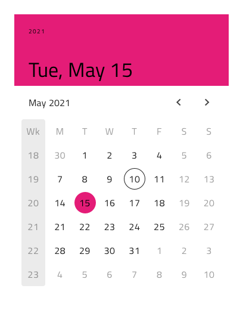
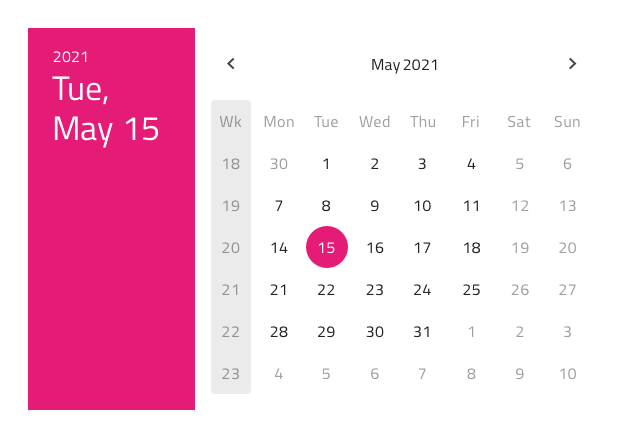

## Multiview Variants

The Calendar includes also a Multiview option to display two months side by side. In Figma, you can enable this with the `Multiview` boolean property and select either Horizontal or Vertical orientation using the `Orientation` property.

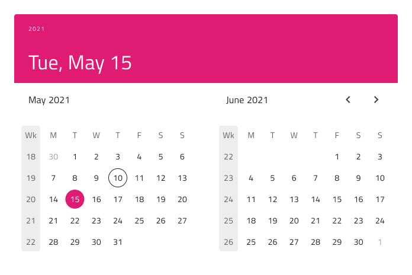
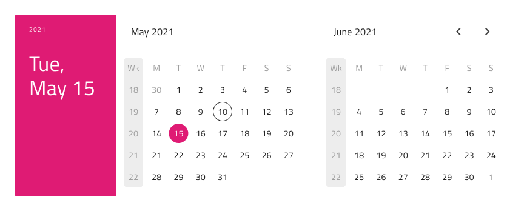

## Content

To facilitate the display of each of the major date portions, there's a `View` property in Figma, which lets you choose between Day, Month, or Year view.

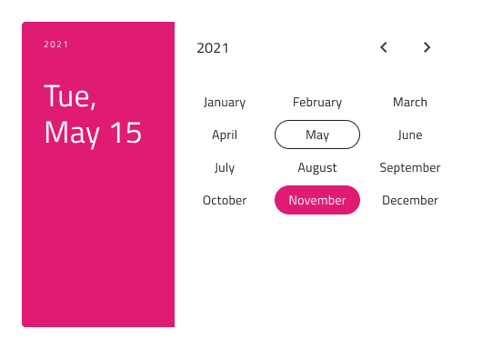
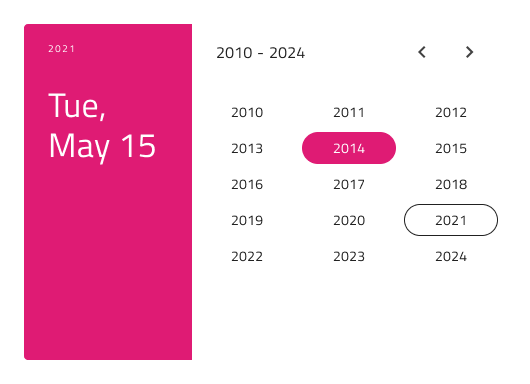

## Week Start

In Figma the start of the week can be chosen from the `Week Start` property, which supports the two most common scenarios for first day of the week: Sunday and Monday.

## Header

The Calendar has a built-in Header that can be omitted, resulting in a base Calendar that you can embed more seamlessly in your forms. In Figma, this can be achieved using the `Header` boolean property.

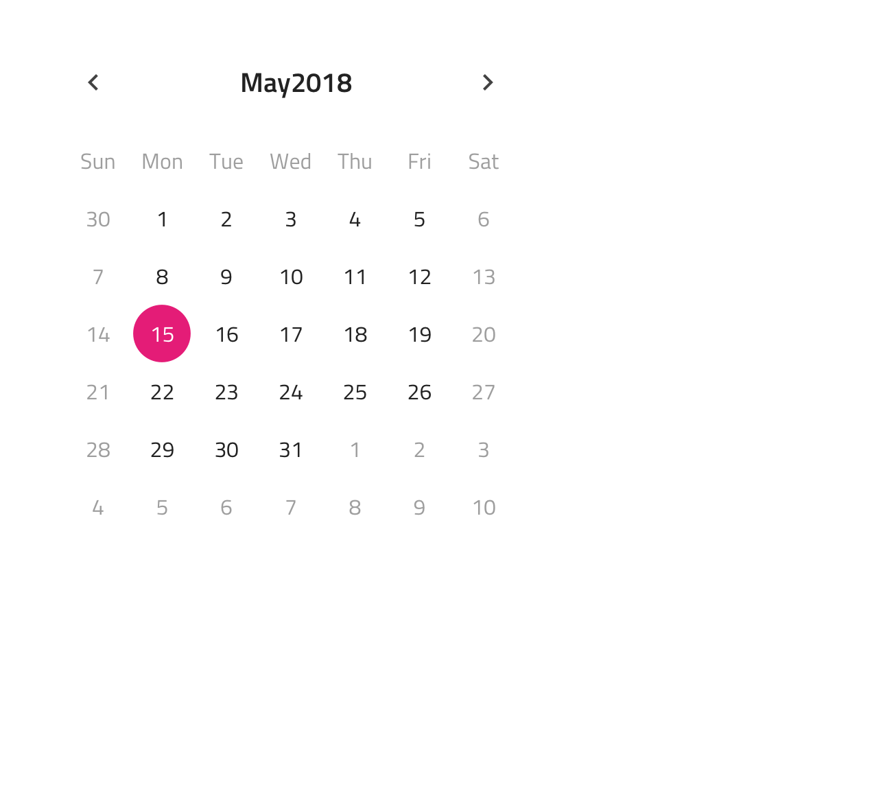

## Week Numbers

The Calendar also has built-in support for Week Numbers, but if you prefer not to show this part of the UI, simply switch off the `Week Numbers` boolean property from the properties panel in Figma.

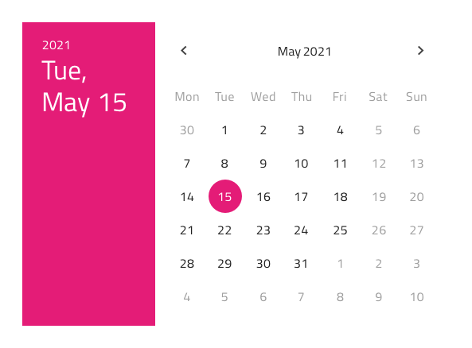

## Selection

The Calendar lets you pick between three selection modes: **Single Day** limiting the user to be able to select only one date, **Range** providing means to select all dates between a start and end date and **Multiple Days** allowing selection of random dates.

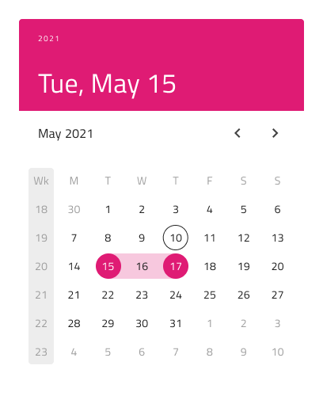
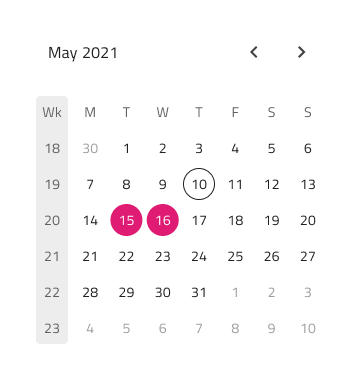

## Styling

The Calendar comes with styling flexibility through the various options for the background, header background, title colors, and content month and year picker items, as well as text and background colors for the selected day, month, or year. These are applied according to the rest of your configurations.

## Usage

Use the Calendar as an inline element with the rest of the UI, without additional visual effects. If you need to show modals, dialogs, or dropdowns, consider using the Date Picker instead.

| Do                                                                                 | Don't                                                                                  |
| ---------------------------------------------------------------------------------- | -------------------------------------------------------------------------------------- |
| 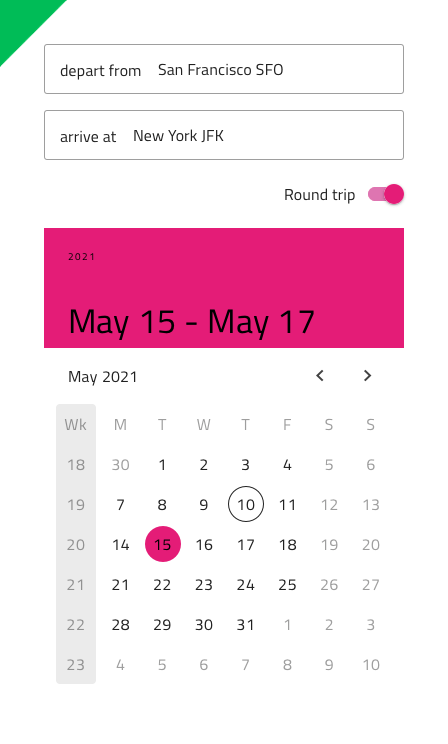 | 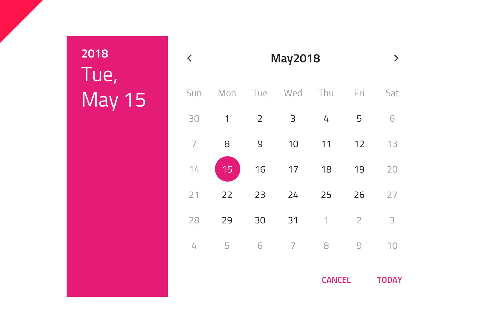 |

## Additional Resources

Related topics:

- [Date Picker](date-picker.md)
- [Time Picker](time-picker.md)
  

Our community is active and always welcoming to new ideas.
