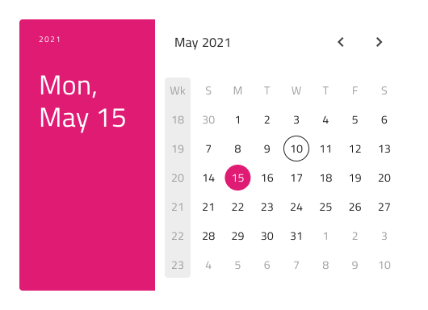

## Calendar

Use the Calendar Component Symbol to represent a date visually and provide consistent means for its selection (date picking) through a combination of views for months and years. The Calendar is also appropriate for picking and setting a date in fields of this type used in various forms.
The Calendar is visually identical to the [Ignite UI for Angular Calendar Component](https://www.infragistics.com/products/ignite-ui-angular/angular/components/calendar.html) & [Ignite UI for Angular Date Picker Component](https://www.infragistics.com/products/ignite-ui-angular/angular/components/date_picker.html)

### Calendar Demo

### Layout

The Calendar supports Horizontal and Vertical date picking modes, as well as a Base calendar rendering for a simplified display and browsing. The former two are mostly used as dialogs, while the latter is preferrably inlined with other content.

### Buttons

The Calendar comes with two buttons: for canceling the selection, which would discard any changes made to original date, and for navigating to today's date. Upon setting both to none through the Overrides a buttonless layout can be achieved.

### Content

The Calendar supports picking for all three major date portions: the year, the month and the day. Three content modes are provided, each responsible for the picking of its respective date portion.

### Week Start

The start of the week is configurable by selecting between the two most common scenarios for the first day: Sunday or Monday.

### Styling

The Calendar comes with styling flexibility through the various overrides controling header background and title colors, content month and year picker items, as well as text and background colors for the selected day,month or year whatever is applicable according to the configurations.
The Cancel and Today buttons are [Flat Buttons](button.md) and can be styled accordingly.

## Usage

Show the Horizontal and Vertical Calendars as a dialog that dims the rest of the UI. Inline the Base Calendar with the rest of the UI witout any special additional visual effects.

| Do                              | Don't                             |
| ------------------------------- | --------------------------------- |
|  |  |
|  |  |

## Code generation

> [!WARNING]
> Triggering `Detach from Symbol` on an instance of the Calendar in your design is very likely to result in loss of code generation capability for the Calendar.

`🕹️DataSource`
`🕹️Event`

## Additional Resources

Related topics:

- [Time Picker](time-picker.md)
- [Form Pattern](forms.md)
  

Our community is active and always welcoming to new ideas.

- [Indigo Design **GitHub**](https://github.com/IgniteUI/design-system-docfx)
