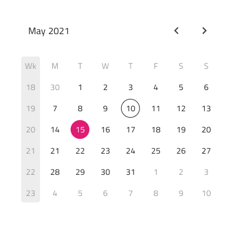

# Calendar

Use the Calendar Component to visually represent a date and provide consistent means for its selection through a combination of views for months and years. The Calendar is meant to be inlined in a view to allow browsing and picking a date. The Calendar is visually identical to the [Ignite UI for Angular Calendar Component](https://www.infragistics.com/products/ignite-ui-angular/angular/components/calendar.html) and is used within the [Ignite UI for Angular Date Picker Component](https://www.infragistics.com/products/ignite-ui-angular/angular/components/date_picker.html)

## Calendar Demo

## Layout

The Calendar supports horizontal and vertical layouts, as well as a base calendar rendering for a simplified display and browsing.

## Content

The Calendar supports picking for all three major date portions: the year, the month, and the day. Three content modes are provided, each responsible for the picking of its respective date portion.

## Week Start

The start of the week is configurable by selecting between the two most common scenarios for the first day: Sunday or Monday.

## Styling

The Calendar comes with styling flexibility through the various overrides controlling header background, title colors, and content month and year picker items, as well as text and background colors for the selected day, month, or year. These are applicable according to the configurations.

## Usage

Use the horizontal, vertical or base Calendars as inline elements with the rest of the UI without additional visual effects such as Elevations.

| Do                                                                                 | Don't                                                                                  |
| ---------------------------------------------------------------------------------- | -------------------------------------------------------------------------------------- |
|  |  |

## Code generation

> [!WARNING]
> Triggering `Detach from Symbol` on an instance of the Calendar in your design is very likely to result in loss of code generation capability for the Calendar.

`🕹️DataSource`
`🕹️Event`

## Additional Resources

Related topics:

- [Time Picker](time-picker.md)
  

Our community is active and always welcoming to new ideas.

