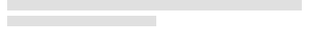

# Skeleton Card

Use the Skeleton Card Component to layout the same type of information that you would in the standard one, but to also indicate an application state when no data is present at the moment e.g. when data is loaded from a remote data source and there is either lack of connectivity, or it takes some time. The Skeleton Card is just a visual representation of a [Card](card.md) with a known layout, but without any data to show.

## Skeleton Card Demo

## Areas

The Skeleton Card supports the same four areas like the standard [Card](card.md): `image`, `header`, `content`, and `actions`. 

## Image

The skeleton image area supports an Image, covering the maps available in the standard [Card](card.md).

## Header

The skeleton header is consistent with that of the standard [Card](card.md).

## Content

The content area supports a Paragraph for a short description text and an Array of shortcuts like Contacts.

## Actions

The skeleton actions map to the same layouts that can be found in the standard [Card](card.md). They are also defined with auto layout in Figma, letting you select the type from the Design tab in the right sidebar.

|                   |  Justified Actions **Off**                                            |  Justified Actions **On**                                             |
| ----------------- | --------------------------------------------------------------------- | --------------------------------------------------------------------- |
| Buttons + Icons   |  |  |
| Icons + Buttons   |  |  |
| Only Buttons      |  

  |  

  |
| Only Icons        |  

  |  

  |

## Skeleton Card Layout

Through the use of an auto layout in Figma, the Skeleton Card can produce various layouts by excluding certain areas or elements to allow the creation of a variety of cards based upon the same Component initially in a similar way like the standard [Card](card.md) does.

## Usage

When creating layouts with multiple cards, avoid combining standard and skeleton cards. Data is either present for all cards, or for none of them, thus the two types should not be used within the same grid layout.

| Do                                                                         | Don't                                                                          |
| -------------------------------------------------------------------------- | ------------------------------------------------------------------------------ |
|  |  |

## Additional Resources

Related topics:

- [Card](card.md)
  

Our community is active and always welcoming to new ideas.
