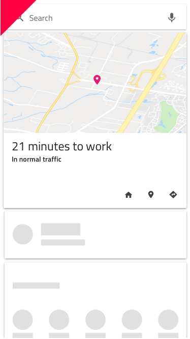

# Skeleton Card

Use the Skeleton Card Component to layout the same type of information that you would in the standard one, but to also indicate an application state when no data is present at the moment e.g. when data is loaded from a remote data source and there is either lack of connectivity, or it takes some time. The Skeleton Card is just a visual representation of a [Card](card.md) with a known layout, but without any data to show.
## Skeleton Card Demo

## Areas

The Skeleton Card supports the same four areas like the standard [Card](card.md): `image`, `header`, `body`, and `actions`. 

## Image and Body

The skeleton image and body areas support overrides either for an Array of shortcuts, an Image, which also covers the maps available in the standard [Card](card.md), or a Paragraph.

## Header

The skeleton header is consistent with that of the standard [Card](card.md).

## Actions

The skeleton actions map to the same six layouts that can be found in the standard [Card](card.md). They are also defined with a smart layout in Sketch, letting you remove elements by setting them to ~No Symbol and have the rest automatically adjust to the desired layout. In Adobe XD, the use of a Stack lets you achieve the same when you remove unnecessary components.

## Skeleton Card Layout

Through the use of `Smart Layout` in Sketch and `Stacks` in Adobe XD, the Skeleton Card can produce various layouts by excluding certain areas or elements within one area or another to create a myriad of distinct variants starting with the same Component initially and consistent with the standard [Card](card.md). 

## Usage

When creating layouts with multiple cards, avoid combining standard and skeleton cards. Data is either present for all cards, or for none of them, thus the two types should not be used within the same grid layout.

| Do                                                                         | Don't                                                                          |
| -------------------------------------------------------------------------- | ------------------------------------------------------------------------------ |
|  |  |

## Additional Resources

Related topics:

- [Card](card.md)
  

Our community is active and always welcoming to new ideas.
