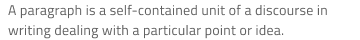

# Card

Use the Card Component to display information for a single object through an image, map, or other media content, as well as text, allowing relevant quick actions to be triggered such as sharing, liking, bookmarking, etc. It usually works as an overview and entry point for more detailed information. Cards with various content and layout can be combined to create a dashboard. The Card is visually identical to the [Ignite UI for Angular Card Component](https://www.infragistics.com/products/ignite-ui-angular/angular/components/card.html)

## Card Demo

## Areas

The Card has four distinct areas: `image` at the top to show picture or map media, `header` which holds a combination of thumbnail Avatar, Title, and Subtitle, `content` which holds text paragraphs and an image array detailing the Card, and `actions` which serve as a toolbar with quick actions related to the Card.

|         |                                                                                                |
| ------- | ---------------------------------------------------------------------------------------------- |
| image   |  |
| header  |  |
| content |  |
| actions |  |

## Image

The image area supports collection of nine variants: 6 continent maps for the populated world areas, one World Map, one Navigation Map, and an Image.

## Header

The Card header supports various layouts, including an Avatar Thumbnail, Title, and Subtitle elements.
In Figma, the auto layout adjusts the card layout based on the selected properties for the `header` element from the side panel.
In Sketch, the smart layout rules adjust the layout accordingly when you set the elements you want to hide to ~No Symbol.
In Adobe XD, the use of a Stack lets you achieve the same when you delete unnecessary layers.

## Content

The content supports a Paragraph for a short description text and an Array of shortcuts like Contacts.

## Actions

- In **Figma**, the Card actions come in four different layouts: **Buttons+Icons**, the inverse **Icons+Buttons** both containing two Flat buttons and three Icons, and variants with **Only Buttons** and **Only Icons**. Every layout has a Justified variant which ensures that the elements are evenly spaced and are built with constraints for responsive behavior. The other four use auto layout for automatic layout adjustments. Additionally, there is a `Content Position` property that allows you to define the positions of the Buttons and Icons specifically for the **Only Buttons** and **Only Icons** variants.

|                   |  Justified Actions **Off**                                            |  Justified Actions **On**                                             |
| ----------------- | --------------------------------------------------------------------- | --------------------------------------------------------------------- |
| Buttons + Icons   |  |  |
| Icons + Buttons   |  |  |
| Only Buttons      |  

  |  

  |
| Only Icons        |  

  |  

  |

- In **Sketch** the actions comes in six distinct layouts: **Button + Icon Actions** with two Flat Buttons and three Icons and the inverse **Icon + Button Actions** laid the other way around, as well as their Justified variants, and variants with only Justified Button Actions and Justified Icon Actions. Each of the six is defined as an override with a smart layout, letting you remove elements by setting them to ~No Symbol and have the rest automatically adjust to the desired layout.

- In **Adobe XD**, the same variety is available and you may also delete unnecessary layers with a layout that adjusts automatically thanks to the use of a Stack.

## Card Layout

Through the use of auto layout in Figma, a smart layout in Sketch and a Stack in Adobe XD, the Card can produce various layouts by excluding certain areas or elements within them to support a variety of distinct cards based upon the same Component initially.

## Styling

The Card comes with styling flexibility through the various options available for image, header, content, and actions areas such as text styles, icon types, and colors, as well as button colors and the possibility to choose a Card background color.

## Usage

The Card usually works as an overview UI and an entry point for more detailed information. Avoid clogging it with too much information and as you create dashboards with it, size and arrange the Cards consistently in order to form a layout grid with equal horizontal and vertical gaps between cards.

| Do                                                                         | Don't                                                                          |
| -------------------------------------------------------------------------- | ------------------------------------------------------------------------------ |
|  |  |
|  |  |

## Additional Resources

Related topics:

- [Avatar](avatar.md)
- [Button](button.md)
- [Icon](icon.md)
  

Our community is active and always welcoming to new ideas.
