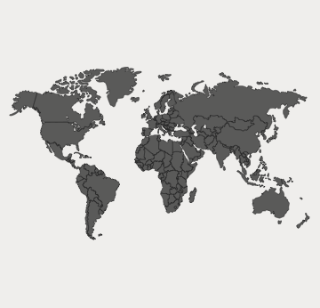
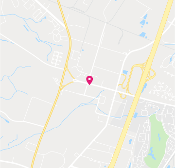

# Card

Use the Card Component to display information for a single object through an image, map, or other media content, as well as text, allowing relevant quick actions to be triggered such as sharing, liking, bookmarking, etc. It usually works as an overview and entry point for more detailed information. Cards with various content and layout can be combined to create a dashboard. The Card is visually identical to the [Ignite UI for Angular Card Component](https://www.infragistics.com/products/ignite-ui-angular/angular/components/card.html)

## Card Demo

## Areas

The Card has four distinct areas: `image` at the top to show picture or map media, `header` which holds a combination of thumbnail Avatar, title, and subtitle, `body` which holds text paragraphs detailing the Card, and `actions` which serve as a toolbar with quick actions related to the Card.

|         |                                                                                                |
| ------- | ---------------------------------------------------------------------------------------------- |
| image   |  |
| header  |  |
| body    |  |
| actions |  |

## Image and Body

The image and body Card areas support the same collection of eleven overrides: 6 continent maps for the populated world areas, one World Map, and one Navigation Map, as well as an Array of shortcuts like contacts, Image, and Paragraph for a short description text.

## Header

The Card header supports various layouts, including an Avatar Thumbnail, Title, and Subtitle elements. In Sketch, the smart layout rules adjust the layout accordingly when you set the elements you want to hide to ~No Symbol. In Adobe XD, the use of a Stack lets you achieve the same when you delete unnecessary layers.

## Actions

The Card actions come in six distinct layouts: **Button + Icon Actions** with two Flat Buttons and three Icons and the inverse Icon + Button Actions laid the other way around, as well as their Justified~ variants, and variants with only Justified Button Actions and Justified Icon Actions. Each of the six is defined with a smart layout in Sketch, letting you remove elements by setting them to ~No Symbol and have the rest automatically adjust to the desired layout. In Adobe XD, you have to delete the unused layers instead, and the layout will adjust through the use of stacks.

## Card Layout

Through the use of `Smart Layout` in Sketch and `Stacks` in Adobe XD, the Card can produce various layouts by excluding certain areas or elements within one area or another to create a myriad of distinct variants starting with the same Component initially.

## Styling

The Card comes with styling flexibility through the various overrides available for image, header, body, and actions areas such as text, icons, and button colors, as well as the possibility to choose a Card background color.

## Usage

The Card usually works as an overview UI and an entry point for more detailed information. Avoid clogging it with too much information and as you create dashboards with it, size and arrange the Cards consistently in order to form a layout grid with equal horizontal and vertical gaps between cards.

| Do                                                                         | Don't                                                                          |
| -------------------------------------------------------------------------- | ------------------------------------------------------------------------------ |
|  |  |
|  |  |

## Additional Resources

Related topics:

- [Avatar](avatar.md)
- [Button](button.md)
- [Icon](icon.md)
  

Our community is active and always welcoming to new ideas.
