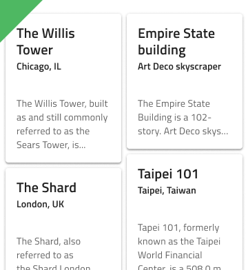

# Card

Use the Card Component to display information for a single object through an image, map, or other media content ,as well as text, allowing relevant quick actions to be triggered such as sharing, liking, bookmarking, etc. It usually works as an overview and entry point for more detailed information. Cards with various content and layout can be combined to create a dashboard. The Card is visually identical to the [Ignite UI for Angular Card Component](https://www.infragistics.com/products/ignite-ui-angular/angular/components/card.html)

## Card Demo

## Areas

The Card has three distinct areas: `header` which holds a combination of title and subtitle, `content` which holds images and paragraphs detailing the Card, and `actions` which serves as a toolbar with quick actions related to the Card.

|         |                                                                                                |
| ------- | ---------------------------------------------------------------------------------------------- |
| header  |              |
| content |  |
| actions |  |

## Header

The Card Header supports three distinct layouts: **Large Title** which provides a large title and a subtitle, Small Title which provides a small title and a subtitle, and Small Title Only which provides a small title and no subtitle.

## Content

The Card Content supports five distinct layouts: **Array** for shortcuts like contacts, Image with or without a title, Map for showing geographical location, and Paragraph for a short description text.

## Actions

The Card Actions come in three distinct layouts: **Button Actions** with just a couple of Flat Buttons, Icon Actions with up to three icons, and Icon + Button Actions combining the two approaches.

## Types

The Card is available in one of the following layouts:

|                   |                                                                                                |
| ----------------- | ---------------------------------------------------------------------------------------------- |
| Point of Interest |                      |
| Audio Video Card  |                        |
| Normal Pin        |        |
| Condensed Pin     |  |
| Shortcuts         |          |
| Simple Card       |                |
| Small Card        |                  |
| Square Card       |                |
| Text Card         |                    |
| Timeline Card     |            |

If none of them works for your design, you may create your own [Custom Cards](cards-custom.md).

## Styling

The Card comes with styling flexibility through the various overrides available for header, content, and actions areas such as text, icons, and button colors, as well as the possibility to choose a Card background color.

## Usage

The Card usually works as an overview and entry point for more detailed information, therefore, you want to avoid clogging it with too much information. When creating card dashboards, size and arrange cards consistently in order to form a layout grid with equal horizontal and vertical gaps between cards.

| Do                                                                         | Don't                                                                          |
| -------------------------------------------------------------------------- | ------------------------------------------------------------------------------ |
|  |  |
|  |  |

## Code generation

> [!WARNING]
> Triggering `Detach from Symbol` on an instance of the Card in your design is very likely to result in loss of code generation capability for the Card.

`🕹️DataSource`
`🕹️Event`

## Additional Resources

Related topics:

- [Avatar](avatar.md)
- [Button](button.md)
- [Icon](icon.md)
- [Card Collection Pattern](../patterns/card-collection.md)
  

Our community is active and always welcoming to new ideas.

