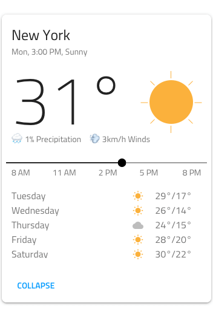
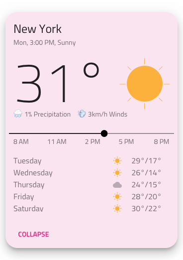
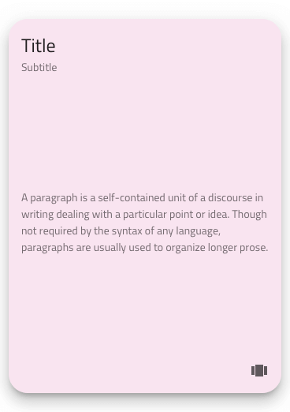
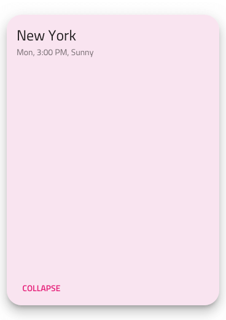
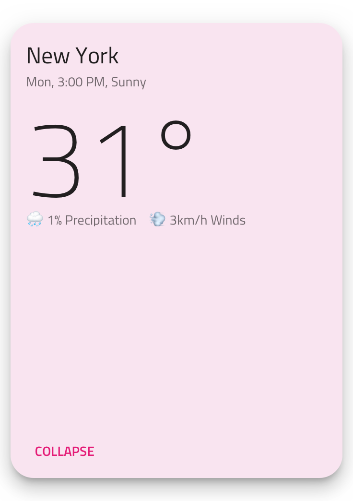
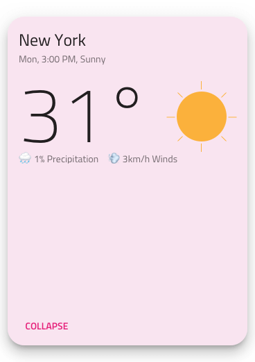
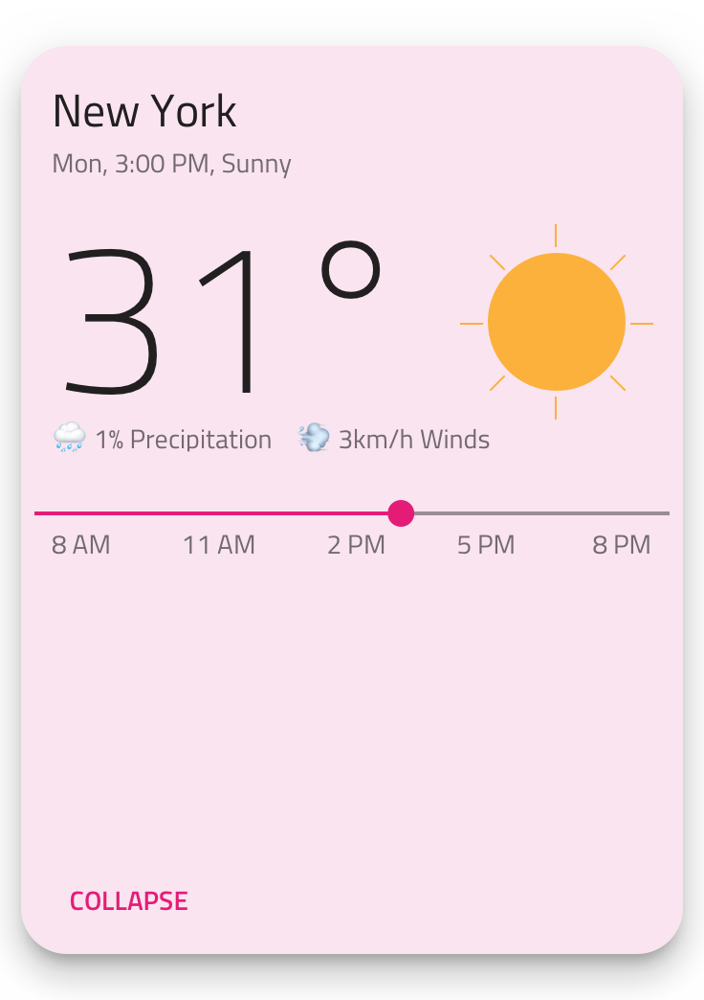
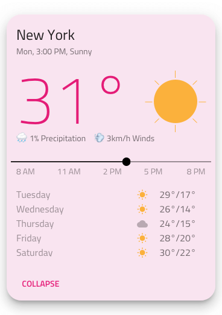

## Custom Cards

Use the Custom Card Component to display the same type of information that you would in a normal Card but with the complete freedom to arrange your layout exactly as you would like. The Custom Card is achievable by writing the necessary customizations to layout of the [Ignite UI for Angular Card Component](https://www.infragistics.com/products/ignite-ui-angular/angular/components/card.html)

### Custom Card Demo

### Detach from Symbol

In order to customize Card layouts start by dragging a `Cards/Custom` to your Artboard, right clicking on top of it, and selecting the `Detach from Symbol` option near the bottom of the contextual menu. In your layers panel under the newly appeared _Cards/Custom_ group, you should see the following:

> [!INFO]
> | Layer | Use |
> | ----------------------------- | ---------------------------------------- |
> | 🚫 igx-card/custom | A special locked layer starting with a prohibited icon. This layer is required by the code generation and you should avoid deleting or modifying it. |
> | Custom Card | Groups together the Card layout elements |
> | &nbsp;&nbsp; Card Area | Groups together the Card layout elements |
> | &nbsp;&nbsp; 🌈 Background | Defines the background color of the card |
> | &nbsp;&nbsp; Mask | Gives the card its corner rounding by adjusting the `Radius` layer property|
> | &nbsp;&nbsp; Elevation | Drops a slight shadow on the card collection background |
> | 🕹️DataProperty | Used by code generation for data binding |

#### Styling

The Custom Card has high-level styling flexibility that matches the normal Card through various overrides for text, icons, buttons, and background colors. The detaching of the symbol provides additional control over the corner rounding and elevation level.

> [!INFO]
> | Layer | Use |
> | ----------------------------- | ---------------------------------------- |
> | Card Area | Groups together the Card layout elements |
> | &nbsp;&nbsp; Header | Groups together the Card layout elements |
> | &nbsp;&nbsp; Content | Groups together the Card layout elements |
> | &nbsp;&nbsp; Actions | Groups together the Card layout elements |

#### Layout

Let's see how we can create the intricate layout for the weather forecast Card found above in five simple steps. We have dragged a Custom Card into an empty Artboard, selected the `Detach from Symbol`, and applied the available basic styling changes for the background color, corner radius, and elevation. Once that was completed, we had this for a starting point.

1.  We will reuse the Header Style and just update the strings for the Title and Subtitle Text. For now, let's ignore the Content group and move to the Actions Style, where we need to change it to Button Actions rather than the Icon Actions are default. Lastly, we will update the Left Button text and hide the Right Button by setting it to none.

2.  Now, it is time to get back to the Content and create the layout for the weather forecast. We will start by inserting a Cards/Blocks/Header/Large Title (we can use any type of block in any Card area group), updating the title to a Size of H1, and resizing the symbol to correctly display both the title and subtitle. After updating the string values, you may delete the default paragraph, Content Style, and you should see an outcome similar to the example. As a note, deleting the default Content Style now will preserve the Content group since it now holds another element as well.

3.  The next item to add in the Content Group is a sun illustration. You can create your own by grouping an Oval shape with a few line shapes and fixing the group width and height in the properties panel to avoid distortions. Place the sun illustration to the right of the degrees title, and your layout should look like this.

4.  Now, we have to add a One-thumb Slider Component and a Cards/Blocks/Content/Paragraph Text for the array of labels underneath. In order to achieve our target design, we have to select the Slider and set its Label Text Style and Label Background overrides to none, which will hide the label balloon. After inserting some label values in the Paragraph Text, you should be able to achieve something similar to this.

5.  It's time to design the detailed forecast area, and the easiest way to do that is by inserting the Cards/Blocks/Content/Paragraph Text twice: once for the weekdays and once for the degrees. In-between these two text columns, we will insert a Small Icon and duplicate it four more times to create a vertically aligned set, forming one more column. After choosing visualizations for them resonating with the forecast values, our target layout is complete.

#### Additional Styling

With this Custom Card layout, extensive additional styling is possible based on the elements that have been inserted in the card. For example, we can set a color for the text of the temperature to emphasize it and set a subtler color for the complimentary information, such as the labels underneath the slider and the weekday labels paragraph.

## Additional Resources

Related topics:

- [Avatar](avatar.md)
- [Button](button.md)
- [Icon](icon.md)
- [Slider](slider.md)
- [Card Collection Pattern](card-collection.md)
  

Our community is active and always welcoming to new ideas.

- [Indigo Design **GitHub**](https://github.com/IgniteUI/design-system-docfx)
