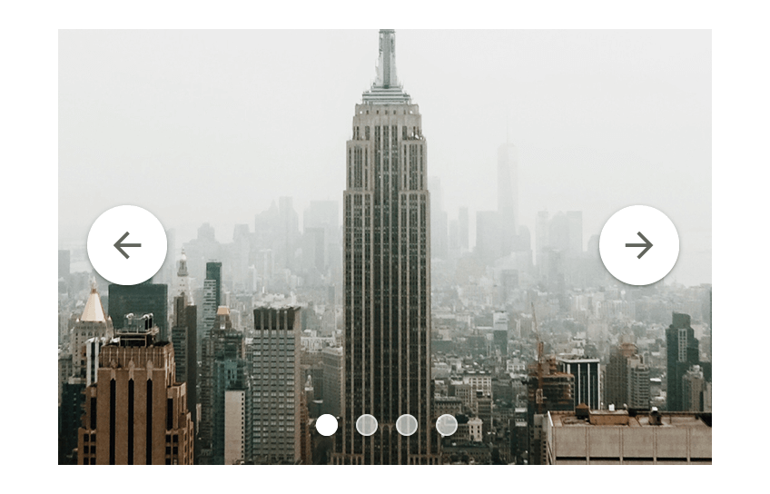
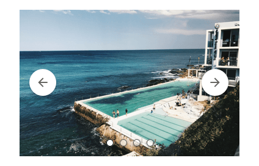

# Carousel

Use the Carousel Component to let the user navigate through a collection of images in a sequential fashion, moving to the previous/next one through the arrows on the sides. The Carousel is visually identical to the [Ignite UI for Angular Carousel Component](https://www.infragistics.com/products/ignite-ui-angular/angular/components/carousel.html)

## Carousel Demo

## Indicators and Slides

The Carousel allows you to define up to five slides, each paired with a corresponding indicator dot for seamless navigation. In **Figma**, you can easily adjust the number of indicators by hiding layers, with the layout automatically adapting to reflect the changes.

## Styling

The Carousel comes with styling flexibility through the various options for the navigation buttons background and icon colors, the indicator colors, border colors, and the slide image for the currently active slide, along with button elevation and state where applicable. You should keep in mind that only one indicator may be active at a time.

## Usage

The previous and next navigation buttons of the Carousel should always appear on top of the image slide, and the indicators should have consistent styling, where only the active one should be emphasized.

| Do                                                                                 | Don't                                                                                  |
| ---------------------------------------------------------------------------------- | -------------------------------------------------------------------------------------- |
|  |  |
|  |  |

## Additional Resources

Related topic:

- [Grid](grid.md)

Our community is active and always welcoming to new ideas.
