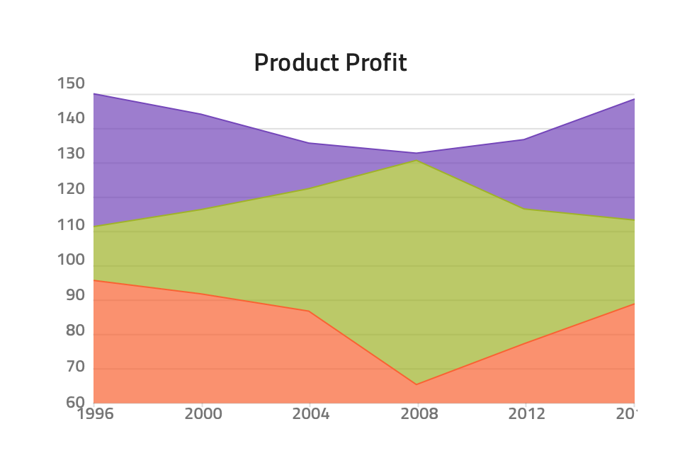
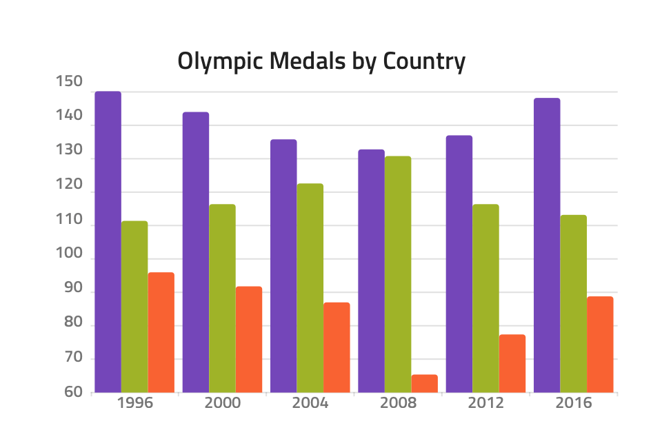
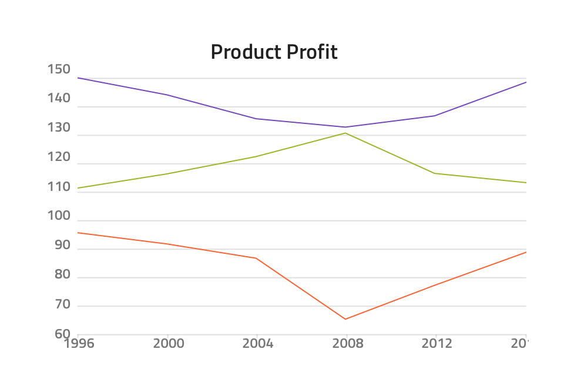
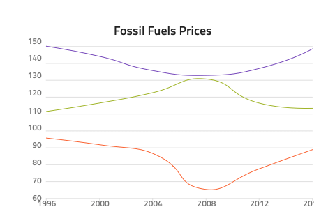
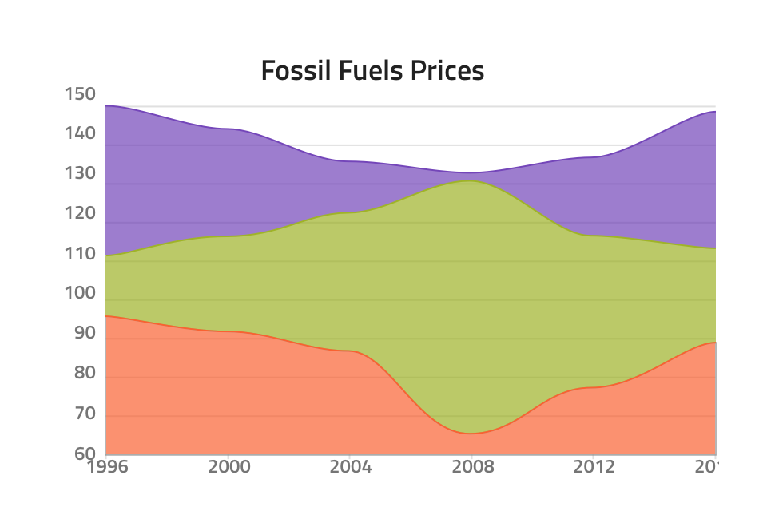
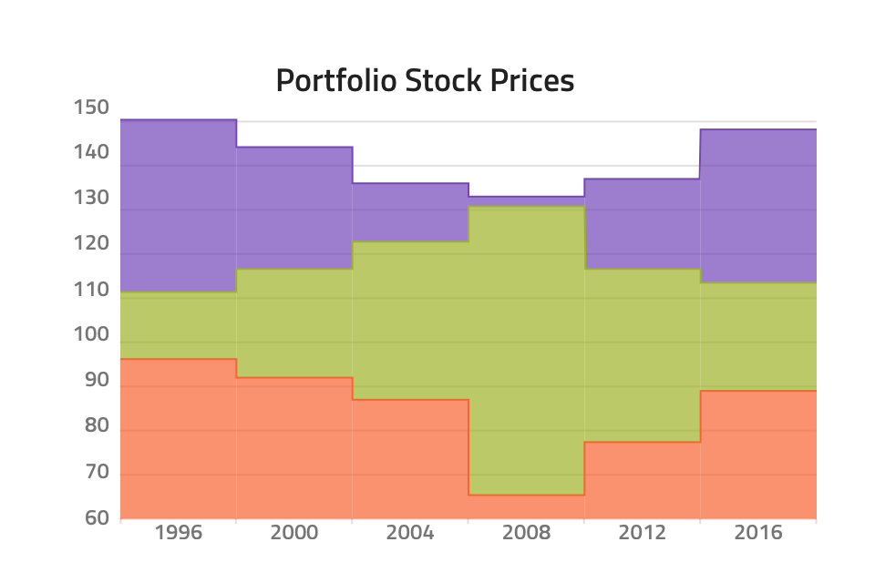
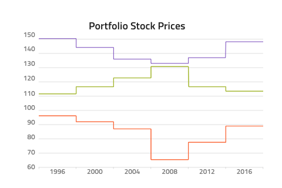

## Category Chart

Use the Category Chart Component to wrap the density and complexity of data in a simple visual. Category Charts are often combined to create beautiful dashboards for related sets of data. The Category Chart is visually identical to the [Ignite UI for Angular Category Chart Component](https://www.infragistics.com/products/ignite-ui-angular/angular/components/categorychart.html)

### Category Chart Demo


### Tooltip

The Category Chart comes with an override for the tooltip visibility: **Tooltip Off** hides it and Tooltip On shows it on top of the series.


### Types

The Category Chart comes with flexibility for selecting the Chart type through various overrides such as:

|             |                                               |
| ----------- | --------------------------------------------- |
| Area        |         |
| Column      |       |
| Line        |         |
| Point       |        |
| Spline      |       |
| Spline Area |  |
| Step Area   |    |
| Step Line   |    |
| Waterfall   |    |

## Usage

Even though you might need to combine different types of series in the same chart, you should avoid stacking multiple Category Charts on top of one another. Use the Category Chart Component as if it were a simplified stencil for data visualization.

| Do                                    | Don't                                   |
| ------------------------------------- | --------------------------------------- |
|  |  |

## Code Generation

The Category Chart is a simple to use component requiring only a few properties to be set.

> [!WARNING]
> Triggering `Detach from Symbol` on an instance of the Category Chart in your design is very likely to result in loss of code generation capability for the Category Chart.

### Data Bindings

Data bindings are specified by using curly brace syntax, example: {isAdmin}. Data bindings can be non-nested or nested. If the target property is a nested property, include the nested property chain, but don’t include the model object name. Examples:

#### Not Nested

```PseudoCode
Customer {
    imageName: String;
}

DataProperty would be: {imageName}
```

#### Nested

```PseudoCode
Profile {
    imageName: String;
}

Customer {
    profile: Profile;
}

DataProperty would be: {profile.imageName}
```

### Data Source

When supplied, the `🕹️DataSource` property value is used to set up a binding to the chart dataSource property. Without a `🕹️DataSource` and valid data in the data source, the Category Chart cannot render at runtime.

### Chart Dimensions

The Category Chart will generate with fixed dimensions obtained within the Sketch. The developer can then modify these dimensions as they see fit within the HTML. Valid values for the width and height are pixel values and percent values. Examples:

width=”300px” or width=”100%”

### Chart Type

Configures the chart to use the provided series type. When Type is None, the chart will not render.

### Chart Title

The Title property may contain text, binding, or a combination of the two, examples:

- Settings
- {settingsLabel}
- Important {labelText}

The Title is optional.

## Additional Resources

Related topics:

Our community is active and always welcoming to new ideas.

- [Indigo Design **GitHub**](https://github.com/IgniteUI/design-system-docfx)
