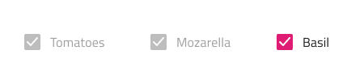
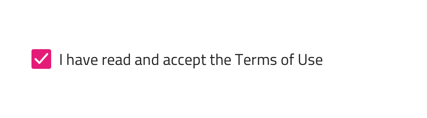
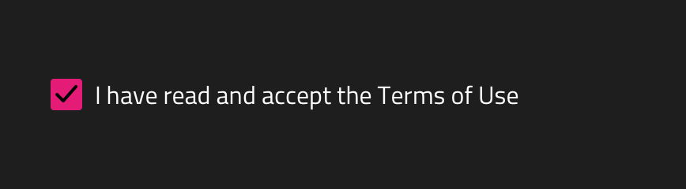
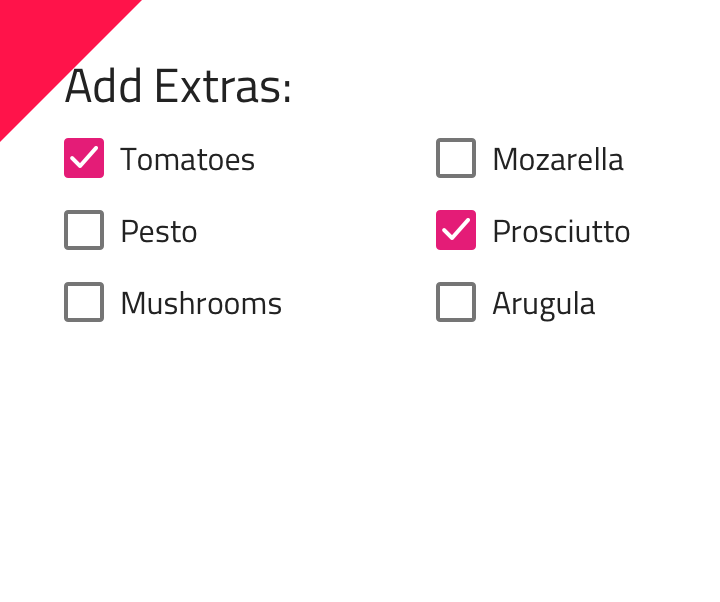

# Checkbox

Use the Checkbox Component to allow the user make a selection, which most often expresses a preference or agreement in a form. The Checkbox is visually identical to the [Ignite UI for Angular Checkbox Component](https://www.infragistics.com/products/ignite-ui-angular/angular/components/checkbox.html)

## Checkbox Demo

## Interaction State

The checkbox can be inserted in an enabled or disabled state.

## Theme

The Checkbox can be used styled in **dark** and light variants to assure good readability and contrast for both lighter and darker backgrounds.

## Layout Template

The checkbox supports a label position where the Checkbox label is placed after or before the Checkbox box element.

## State

The Checkbox provides **on**, off, and indeterminate selection states.

## Styling

The Checkbox comes with styling flexibility through the various overrides controlling its check and fill colors, as well as the label position and its color.

## Usage

When many Checkboxes are necessary, you'll want to arrange them in a column group which makes it really easy to scan quickly through the list. Fewer Checkboxes may also be arranged on a single line next to each other but you should avoid arrangements in multiple columns.

| Do                                                                                 | Don't                                                                                  |
| ---------------------------------------------------------------------------------- | -------------------------------------------------------------------------------------- |
|  |  |

## Additional Resources

Related topic:

- [Form Pattern](../patterns/form.md)
- [Data Binding](../codegen/data-binding.md)
  

Our community is active and always welcoming to new ideas.
