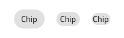

# Chip

Use the Chip Component as a compact visual shown in an obround to display tags and people information e.g. for the recipients of an email. The Chip is visually identical to the [Ignite UI for Angular Chip Component](https://www.infragistics.com/products/ignite-ui-angular/angular/components/chip.html)

## Chip Demo

## Chip Density

The Chip comes in three density variants:

- Comfortable - Suitable for interactive scenarios e.g. action triggers
- Cosy - Appropriate for short areas such as the recipient field of an email message composer
- Compact - Best for data-dense scenarios such as the values for a cell in the Grid

## Chip Types

The Chip provides two type variants: Default and Primary.

## Interaction State

The Chip can be in an Enabled or Disabled state. In Figma, you can change the state using the Disabled boolean operation from the properties panel. In Sketch, you should choose the state prior to inserting the component. In Adobe XD we are using the Component States paradigm to let you easily switch between them.

## State

When the user interacts with the Chip, it may change from the default **Idle** state to Hover, Focused, and Selected. This affords a more dynamic interaction design that can seamlessly flow into high-fidelity prototyping. In Figma these can be selected from the State property in the properties panel. In Sketch this is achieved with `Symbol Overrides`, while in Adobe XD we are using the `Component States` paradigm to let you easily switch between states.

You will also notice one more state named Templated, which is used internally in the [Grid Advanced Filter](grid-advanced-filter.md) interface. In Figma, the Chip Templated is a separate component, while in Sketch and Adobe XD it can be selected as a State from the main Chip component.

## Remove Chip

When a chip can be removed, a special cancel icon will appear at the far right to indicate this. In Figma, the remove icon can be shown/hidden using the Remove Icon boolean property. In Sketch the `🔣 Remove Icon` override provides the means to trigger this functionality. The smart layout rules applied to the Chip adjust its layout accordingly. In Adobe XD, the `🔣 Remove Icon` layer has to be made visible to achieve the same and the Stack on the Chip will adjust its layout in a similar way. If you don't want the Chip to be removable, simply delete the `🔣 Remove Icon` layer.

## Chip Content

The Chip has rich support for content templating via the prefix and suffix containers allowing to insert icons and text before and after the main label. 

In Figma, you can show or hide the prefix and suffix icons by using the "Prefix Icon" and "Suffix Icon" properties in the properties panel and the layout will adjust itself accordingly.

In Sketch, prefix and suffix containers can be added by finding them in the Overrides/Input/Prefix/Container and Overrides/Input/Suffix/Container or removed by setting them to ~No Symbol, upon which the layout will adjust accordingly. 

In Adobe XD, you have to make the desired layers visible and delete the unnecessary elements from them. If you want to remove a prefix or suffix all at once, simply delete it altogether. In the end, the layout will adjust thanks to the Stack that is being used.

`Text`

`Prefix`

`Prefix+Suffix`

`Suffix`

## Chip Styling

The Chip comes with styling flexibility through the various options for the border and background colors, as well as the text and prefix, suffix, selection, and remove icon colors, where applicable.

## Chips Area

Use the Chips Area Component to organize a collection of Chips. The Chips Area is identical to the Chip Area used in Ignite UI for Angular, which is explained at length in the [Ignite UI for Angular Chip Component](https://www.infragistics.com/products/ignite-ui-angular/angular/components/chip.html) help topic.

The Chips Area comes with the inherent styling flexibility of the Chips.

## Usage

When using a Chip, the obround will automatically size itself to fit the content and you only need to adjust the size of the instance accordingly. If the Chip is used as an action trigger for related content avoid using it in scenarios where there is only one available action, or for configurations presenting only one selectable option.

| Do                                                                         | Don't                                                                          |
| -------------------------------------------------------------------------- | ------------------------------------------------------------------------------ |
| |
|  |  |
|  |  |

## Additional Resources

Related topics:

- [Grid](grid.md)
  

Our community is active and always welcoming to new ideas.
