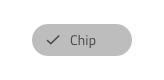
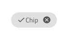
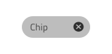
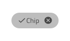
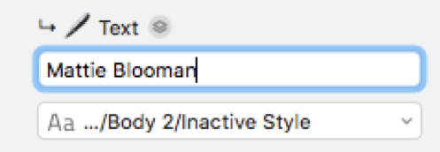

## Chip

Use the Chip Component as a compact visual shown in an obround to display tags and people information e.g. for the recipients of an email. The Chip is visually identical to the [Ignite UI for Angular Chip Component](https://www.infragistics.com/products/ignite-ui-angular/angular/components/chip.html)

### Chip Demo


### Chip Density

The Chip comes in three density variants:

- Comfortable - Suitable for intractive scenarios e.g. action triggers
- Cosy - Appropriate for short areas such as the recipient field of an email message composer
- Compact - Best for data dense scenarios such the values for a cell in the Grid


### Chip State

When the user interacts with the Chip, it goes through various states: **idle**, selected when the user has performed selective action, and focused while the user is navigating through the tab index. These flexibility enhancements afford a more dynamic interaction design that can seamlessly flow into high-fidelity prototyping.


`idle`


`idle when selected`


`focus`


`focus when selected`

Additional states are available in case you want to make the Chip removable and add a special icon at the far right of the element that deletes the Chip upon clicking or tapping it.


`idle and removable`


`idle and removable when selected`


`focus and removable`


`focus and removable when selected`

### Chip Content

The Chip has rich support for prefix and suffix icons that can be used to convey additional meaning through the provided content states: **OnlyText**, Prefix, Prefix+Suffix, Suffix.


### Chip Styling

The Chip comes with styling flexibility through the various overrides controlling the border and background colors, as well as the text and prefix, suffix, remove icon colors, where applicable.


## Chips Area

Use the Chips Area Component to organize a collection of Chips. The Chips Area is identical to the conatiner area used in Ignite UI for Angular, which is explained at length in the [Ignite UI for Angular Chip Component](https://www.infragistics.com/products/ignite-ui-angular/angular/components/chip.html) help topic.

### Chips Area Demo


### Chips Area Type

The Chips Area is available in two distict types: a standard one, where the Chips represent an unrelated collection and a connected one, where the Chips appear in a predefined sequence.


### Chips Area Styling

The Chips Area comes with the inherent styling flexibility of the Chips, but, where applicable, also allows changing the collor and glyph of the connector icon.


## Usage

When using a Chip adjust it size so that the text content appears on a single line. If the Chip is used as an action trigger for related content avoid using it in scenarios where there is only one available action, or for cofigurations presenting only one selecetable option.

| Do                                                                         | Don't                                                                          |
| -------------------------------------------------------------------------- | ------------------------------------------------------------------------------ |
|  |  |
|  |  |
|  |  |

When using the Chips Area follow the suggestions for the individual Chip components above and when using a connected Chips Area don't configure the individual chips as actions, they are supposed to be entitites related in some way e.g. an ordered list of people.

| Do                                                                                     | Don't                                                                                      |
| -------------------------------------------------------------------------------------- | ------------------------------------------------------------------------------------------ |
|  |  |

## Code Generation

> [!WARNING]
> Triggering `Detach from Symbol` on an instance of the Chip in your design is very likely to result in loss of code generation capability for the Chip. The Chips Area on the other hand must be detached for code generation to work properly.

### Chip State

This override controls the state of the Chip. During code generation it primarily controls how the Chip theme is generated. The Chip Component inside the Ignite UI for Angular product has different states it can be in and as a result its theme has a number of parameters which control the theming for these states. The value of this override will determine what Ignite UI theme parameters will be set.

### Chip Selection Icon

This override controls what icon glyph is used when the Chip is selected. During code generation, an Ignite UI for Angular Icon component will be generated inside an `ng-template` and this template will be used for the Chip components `selectIcon` property.

### Chip Remove Icon

This override controls what icon glyph is used as the remove button for this Chip. During code generation, an Ignite UI for Angular Icon component will be generated inside an `ng-template` and this template will be used for the Chip components `removeIcon` property.

### Chip Text

This override controls the text used inside the Chip. It is possible to provide a binding to this override so that during code generation it will create the proper HTML to facility data binding.

No Binding:



Binding:


### Prefix Icon

This override places an icon at the beginning of the Chip content. During code generation, an Ignite UI for Angular Icon component will be added to the Chip content with the `igxPrefix` directive. An Icon theme will also be generated in order to color this icon with the color specified in Sketch.

### Suffix Icon

This override places an icon at the end of the Chip content. During code generation, an Ignite UI for Angular Icon component will be added to the Chip content with the `igxSuffix` directive. An Icon theme will also be generated in order to color this icon with the color specified in Sketch.

### Event

This override is used to hook up a function to the Chip’s `onSelection` event. During code generation, it will generate an empty function in the component’s TypeScript whose name is the value of the override and it will hook that function to the Chip’s `onSelection` event in HTML. It would end up looking like this:

In Sketch:


HTML:

```html
<igx-chip (onSelection)=”mySelectEvent($event)”>
```

TypeScript:

```typescript
mySelectEvent(event): void {
}
```

### Chips Area Detach Symbol

The Chips Area must be detached in order for it to be code generated properly. When detached you will notice that it contains a number of child elements. These elements will be individual Chip elements along with a DataSource element. For Chip Areas with connected chips you will see connector elements. The individual Chip has the same overrides as the Chip mentioned above. The overrides for the connector and DataSource elements will be listed below.

### Chips Area DataSource

This override tells code generation that you want to generate this Chips Area based on some data. The value specified here should be the TypeScript property that contains this data. It should be an array or list of some type. During code generation, it will generate an Angular `ngFor` directive which will iterate over the TypeScript property and create Ignite UI for Angular Chip components.


HTML:

```html
<igx-chip-area>
    <ng-container *ngFor=”let chip of chipList; let last = last;”>
        <igx-chip></igx-chip>
    <ng-container>
</igx-chip-area
```

### Chips Area Connector Icon

This override controls what icon glyph is used between Chips inside the Chips Area. During code generation, it will generate an Ignite UI for Angular Icon component to be used for this purpose. It will also generate an Ignite UI for Angular Icon theme to be used with the Icon so the color specified in Sketch is preserved in Angular.

## Additional Resources

Related topics:

- [Grid](grid.md)
  <div class="divider--half"></div>

Our community is active and always welcoming to new ideas.

- [Indigo Design **GitHub**](https://github.com/IgniteUI/design-system-docfx)
