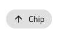
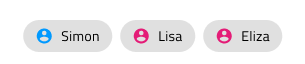

# Chip

Use the Chip Component as a compact visual shown in an obround to display tags and people information e.g. for the recipients of an email. The Chip is visually identical to the [Ignite UI for Angular Chip Component](https://www.infragistics.com/products/ignite-ui-angular/angular/components/chip.html)

## Chip Demo

## Chip Density

The Chip comes in three density variants:

- Comfortable - Suitable for interactive scenarios e.g. action triggers
- Cosy - Appropriate for short areas such as the recipient field of an email message composer
- Compact - Best for data-dense scenarios such as the values for a cell in the Grid

## Chip State

When the user interacts with the Chip, it may change from the default **idle** state to focus and vice versa. This affords a more dynamic interaction design that can seamlessly flow into high-fidelity prototyping.

`idle`

`focus`

## Chip Selection

When a chip is selected a special check icon will appear at the far left to indicate this. The `🔣 Selection Icon` override provides the means to trigger this functionality.

## Remove Chip

When a chip can be removed a special cancel icon will appear at the far right to indicate this. The `🔣 Remove Icon` override provides the means to trigger this functionality.

`idle and removable`

## Chip Content

The Chip has rich support for content templating via the prefix and suffix containers allowing to insert icons and text before and after the chip main text content.

`Text`

`Prefix`

`Prefix+Suffix`

`Suffix`

## Chip Styling

The Chip comes with styling flexibility through the various options controlling the border and background colors, as well as the text and prefix, suffix, selection and remove icon colors, where applicable.

## Chips Area

Use the Chips Area Component to organize a collection of Chips. The Chips Area is identical to the container area used in Ignite UI for Angular, which is explained at length in the [Ignite UI for Angular Chip Component](https://www.infragistics.com/products/ignite-ui-angular/angular/components/chip.html) help topic.

### Chips Area Demo

### Chips Area Type

The Chips Area is available in two distinct types: Chips, where the Chip collection is not related, and Connected Chips, where Chips appear in a predefined sequence.

### Chips Area Styling

The Chips Area comes with the inherent styling flexibility of the Chips, but, where applicable, also allows changing the color and glyph of the connector icon.

## Usage

When using a Chip, the obround will automatically size itself to fit the content and you only need to adjust the size of the instance accordingly. If the Chip is used as an action trigger for related content avoid using it in scenarios where there is only one available action, or for configurations presenting only one selectable option.

| Do                                                                         | Don't                                                                          |
| -------------------------------------------------------------------------- | ------------------------------------------------------------------------------ |
| |
|  |  |
|  |  |

When using the Chips Area follow the suggestions for the individual Chip components above and when using a connected Chips Area don't configure the individual chips as actions, they are supposed to be entitites related in some way e.g. an ordered list of people.

| Do                                                                                     | Don't                                                                                      |
| -------------------------------------------------------------------------------------- | ------------------------------------------------------------------------------------------ |
|  |  |

## Additional Resources

Related topics:

- [Grid](grid.md)
  

Our community is active and always welcoming to new ideas.
