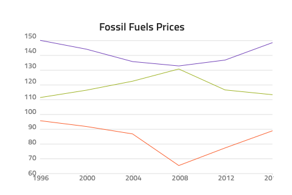
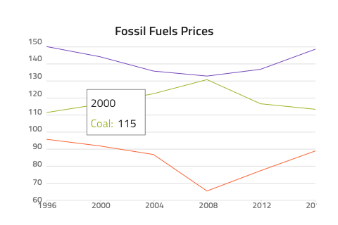
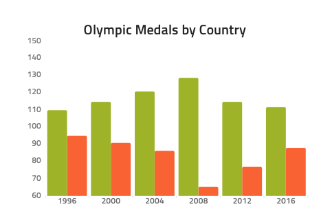
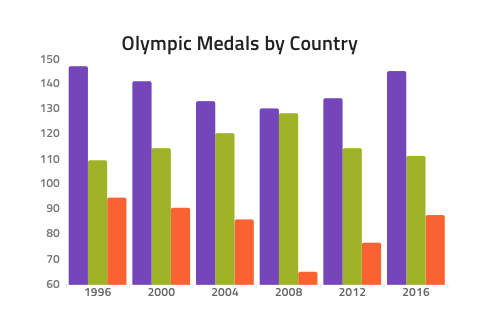
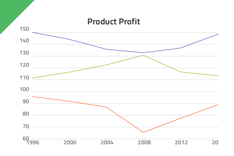
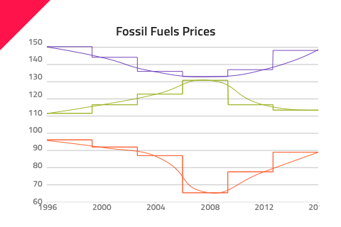

# Column Chart

Use the Category Chart Component to wrap the density and complexity of data in a simple visual. Category Charts are often combined to create beautiful dashboards for related sets of data. The Category Chart is visually identical to the [Ignite UI for Angular Category Chart Component](https://www.infragistics.com/products/ignite-ui-angular/angular/components/categorychart.html)

## Column Chart Demo

......

## Title and Legend

## Tooltip

The Category Chart comes with an override for the tooltip visibility: **Tooltip Off** hides it and Tooltip On shows it on top of the series.

## Series Amount

This override provides flexibility to select between one and **three** series that will be rendered.

## Styling

## Usage

Even though you might need to combine different types of series in the same chart, you should avoid stacking multiple Category Charts on top of one another. Use the Category Chart Component as if it were a simplified stencil for data visualization.

| Do                                                                                             | Don't                                                                                              |
| ---------------------------------------------------------------------------------------------- | -------------------------------------------------------------------------------------------------- |
|  |  |

## Additional Resources

Related topic:

- [Data Binding](../codegen/data-binding.md)
  

Our community is active and always welcoming to new ideas.

